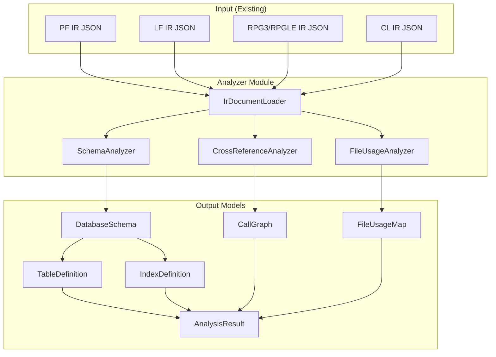

# System Design: Analyzer

## Architecture Overview



## Data Models

### DatabaseSchema
```
DatabaseSchema
├── tables: List<TableDefinition>
│   ├── name: String (PF member name)
│   ├── recordFormat: String
│   ├── description: String (from TEXT keyword)
│   ├── columns: List<ColumnDefinition>
│   │   ├── name: String
│   │   ├── ddsType: String (A, P, S, B, L, T, Z)
│   │   ├── sqlType: String (VARCHAR, NUMERIC, INTEGER, DATE, etc.)
│   │   ├── length: int
│   │   ├── decimalPositions: Integer (nullable)
│   │   ├── nullable: boolean
│   │   ├── defaultValue: String (from DFT keyword)
│   │   ├── description: String (from TEXT keyword)
│   │   ├── columnHeading: String (from COLHDG keyword)
│   │   └── constraints: List<String> (VALUES, CHECK, etc.)
│   ├── primaryKey: List<String> (key field names)
│   ├── unique: boolean (from UNIQUE file keyword)
│   └── fileKeywords: Map<String, String>
│
├── indexes: List<IndexDefinition>
│   ├── name: String (LF member name)
│   ├── tableName: String (from PFILE keyword)
│   ├── type: enum (SIMPLE, SELECT_OMIT, JOIN)
│   ├── keyFields: List<KeyFieldDef>
│   │   ├── fieldName: String
│   │   └── sortOrder: ASC/DESC
│   ├── selectOmitRules: List<SelectOmitRule> (if applicable)
│   └── joinSpec: JoinDefinition (if JOIN type)
│
└── typeMapping: DdsToSqlTypeMapper
```

### CrossReference
```
CrossReference
├── callGraph: Map<String, ProgramCalls>
│   ├── programName: String
│   ├── callsPrograms: List<CallTarget>
│   │   ├── targetName: String
│   │   ├── callType: enum (CALL, CALLP, CALLB, EXSR)
│   │   └── locations: List<Location>
│   └── calledBy: List<String>
│
├── fileUsage: Map<String, List<FileOperation>>
│   ├── programName: String
│   └── files: List<FileUsage>
│       ├── fileName: String
│       ├── fileType: enum (PF, LF, DSPF, PRTF)
│       ├── operations: Set<IOOperation>
│       │   (CHAIN, READ, READE, READP, READPE, WRITE, UPDATE, DELETE, SETLL, SETGT, OPEN, CLOSE)
│       └── accessMode: enum (INPUT, OUTPUT, UPDATE, COMBINE)
│
└── copyMembers: Map<String, List<CopyReference>>
    ├── programName: String
    └── copies: List<String> (member names)
```

## Component Breakdown

### 1. IrDocumentLoader
- Loads IR JSON files from a directory
- Deserializes into IrDocument objects using existing Gson model
- Groups by sourceType (DDS_PF, DDS_LF, RPG3, RPGLE, CL, DSPF, PRTF)

### 2. SchemaAnalyzer
- **Input**: List of DDS_PF and DDS_LF IrDocuments
- **PF Processing**:
  - Extract recordFormats[0].fields → ColumnDefinition list
  - Map dataType using DdsToSqlTypeMapper
  - Extract keys from recordFormats[0].keys or content.keyFields
  - Extract file-level keywords (UNIQUE, etc.)
- **LF Processing**:
  - Extract PFILE reference → link to parent table
  - Extract key fields → IndexDefinition
  - Detect type: simple (keys only), select-omit, or join

### 3. DdsToSqlTypeMapper
Deterministic mapping:

| DDS Type | SQL Type | Rule |
|----------|----------|------|
| A (Alpha) | VARCHAR(n) | Direct length mapping |
| P (Packed) | NUMERIC(p, s) | p = length, s = decimal positions |
| S (Zoned) | NUMERIC(p, s) | p = length, s = decimal positions |
| B (Binary) | SMALLINT/INTEGER/BIGINT | Based on length (≤4→SMALLINT, ≤9→INTEGER, else BIGINT) |
| L (Date) | DATE | |
| T (Time) | TIME | |
| Z (Timestamp) | TIMESTAMP | |
| H (Hex) | BYTEA | |
| F (Float) | DOUBLE PRECISION | |

### 4. CrossReferenceAnalyzer
- **RPG3 Input**: Scan calculationSpecs for CALL, EXSR, CALLP opcodes → extract factor 2 as target
- **RPGLE Input**: Scan calculationSpecs for CALLP, EXSR opcodes and freeFormatStatements
- **CL Input**: Scan commands for CALL, SBMJOB → extract PGM parameter as target
- **Build reverse map**: For each target, record which programs call it

### 5. FileUsageAnalyzer
- **RPG3/RPGLE Input**: Extract fileSpecs → file names with access mode (I/O/U/C)
- **Scan calculationSpecs**: Match opcodes (READ, CHAIN, WRITE, etc.) with their factor 2 file references
- **CL Input**: Scan for OVRDBF, OPNQRYF → file references

## Design Decisions

| Decision | Choice | Rationale |
|----------|--------|-----------|
| Output format | Standalone AnalysisResult JSON | Keeps parser IR immutable; analysis is a separate concern |
| Module location | `com.as400parser.common.analyzer` | Shared across all source types |
| DDS type mapping | Static rule-based | Deterministic, no AI needed. 100% coverage of DDS types |
| Call graph structure | Adjacency list + reverse map | Efficient for both "who do I call" and "who calls me" queries |

## Non-Functional Requirements

- **Performance**: Analyze full student-mgmt app (20+ files) in <1 second
- **Extensibility**: Adding new opcode recognition should be a single-line change
- **Testability**: All analyzers take IrDocument as input (no file I/O in core logic)
