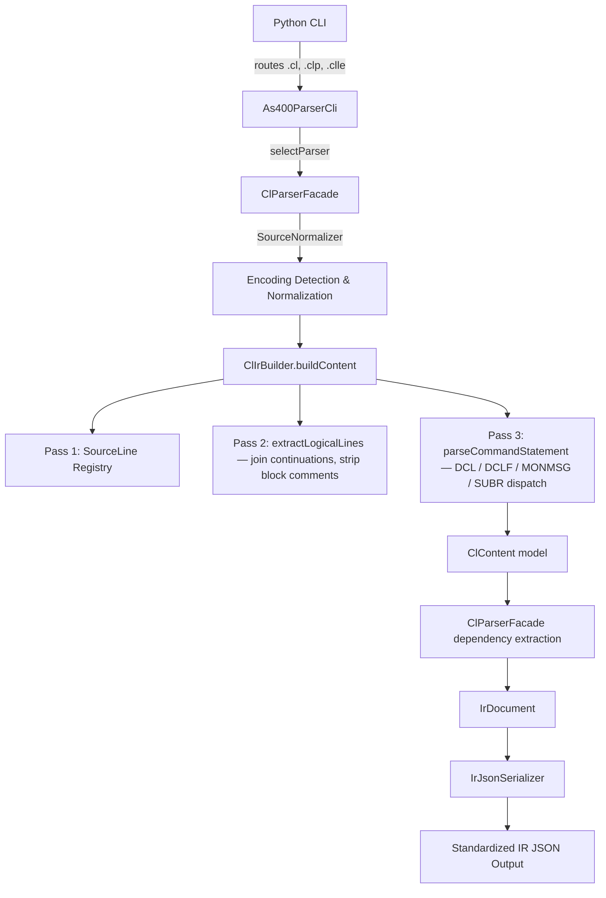

# System Design & Architecture

## Architecture Overview

- **Common Framework Integration:**
  - `ClParserFacade` implements `As400Parser` (from `com.as400parser.common.parser`).
  - Uses `SourceNormalizer` for encoding detection (from `com.as400parser.common.normalizer`).
  - Returns `IrDocument` with `Metadata`, `Dependencies`, `ParseError` (from `com.as400parser.common.model`).
  - Registered in `As400ParserCli.PARSERS` for auto-dispatch by file extension.
  - JSON output produced by `IrJsonSerializer`.

- **Extension-to-SourceType mapping:**
  - `.cl`   → `sourceType = "CL"`
  - `.clp`  → `sourceType = "CLP"`
  - `.clle` → `sourceType = "CLLE"`
  - String-based `parse(String, ParseOptions)` defaults to `"CLLE"` (no extension available).

## Data Models

- **Common Models (reused from `com.as400parser.common.model`):**
  - `IrDocument` — top-level result (content, metadata, dependencies, errors).
  - `Metadata` + `Metadata.ParseInfo` — sourceType, member, library, parseStatus, encoding.
  - `IrDocument.Dependencies` — calledPrograms, referencedFiles, copyMembers (always empty for CL).
  - `ParseError` — error/warning entries with severity.
  - `Location` — line range tracking.

- **CL-Specific Content Model (`com.as400parser.cl.model`):**
  - `ClContent` — language-specific content set on `IrDocument.setContent()`.
  - `ClVariable` — DCL variable declarations (`&NAME`, type, length, decimal positions, initial value).
  - `ClFileDeclaration` — DCLF file declarations (fileName, openId, location).
  - `ClCommand` — general CL command (name, parameters, location, rawSourceLines, execCommands, monitorMessage).
  - `ClParameter` — single parameter (keyword, value, isPositional).
  - `ClLabel` — GOTO target labels.
  - `ClSubroutine` — CLLE SUBR...ENDSUBR blocks (name from label prefix, commands list).
  - `ClMonitorMessage` — MONMSG entries (msgId, cmpData, execCommands).
  - `ClComment` — extracted `/* ... */` block comments.

## API Design

- **Interface:** `ClParserFacade` implements `As400Parser` with two `parse()` overloads:
  - `IrDocument parse(Path sourceFile, ParseOptions options)` — file-based, encoding auto-detected.
  - `IrDocument parse(String sourceText, ParseOptions options)` — string-based, defaults to `"CLLE"`.
- **Registration:** `getSourceType()` → `"CL"`, `getSupportedExtensions()` → `[".cl", ".clp", ".clle"]`.
- **Output:** Returns `IrDocument` with `null` for missing values.
- **Pipeline:**
  1. Normalize source via `SourceNormalizer`.
  2. Build `ClContent` via `ClIrBuilder.buildContent()`.
  3. Extract dependencies (calledPrograms, referencedFiles).
  4. Populate `Metadata` with parse info.
  5. Return fully populated `IrDocument`.

## Component Breakdown

1. `as400_parser_cli.py`: Python CLI — updated with `.cl`, `.clp`, `.clle` extensions.
2. `As400ParserCli.java`: Java CLI — register `ClParserFacade` in `PARSERS`.
3. `ClParserFacade.java`: Core facade implementing `As400Parser`. Orchestrates pipeline and dependency extraction.
4. `ClIrBuilder.java`: Two-pass CL parser — tokenization (Pass 2) then command parsing (Pass 3).
5. `com.as400parser.cl.model.*`: CL-specific content models (9 classes).

## ClIrBuilder Parsing Strategy

### Pass 2: Tokenization (`extractLogicalLines`)
- Scans character-by-character, correctly handling:
  - **Block comments:** `/* ... */` (single or multi-line) — extracted into `ClContent.comments`
  - **Quoted strings:** `'...'` — `''` (doubled single-quote) is an in-string escape; `+` inside quotes is NOT continuation
  - **Continuation markers:**
    - `+` as last non-blank char → skip leading whitespace on next line
    - `-` as last non-blank char → continue without skipping whitespace
- Failsafe: unterminated comment at EOF adds a `ParseError.WARNING`

### Pass 3: Command Parsing (`parseCommandStatement`)
- Extracts command name (first token before space or `(`)
- Parses keyword/positional parameters via `parseParameters()`
- Special dispatch for structural commands:
  - `PGM` → sets `programName` if provided
  - `DCL` → builds `ClVariable` → added to `content.variables`
  - `DCLF` → builds `ClFileDeclaration` → added to `content.fileDeclarations` (NOT `content.commands`)
  - `MONMSG` → builds `ClMonitorMessage`; parses nested EXEC command
  - `SUBR` / `ENDSUBR` → manages subroutine scope; name comes from preceding label (not SUBR parameters)

### Dependency Extraction (in `ClParserFacade`)
- CALL PGM → `calledPrograms` (type `"call"`)
- DCLF FILE → `referencedFiles` (type `"file-declaration"`)
- OVRxxx FILE/TOFILE → `referencedFiles` (type `"file-override"`; TOFILE takes priority)
- DLTOVR FILE (*ALL excluded) → `referencedFiles` (type `"file-override-delete"`)
- SNDPGMMSG MSGF → `referencedFiles` (type `"message-file"`)
- ADDLIBLE LIB → `referencedFiles` (type `"library"`)
- 30+ other commands mapped to appropriate reference types
- `copyMembers` always empty (CL has no `/COPY` mechanism)

## Design Decisions

- **Single parser for all CL variants:** CL, CLP, and CLLE differ only in source type naming; the grammar is identical.
- **No ANTLR for CL:** CL's grammar is simple enough that a character-level tokenizer + regex-free parser is sufficient, faster, and more maintainable.
- **Command-aligned architecture:** Each recognized command maps to a specific dependency reference type, enabling fine-grained dependency graphs without full semantic analysis.
- **Subroutine name from label only:** The `SUBR` command in CL does not take a name parameter; names always come from the preceding label (`PROCESS: SUBR`).
- **`copyMembers` always empty:** CL has no `/COPY` or `/INCLUDE` mechanism (unlike RPGLE), so this is correctly hardcoded to `List.of()`.

## Non-Functional Requirements

- **Performance:** Must parse large CL programs (hundreds of commands, multi-line continuations) in milliseconds.
- **Correctness:** Block comment and quoted string handling must be robust against embedded `/*`, `+`, `-`, `'` characters.
- **Consistency:** JSON output structure matches the IR standard (same as RPGLE, RPG3, DDS, CL, DSPF, PRTF parsers).
