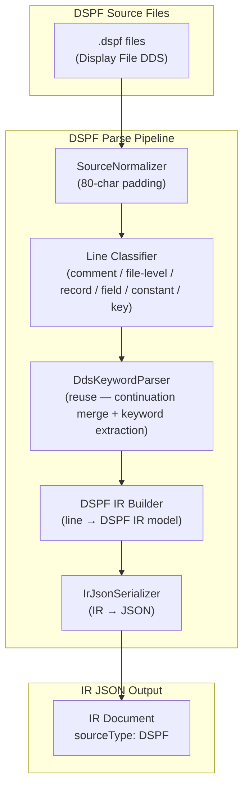
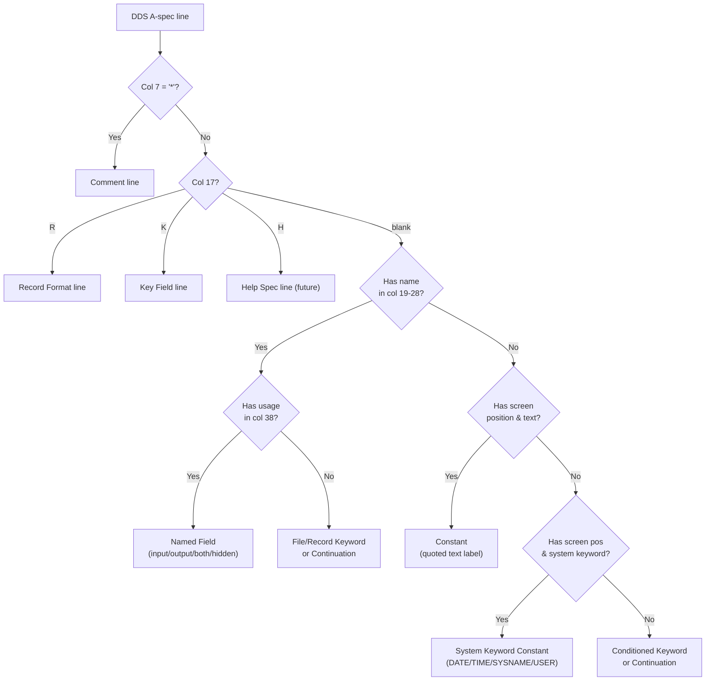
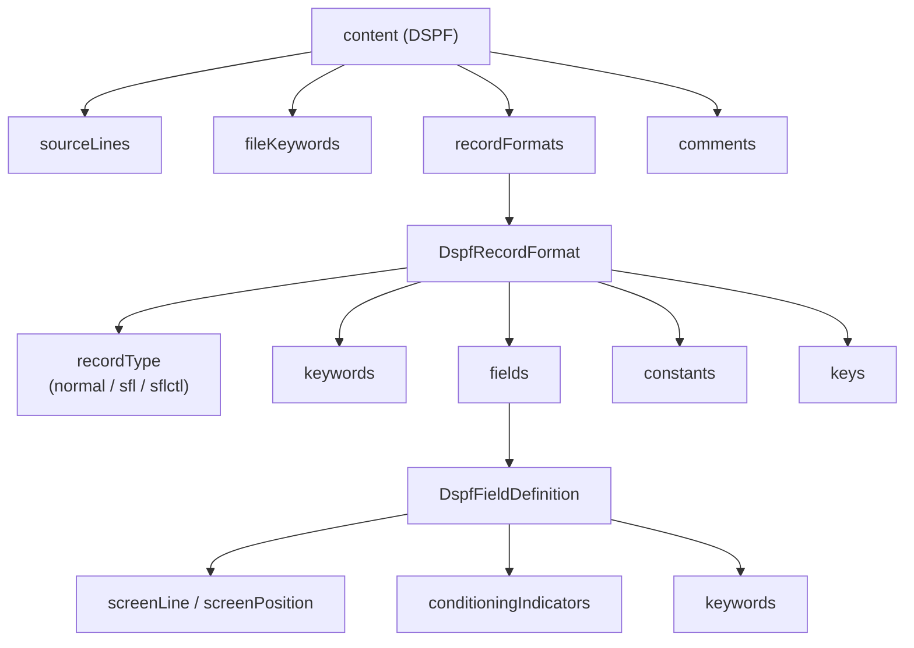

# System Design & Architecture — DSPF Parser

## Architecture Overview

The DSPF parser plugs into the existing `As400Parser` framework exactly like the PF/LF parser. It reuses the common infrastructure (normalizer, serializer, keyword parser) and adds DSPF-specific IR building and model classes. Since DSPF uses the same DDS A-spec column layout, the parser uses the **same raw-line column-position approach**.



### Reuse from PF/LF Parser

| Component | Reuse | Notes |
|---|---|---|
| `SourceNormalizer` | ✅ Reuse | Standard 80-char padding |
| `IrDocument` / `Metadata` / `Location` | ✅ Reuse | Same envelope, new content type |
| `IrJsonSerializer` | ✅ Reuse | Serializes any `IrDocument` |
| `As400Parser` interface | ✅ Implement | `DspfParserFacade implements As400Parser` |
| `ParseOptions` | ✅ Reuse | No changes needed |
| `DdsKeywordParser` | ✅ Reuse | Same keyword syntax as PF/LF |
| `DdsKeyword` model | ✅ Reuse | Same keyword representation |
| `FieldDefinition` model | ❌ New | DSPF fields need screen coordinates, conditioning indicators, constants |
| `RecordFormat` model | ❌ New | DSPF record formats have different structure (record type, subfile link) |

---

## DDS A-Spec Column Layout for DSPF

Same column layout as PF/LF with DSPF-specific semantics:

```
Columns  1- 5: Sequence number
Column      6: Form type (always 'A')
Column      7: Comment indicator ('*' = comment line)
Columns  8-16: Conditioning indicators (3 slots of 3 cols: 8-10, 11-13, 14-16)
               DSPF ACTIVELY USES THESE for field/keyword visibility/protection
Column     17: Name type / Entry type indicator:
                 blank = field/constant definition
                 'R'   = record format
                 'K'   = key field (rare in DSPF)
                 'H'   = help specification (future)
Columns 19-28: Name (field or record format name)
Column     29: Reference indicator ('R' = use REF/REFFLD)
Columns 30-34: Length (numeric, right-justified)
Column     35: Data type (A, S, P, B, etc.)
Columns 36-37: Decimal positions
Column     38: Usage (B=Both, I=Input, O=Output, H=Hidden, M=Message, P=Program-to-system)
Columns 39-41: Screen line number (1-24, or 0 for cursor-relative)
Columns 42-44: Screen position/column (1-80, or 0 for cursor-relative)
Columns 45-80: Keywords and comments
Column     80: Continuation indicator ('+' = line continues on next)
```

> [!IMPORTANT]
> **Key DSPF differences from PF/LF:**
> - Columns 39-44 contain screen coordinates (line/position) rather than being unused
> - Conditioning indicators (columns 8-16) are **actively used** to control field visibility, display attributes, and keyword applicability
> - Unnamed fields (no name in cols 19-28) with literal text in keywords are **constants** (screen labels/headings)

### Line Type Classification for DSPF



---

## Data Models — IR Content Structure

### DSPF Content (`DSPF`)



#### `content` for `DSPF`

| Field | Type | Description |
|---|---|---|
| `sourceLines` | `array<SourceLine>` | All raw source lines (same structure as RPG3/DDS) |
| `fileKeywords` | `array<DdsKeyword>` | File-level keywords: `DSPSIZ`, `CAxx`/`CFxx`, `PRINT`, `REF`, `CHGINPDFT`, `INDARA`, etc. |
| `recordFormats` | `array<DspfRecordFormat>` | Record format definitions |
| `comments` | `array<Comment>` | Standalone comment lines |

#### `Comment`

Same structure as PF/LF:

| Field | Type | Description |
|---|---|---|
| `lineNumber` | `integer` | Source line number (1-based) |
| `text` | `string` | Comment text (after `A*`, trimmed) |

#### `DspfRecordFormat`

| Field | Type | Description |
|---|---|---|
| `location` | `location` | Source position |
| `rawSourceLine` | `string` | Original source text |
| `conditioningIndicators` | `array<ConditioningIndicator>` | Conditioning indicators on the record format line |
| `name` | `string` | Record format name (e.g., `MNUREC`, `STUSFL`, `STUSFC`) |
| `recordType` | `string` | DSPF record type: `normal`, `sfl` (subfile), `sflctl` (subfile control) |
| `sflControlFor` | `string` | For `sflctl` type: name of the SFL record format it controls (from `SFLCTL` keyword). `null` for non-SFLCTL records |
| `text` | `string` | Record text from `TEXT(...)` keyword |
| `keywords` | `array<DdsKeyword>` | Record-level keywords with conditioning indicators |
| `fields` | `array<DspfFieldDefinition>` | Named field definitions |
| `constants` | `array<DspfConstant>` | Constant (literal text) entries |
| `keys` | `array<KeyDefinition>` | Key field specifications (rare in DSPF) |

#### `DspfFieldDefinition`

| Field | Type | Description |
|---|---|---|
| `location` | `location` | Source position (may span multiple lines) |
| `rawSourceLines` | `array<string>` | All source lines for this field (including continuations) |
| `conditioningIndicators` | `array<ConditioningIndicator>` | Conditioning indicators on field definition line |
| `name` | `string` | Field name (e.g., `MNUOPT`, `SFSTID`) |
| `reference` | `string` | Reference indicator: `R` if using REF/REFFLD, `null` otherwise |
| `length` | `integer` | Field length. `null` if inherited via REF |
| `dataType` | `string` | DDS data type code: `A`, `S`, `P`, etc. |
| `decimalPositions` | `integer` | Decimal positions (`null` for character types) |
| `usage` | `string` | Usage: `B` (Both), `I` (Input), `O` (Output), `H` (Hidden), `M` (Message) |
| `screenLine` | `integer` | Screen line number (cols 39-41). `null` if not specified |
| `screenPosition` | `integer` | Screen column position (cols 42-44). `null` if not specified |
| `source` | `string` | Field source: `direct`, `reference` (REF/REFFLD) |
| `keywords` | `array<ConditionedKeyword>` | Field-level keywords with optional conditioning indicators |

#### `DspfConstant`

Represents unnamed display elements on the screen: either **quoted literal text** (labels, headings) or **system keyword constants** (`DATE`, `TIME`, `SYSNAME`, `USER`).

| Field | Type | Description |
|---|---|---|
| `location` | `location` | Source position |
| `rawSourceLine` | `string` | Original source text |
| `conditioningIndicators` | `array<ConditioningIndicator>` | Conditioning indicators controlling visibility |
| `screenLine` | `integer` | Screen line number |
| `screenPosition` | `integer` | Screen column position |
| `text` | `string` | Literal text content (stripped of quotes). `null` for system keyword constants |
| `systemKeyword` | `string` | System keyword name (`DATE`, `TIME`, `SYSNAME`, `USER`, `PAGNBR`). `null` for quoted text constants |
| `keywords` | `array<ConditionedKeyword>` | Keywords on the constant (e.g., `DSPATR`, `COLOR`, `EDTCDE`) |

#### `ConditioningIndicator`

DSPF uses conditioning indicators extensively. Each indicator entry from columns 8-16:

| Field | Type | Description |
|---|---|---|
| `not` | `boolean` | Whether negated (`N` prefix, e.g., `N60`) |
| `indicator` | `string` | Indicator number or code (e.g., `60`, `03`, `40`) |

#### `ConditionedKeyword`

Keywords in DSPF can have their own conditioning indicators. Keyword-only lines with indicators (e.g., `A N60 DSPATR(PR)`) are **merged into the preceding field/constant's keyword list** as `ConditionedKeyword` entries:

| Field | Type | Description |
|---|---|---|
| `keyword` | `DdsKeyword` | The keyword itself (reusing unified DdsKeyword) |
| `conditioningIndicators` | `array<ConditioningIndicator>` | Indicators conditioning this keyword |

#### `KeyDefinition`

Reuse from PF/LF — same structure (rare in DSPF).

---

### DSPF Keywords Reference (IBM DDS for Display Files)

> [!NOTE]
> The `DdsKeywordParser` captures **all** keywords generically using the `KEYWORD(args)` pattern. This comprehensive list serves as documentation of known DSPF keywords from the official IBM DDS Reference for Display Files. No special handling is needed per keyword — they are all stored as `DdsKeyword` objects.
>
> Each keyword below includes a DDS code example. Column ruler for reference:
> ```
> |...+....1....+....2....+....3....+....4....+....5....+....6....+....7....+....8
>       A            Name     LenTDULnPos Keywords...
>       6  7  8     17 19       30 35383941 45                                  80
> ```

---

#### File-Level Keywords

##### `ALARM` — Audible alarm
Record-level. Sounds alarm when record is displayed.
```
     A          R CUSTREC                   ALARM
     A  01                                  ALARM
```

##### `ALTHELP` — Alternative help key
File-level. Assigns a CA key as alternative Help key (default: CA01).
```
     A                                      ALTHELP
     A                                      ALTHELP(CA02)
```

##### `ALTPAGEDWN` / `ALTPAGEUP` — Alternative page keys
File-level. Assigns CF keys as alternative Page Down/Up (defaults: CF08/CF07).
```
     A                                      ALTPAGEUP
     A                                      ALTPAGEDWN
```

##### `BLINK` — Blink cursor
Record-level. Cursor flashes while record is displayed.
```
     A          R MASTER                    BLINK
```

##### `CAnn` — Command attention key
File- or record-level. Does NOT return changed field data to program.
```
     A                                      CA01(91 'End of Program')
     A                                      CA03(03 '終了')
     A                                      CA12(12 '戻る')
     A                                      CA03
```

##### `CFnn` — Command function key
File- or record-level. Returns changed field data to program.
```
     A                                      CF01(91 'End of Program')
     A                                      CF05(05 '更新')
     A                                      CF10
```

##### `CHGINPDFT` — Change input default
File- or record-level. Changes default underline for input fields.
```
     A                                      CHGINPDFT(UL)
     A                                      CHGINPDFT(ME)
```

##### `CLEAR` — Clear key
File- or record-level. Enables the Clear key.
```
     A                                      CLEAR
     A                                      CLEAR(50 'Clear was pressed')
```

##### `CSRINPONLY` — Cursor input only
File-level. Restricts cursor movement to input-capable fields only.
```
     A                                      CSRINPONLY
```

##### `DSPMOD` — Display mode
Record-level. Specifies display mode for dual-size displays (24×80 / 27×132).
```
     A          R RECORD1                   DSPMOD(*DS4)
     A  03                                  DSPMOD(*DS4)
```

##### `DSPRL` — Display right to left
File-level. Records written right-to-left (bidirectional devices).
```
     A                                      DSPRL
```

##### `DSPSIZ` — Display size
File-level. Specifies display dimensions (default: 24×80).
```
     A                                      DSPSIZ(24 80 *DS3)
     A                                      DSPSIZ(*DS3 *DS4)
     A                                      DSPSIZ(27 132 *WIDE 24 80 *NORMAL)
     A                                      DSPSIZ(27 132 24 80)
```

##### `ENTFLDATR` — Entry field attribute
File-level. Specifies entry field display attributes.
```
     A                                      ENTFLDATR(UL)
```

##### `HELP` — Enable help key
File- or record-level. Enables the Help key for the record or file.
```
     A                                      HELP
     A                                      HELP(01 'HELP KEY PRESSED')
```

##### `HOME` — Home key
File- or record-level. Enables the Home key with optional response indicator.
```
     A                                      HOME(50 'Home pressed')
```

##### `INDARA` — Indicator area
File-level. Separate indicator area (not in data buffer).
```
     A                                      INDARA
```

##### `INVITE` — Invite
Record-level. Invites a record for ICF communications.
```
     A          R RCDINV                    INVITE
```

##### `LOWER` — Allow lowercase
File-level. Allows lowercase character input.
```
     A                                      LOWER
```

##### `MSGLOC` — Message location
File-level. Specifies line number for message display (default: last line).
```
     A                                      MSGLOC(24)
     A  *DS4                                MSGLOC(26)
```

##### `NOCCSID` — No CCSID
File- or field-level. Suppresses CCSID processing.
```
     A                                      NOCCSID
```

##### `OPENPRT` — Open printer file
File-level. Opens printer file for print key support.
```
     A                                      OPENPRT
```

##### `PRINT` — Enable print key
File- or record-level. Enables the Print key.
```
     A                                      PRINT
     A                                      PRINT(*PGM)
     A                                      PRINT(99 'Print key')
```

##### `REF` — Reference file
File-level. Specifies reference file for field attributes.
```
     A                                      REF(PAYROLL)
     A                                      REF(MYLIB/CUSTMAST)
```

##### `USRDFN` — User-defined
Record-level. User-defined record format (program controls screen layout).
```
     A          R USRREC                    USRDFN
```

##### `USRDSPMGT` — User display management
File-level. Program manages display yourself.
```
     A                                      USRDSPMGT
```

##### `USRRSTDSP` — User restore display
File-level. Program restores display after system operations.
```
     A                                      USRRSTDSP
```

##### `VLDCMDKEY` — Valid command key
File-level. Controls response when valid command key is pressed.
```
     A                                      VLDCMDKEY(05 'Enter pressed')
```

---

#### Record-Level Keywords

##### `ALTNAME` — Alternative record name
```
     A          R REC1                      ALTNAME('CUSTOMER_RECORD')
```

##### `ASSUME` — Assume on display
Record remains on display when file is opened.
```
     A          R HEADER                    ASSUME
```

##### `CHANGE` — Change indicator
Sets response indicator when any input field is modified.
```
     A          R REC1
     A                                      CHANGE(88 'A field was changed')
     A            FLDX           5   B  8  2CHANGE(67 'FLDX was changed')
```

##### `CLRL` — Clear line
Clears portion of display before writing record.
```
     A          R DETAIL                    CLRL(*ALL)
     A          R DETAIL                    CLRL(*NO)
     A          R DETAIL                    CLRL(5)
```

##### `ERASE` — Erase record
Erases specified record format from display.
```
     A          R REC2                      ERASE(REC1)
     A  01                                  ERASE(HEADER)
```

##### `ERASEINP` — Erase input fields
Erases input fields on the displayed record.
```
     A          R ENTRY                     ERASEINP
```

##### `FRCDTA` — Force data
Forces input data to be returned without waiting for Enter key.
```
     A          R PROMPT                    FRCDTA
```

##### `HLPBDY` — Help boundary
Defines help boundary between help specifications.
```
     A          R RECORD1                   HLPBDY
```

##### `HLPCLR` — Help cleared
Specifies that help display is cleared.
```
     A          R RECORD1                   HLPCLR
```

##### `HLPCMDKEY` — Help command key
Specifies command key handling while help is displayed.
```
     A          R RECORD1                   HLPCMDKEY
```

##### `HLPRTN` — Help return
Returns to application after help is displayed.
```
     A          R RECORD1                   HLPRTN
```

##### `INZRCD` — Initialize record
Initializes record format fields with default values.
```
     A          R ENTRY                     INZRCD
```

##### `KEEP` — Keep on display
Keeps record on display when file is closed.
```
     A          R FOOTER                    KEEP
```

##### `LOCK` — Lock keyboard
Locks keyboard during output operation.
```
     A          R PROCESS                   LOCK
```

##### `OVERLAY` — Overlay display
Writes record without erasing other displayed records.
```
     A          R DETAIL                    OVERLAY
     A          R STUSFC                    OVERLAY
```

##### `PAGEDOWN` / `PAGEUP` — Page keys
Handles Page Down / Page Up key with response indicator.
```
     A          R SFLCTL                    PAGEDOWN(25 'PAGE DOWN')
     A          R SFLCTL                    PAGEUP(26 'PAGE UP')
```

##### `PASSRCD` — Passed record
Specifies that this record is passed to another display file.
```
     A          R PASSRC                    PASSRCD
```

##### `PROTECT` — Protect all input
Protects all input fields in the record (read-only).
```
     A          R DISPLAY                   PROTECT
```

##### `PULLDOWN` — Pull-down menu
Marks record as a pull-down menu for a menu bar.
```
     A          R FILEOPT                   PULLDOWN
```

##### `PUTOVR` — Put with override
Outputs only changed fields (performance optimization).
```
     A          R DETAIL                    PUTOVR
```

##### `PUTRETAIN` — Put-retain
Retains field data between output operations.
```
     A          R DETAIL                    PUTRETAIN OVERLAY
```

##### `RETCMDKEY` / `RETKEY` — Retain keys
Retains function key settings from previously displayed record.
```
     A          R POPUP                     RETCMDKEY
     A          R POPUP                     RETKEY
```

##### `RETLCKSTS` — Retain lock status
Retains keyboard lock status.
```
     A          R REC1                      RETLCKSTS
```

##### `ROLLUP` / `ROLLDN` — Roll up/down
Roll Up (Page Down) / Roll Down (Page Up) with response indicator.
```
     A          R SFLCTL                    ROLLUP(25)
     A          R SFLCTL                    ROLLDN(26)
```

##### `RTNCSRLOC` — Return cursor location
Returns cursor line/position to program fields.
```
     A          R REC1                      RTNCSRLOC(*RECNAME &CSRRCD &CSRFLD)
```

##### `RTNDTA` — Return data
Returns data without re-reading (uses saved buffer).
```
     A          R DISPLAY                   RTNDTA
```

##### `SETOF` / `SETOFF` — Set indicator off
Turns off response indicators after input.
```
     A          R REC1                      SETOF(30 'Reset ind 30')
```

##### `SLNO` — Starting line number
Specifies first display line for the record.
```
     A          R DETAIL                    SLNO(5)
     A          R DETAIL                    SLNO(*VAR &LINENO)
```

##### `TEXT` — Record description
Provides descriptive text for a record format (documentation).
```
     A          R CUSTREC                   TEXT('Customer detail record')
```

##### `UNLOCK` — Unlock keyboard
Unlocks keyboard after output (allows typeahead).
```
     A          R REC1                      UNLOCK
```

---

#### Subfile Keywords (Record-Level)

##### `SFL` — Subfile record
Marks the record as a subfile record format.
```
     A          R STUSFL                    SFL
```

##### `SFLCHCCTL` — Subfile choice control
Specifies this is a subfile choice control record.
```
     A          R CHOICES                   SFLCHCCTL
```

##### `SFLCLR` — Subfile clear
Clears all records from the subfile (conditioned by indicator).
```
     A  42                                  SFLCLR
```

##### `SFLCSRPRG` — Subfile cursor progression
Specifies field for cursor progression within subfile.
```
     A            OPTFLD         1A  B  8  3SFLCSRPRG
```

##### `SFLCSRRRN` — Subfile cursor RRN
Returns relative record number where cursor is positioned.
```
     A            CSRRRN         4S 0H      SFLCSRRRN
```

##### `SFLCTL` — Subfile control
Links this record as controller for specified subfile record.
```
     A          R STUSFC                    SFLCTL(STUSFL)
```

##### `SFLDLT` — Subfile delete
Deletes the subfile.
```
     A  45                                  SFLDLT
```

##### `SFLDROP` — Subfile drop
Toggles subfile display between folded/truncated (key-activated).
```
     A                                      SFLDROP(CF10)
```

##### `SFLDSP` — Subfile display
Displays the subfile records (conditioned by indicator).
```
     A  40                                  SFLDSP
```

##### `SFLDSPCTL` — Subfile display control
Displays the subfile control record (conditioned by indicator).
```
     A  41                                  SFLDSPCTL
```

##### `SFLEND` — Subfile end
Displays "More..." or scrollbar at end of subfile.
```
     A  43                                  SFLEND(*MORE)
     A  43                                  SFLEND(*SCRBAR)
     A  43                                  SFLEND
```

##### `SFLENTER` — Subfile enter
Specifies CA/CF key to act as Enter within subfile.
```
     A                                      SFLENTER(CF05)
```

##### `SFLFOLD` — Subfile fold
Toggles between folded/truncated subfile view.
```
     A                                      SFLFOLD(CF11)
```

##### `SFLINZ` — Subfile initialize
Initializes all subfile records before display.
```
     A                                      SFLINZ
```

##### `SFLLIN` — Subfile line
Specifies display line for subfile (used with WINDOW).
```
     A                                      SFLLIN(8)
```

##### `SFLMLTCHC` — Subfile multiple choice
Subfile appears as a multiple-choice selection list.
```
     A          R CHCSFL                    SFL
     A                                      SFLMLTCHC
```

##### `SFLMODE` — Subfile mode
Sets response indicator to indicate truncated/folded mode.
```
     A                                      SFLMODE(31)
```

##### `SFLMSG` / `SFLMSGID` — Subfile message
Displays message text in the subfile message area.
```
     A  50                                  SFLMSG('Record not found')
     A  50                                  SFLMSGID(ERR0012 MSGFILE)
```

##### `SFLMSGKEY` — Subfile message key
Specifies field containing the message key.
```
     A            MSGKEY         4A  H      SFLMSGKEY
```

##### `SFLMSGRCD` — Subfile message record
Marks record as a message subfile record.
```
     A          R MSGSFL                    SFL
     A                                      SFLMSGRCD(24)
```

##### `SFLNXTCHG` — Subfile next changed
Forces subfile record to be returned on next read-changed.
```
     A                                      SFLNXTCHG
```

##### `SFLPAG` — Subfile page size
Number of records displayed per page.
```
     A                                      SFLPAG(0012)
     A                                      SFLPAG(10)
```

##### `SFLPGMQ` — Subfile program message queue
Specifies program message queue for message subfile.
```
     A                                      SFLPGMQ(&PGMQ)
```

##### `SFLRCDNBR` — Subfile record number
Field containing RRN of record to position subfile page to.
```
     A            SFRCDNBR       4S 0H      SFLRCDNBR
     A            RCDNBR         4S 0H      SFLRCDNBR(CURSOR *TOP)
```

##### `SFLRNA` — Subfile records not active
Records in subfile are not active (cannot be read).
```
     A                                      SFLRNA
```

##### `SFLROLVAL` — Subfile roll value
Field containing the number of records to scroll.
```
     A            ROLVAL         4S 0B  5 70SFLROLVAL
```

##### `SFLRTNSEL` — Subfile return selected
Returns selected choices from a selection subfile.
```
     A                                      SFLRTNSEL
```

##### `SFLSCROLL` — Subfile scroll
Field receiving the RRN of the first displayed record after scroll.
```
     A            SCLRRN         4S 0H      SFLSCROLL
```

##### `SFLSIZ` — Subfile size
Total number of records the subfile can hold.
```
     A                                      SFLSIZ(0100)
     A                                      SFLSIZ(30)
```

##### `SFLSNGCHC` — Subfile single choice
Subfile appears as a single-choice selection list.
```
     A          R OPTLIST                   SFL
     A                                      SFLSNGCHC
```

---

#### Window Keywords

##### `RMVWDW` — Remove window
Removes windows from display.
```
     A          R MAIN                      RMVWDW
```

##### `WDWBORDER` — Window border
Specifies border attributes for a window.
```
     A                                      WDWBORDER((*DSPATR HI) +
     A                                                (*COLOR WHT))
```

##### `WDWTITLE` — Window title
Sets the title text displayed in the window border.
```
     A                                      WDWTITLE(*TOP 'Customer Lookup')
     A                                      WDWTITLE(*BOTTOM 'F3=Exit' *CENTER)
```

##### `WINDOW` — Define window
Defines a window on the display (line, position, rows, columns).
```
     A          R WDWREC                    WINDOW(5 20 10 40)
     A          R WDWREC                    WINDOW(*DFT 10 40)
     A          R WDWREC                    WINDOW(MAINREC *DFT)
```

---

#### Help Keywords

##### `HLPARA` — Help area
Defines rectangular area on screen for context-sensitive help.
```
     A          H                           HLPARA(1 1 12 80)
     A          H                           HLPARA(*RCD)
```

##### `HLPDOC` — Help document
Specifies a document as help text.
```
     A          H                           HLPDOC('QSYSINC/HELPDOCS' 'CUSTHLP')
```

##### `HLPEXCLD` — Help excluded
Excludes a help area from help display.
```
     A          H                           HLPEXCLD
```

##### `HLPFULL` — Help full screen
Help occupies the full screen.
```
     A          H                           HLPFULL
```

##### `HLPID` — Help identifier
Specifies help module identifier within a panel group.
```
     A          H                           HLPID('CUSTFLD1')
```

##### `HLPPNLGRP` — Help panel group
Specifies panel group containing help text.
```
     A          H                           HLPPNLGRP(CUSTHP MYLIB)
     A                                      HLPRCD(RECORD1 FILEA)
```

##### `HLPRCD` — Help record
Specifies record format containing help text.
```
     A          H                           HLPRCD(HELPRC1 HELPFILE)
```

##### `HLPSCHIDX` — Help search index
Specifies search index for help text.
```
     A          H                           HLPSCHIDX(CUSTIDX MYLIB)
```

##### `HLPSEQ` — Help sequencing
Specifies the order of help display.
```
     A          H                           HLPSEQ(1)
```

##### `HLPTITLE` — Help title
Specifies title for the help display.
```
     A          H                           HLPTITLE('Customer Field Help')
```

---

#### Menu-Bar Keywords

##### `MNUBAR` — Menu bar
Record-level. Marks record as a menu bar.
```
     A          R MENUBAR                   MNUBAR
```

##### `MNUBARCHC` — Menu-bar choice
Field-level. Defines a choice on the menu bar and links to pull-down record.
```
     A            FILE           10A  O  1  2MNUBARCHC(01 FILEPDN)
     A            EDIT           10A  O  1 14MNUBARCHC(02 EDITPDN)
```

##### `MNUBARDSP` — Menu-bar display
Record-level. Indicates the pull-down menu is displayed initially.
```
     A          R FILEPDN                   PULLDOWN
     A                                      MNUBARDSP
```

##### `MNUBARSEP` — Menu-bar separator
Field-level. Defines separator line in a pull-down menu.
```
     A                                  4  1MNUBARSEP
```

##### `MNUBARSW` — Menu-bar switch key
File-level. Specifies key to activate/deactivate menu bar.
```
     A                                      MNUBARSW(CA10)
```

##### `MNUCNL` — Menu-cancel key
File-level. Specifies key to cancel out of menu/pull-down.
```
     A                                      MNUCNL(CA12)
```

---

#### Field-Level Keywords

##### `ALIAS` — Alternative field name
```
     A            FIELDA        25A     1  2ALIAS(CUSTOMERNAME)
```

##### `AUTO` — Auto-enter/tab
Equivalent to CHECK(ER) / CHECK(RB) / CHECK(RZ).
```
     A            FLD1          10A  I  5  2AUTO(RA)
     A            FLD2          10A  I  6  2AUTO(RAB)
```

##### `BLANKS` — Allow blanks
Sets response indicator when numeric field is blank vs. zero.
```
     A            QTY1           5Y 0B  5  2BLANKS(01 'ON=QTY1 IS ALL BLANKS')
```

##### `CHECK` — Validity checking
Enforces input validation: ME (mandatory enter), MF (mandatory fill), M10/M11 (modulus check), VN/VNE (valid name), LC (lowercase), ER (auto-enter), RB/RZ (right-adjust), FE (field exit req).
```
     A            CUSTNAME      25A  B  5  2CHECK(ME)
     A            PHONE         10N 0I  6  2CHECK(MF)
     A            ACCTNO        10A  B  7  2CHECK(M10)
     A            CODEVAL        5A  I  8  2CHECK(VN)
     A            ADDRESS       40A  B  9  2CHECK(LC)
     A            AMOUNT         9Y 2I 10  2CHECK(RZ FE)
```

##### `CHKMSGID` — Check message ID
Custom error message for CHECK validation failure.
```
     A            ACCTNO        10A  B  5  2CHECK(M10)
     A                                      CHKMSGID(USR0001 USRMSGF &LIB)
```

##### `CHOICE` — Selection field choice
Defines a choice for a single/multiple choice field.
```
     A            OPTION         2Y 0B  5  2SNGCHCFLD
     A                                      CHOICE(1 'Add new customer')
     A                                      CHOICE(2 'Change customer')
     A                                      CHOICE(3 'Delete customer')
```

##### `CHRID` — Character identifier
Specifies character set for the field.
```
     A            FLD1          10A  B  5  2CHRID(697 37)
```

##### `CMP` / `COMP` — Comparison
Validates field value by comparison.
```
     A            STATUS         1A  I  5  2COMP(EQ 'A')
     A            AGE            3S 0I  6  2COMP(GE 18)
     A            RATING         1A  I  7  2CMP(NE ' ')
```

##### `CNTFLD` — Continued-entry field
Allows a field to span multiple display lines.
```
     A            COMMENTS     200A  B  5  2CNTFLD(40)
```

##### `COLOR` — Color
Specifies display color (BLU, GRN, WHT, RED, TRQ, YLW, PNK).
```
     A            ERRMSG        40A  O  5  2COLOR(RED)
     A            TITLE         30A  O  1  2COLOR(WHT)
     A  01                                  COLOR(YLW)
```

##### `COLHDG` — Column heading
Column headings for subfile fields.
```
     A            CUSTNO         6S 0O  8  2COLHDG('Customer' 'Number')
```

##### `CSRLOC` — Cursor location
Positions cursor to this field on output.
```
     A            FLD1          10A  B  5  2CSRLOC(CSRFLD)
```

##### `DATE` — System date
Unnamed constant: displays system date at screen position.
```
     A                                  2 70DATE
     A                                      EDTCDE(Y)
```

##### `DATFMT` — Date format
Specifies date format for date (L) type fields.
```
     A            ORDDATE         L  B  7 30DATFMT(*JUL) DATSEP('/')
     A            HIREDT          L  B  8 30DATFMT(*MDY) DATSEP('/')
     A            BDATE           L  B  9 30DATFMT(*ISO)
```

##### `DATSEP` — Date separator
Specifies date separator character.
```
     A            ORDDATE         L  B  7 30DATFMT(*MDY) DATSEP('-')
```

##### `DFT` — Default value
Sets default display value for a field or constant text.
```
     A                                  5 20'選択番号 ==> '
     A            OPTION         1A  I  5  2DFT(' ')
     A                                  1 25DFT('学 生 管 理 シ ス テ ム')
```

##### `DFTVAL` — Default value (alternative)
Alternative to DFT keyword.
```
     A            STATUS         1A  I  5  2DFTVAL('A')
```

##### `DLTCHK` — Delete check
Deletes validity-checking keywords from reference field.
```
     A            FLDX      R        B  5  2REFFLD(FLDX DBFILE) DLTCHK
```

##### `DLTEDT` — Delete edit
Deletes editing keywords from reference field.
```
     A            FLDX      R        B  5  2REFFLD(FLDX DBFILE) DLTEDT
```

##### `DSPATR` — Display attribute
Specifies visual attributes: HI, RI, UL, BL, CS, PR, ND, PC, OID, SP, MDT.
```
     A            TITLE         30A  O  1  2DSPATR(HI)
     A            ERRMSG        40A  O 22  2DSPATR(RI)
     A            OPTION         1A  B 15 34DSPATR(UL)
     A N60                                  DSPATR(PR)
     A  60                                  DSPATR(UL)
     A            FIELDC         7Y 0B  7 20DSPATR(RI PC)
     A            HEADER         5A  O  1  2DSPATR(HI CS)
```

##### `DUP` — Duplication
Activates the Dup key for the field.
```
     A            FLDA           5   I  3  2
     A  15                                  DUP(16 'FLDA was duped')
```

##### `EDTCDE` — Edit code
Edits numeric output: leading zero suppression, commas, signs, dates.
```
     A            AMOUNT         9Y 2O  5  2EDTCDE(1)
     A            BALANCE        9Y 2O  6  2EDTCDE(J)
     A            SALARY        11Y 2O  7  2EDTCDE(1 $)
     A            BIRTHDT        8Y 0O  8  2EDTCDE(Y)
```

##### `EDTMSK` — Edit mask
Edit mask for field display.
```
     A            PHONE         10A  O  5  2EDTMSK('(   )   -    ')
```

##### `EDTWRD` — Edit word
Specifies an edit word for numeric formatting.
```
     A            PHONE         10Y 0O  5  2EDTWRD('0(   )   -    ')
     A            SSN            9Y 0O  6  2EDTWRD('0   -  -    ')
```

##### `ERRMSG` — Error message
Displays error message when indicator is on.
```
     A  44                                  ERRMSG('Record not found' 44)
     A  50                                  ERRMSG('Invalid option' 50)
```

##### `ERRMSGID` — Error message identifier
Displays error from message file when indicator is on.
```
     A  44                                  ERRMSGID(ERR0012 USRMSGF 44)
     A  50                                  ERRMSGID(ERR0025 USRMSGF *FIRST)
```

##### `ERRSFL` — Error subfile
Records error messages in an error subfile.
```
     A          R ERRFMT                    ERRSFL
```

##### `FLDCSRPRG` — Cursor progression
Specifies cursor progression order for the field.
```
     A            FLD1          10A  B  5  2FLDCSRPRG
```

##### `FLTFIXDEC` — Float to fixed decimal
Converts floating-point to fixed decimal for display.
```
     A            FLD1           9F 4B  5  2FLTFIXDEC(15 5)
```

##### `FLTPCN` — Floating-point precision
Specifies single (*S) or double (*D) precision.
```
     A            FLD1           9F  B  5  2FLTPCN(*D)
```

##### `GETRETAIN` — Get retain
Retrieves retained data for the field.
```
     A            FLD1          10A  B  5  2GETRETAIN
```

##### `HTML` — HTML content
Outputs HTML content (for browser-based 5250).
```
     A            HTMFLD       500A  O  1  1HTML(&HTMVAR)
```

##### `INDTXT` — Indicator text
Documents the purpose of an indicator (documentation only).
```
     A                                      INDTXT(40 'Subfile display active')
     A                                      INDTXT(60 'Protect mode on')
```

##### `INZINP` — Initialize input
Initializes input fields when record is displayed.
```
     A          R ENTRY                     INZINP
```

##### `LOGINP` — Log input
Logs input data for the field.
```
     A            FLD1          10A  B  5  2LOGINP
```

##### `LOGOUT` — Log output
Logs output data for the field.
```
     A            FLD1          10A  B  5  2LOGOUT
```

##### `MAPVAL` — Map values
Maps display values to program values.
```
     A            STATUS         1A  B  5  2MAPVAL((' ' '0') +
     A                                      ('X' '1'))
```

##### `MDTOFF` — Modified data tag off
Turns off MDT for all input fields when record is displayed.
```
     A          R REC1                      MDTOFF
```

##### `MLTCHCFLD` — Multiple-choice selection field
Field allows multiple selections.
```
     A            OPTIONS        2Y 0B  5  2MLTCHCFLD
     A                                      CHOICE(1 'Option A')
     A                                      CHOICE(2 'Option B')
```

##### `MOUBTN` — Mouse buttons
Specifies mouse button actions.
```
     A            FLD1          10A  B  5  2MOUBTN(*ULP CF04)
```

##### `MSGALARM` — Message alarm
Sounds alarm when ERRMSG/ERRMSGID is displayed.
```
     A  44                                  ERRMSG('Error occurred' 44)
     A                                      MSGALARM
```

##### `MSGCON` — Message constant
Displays text from a message file as a constant.
```
     A                                  1  2MSGCON(30 MSG0001 USRMSGF)
```

##### `MSGID` — Message identifier
Displays text from a message file in a named field.
```
     A            MSGTXT        50A  O  5  2MSGID(MSG0001 USRMSGF &LIB)
```

##### `OVRATR` — Override attribute
Overrides display attributes on subsequent output.
```
     A            FLD1          10A  B  5  2OVRATR
     A  78                                  DSPATR(HI)
```

##### `OVRDTA` — Override data
Overrides field data on subsequent output.
```
     A            FLD1          10A  O  5  2OVRDTA
```

##### `PSHBTNCHC` — Push button choice
Defines a push button choice within a push button field.
```
     A            ACTIONS        2Y 0B 20  2PSHBTNFLD
     A                                      PSHBTNCHC(1 'OK' CF01)
     A                                      PSHBTNCHC(2 'Cancel' CF03)
```

##### `PSHBTNFLD` — Push button field
Marks field as a push button field.
```
     A            ACTIONS        2Y 0B 20  2PSHBTNFLD
```

##### `RANGE` — Range validation
Validates field value is within a range.
```
     A            MONTH          2S 0I  5  2RANGE(1 12)
     A            OPTION         1A  I  6  2RANGE('A' 'Z')
```

##### `REF` — Reference file (field-level)
File-level reference for field attributes.
```
     A                                      REF(CUSTMAST)
```

##### `REFFLD` — Reference field
Copies attributes from a field in another file.
```
     A            CUSTNM    R        B  5  2REFFLD(CUSTNM CUSTMAST)
     A            CITY      R        B  6  2REFFLD(CITY ADDRREC ADDRFILE)
```

##### `SNGCHCFLD` — Single-choice selection field
Field allows only one selection.
```
     A            OPTION         2Y 0B  5  2SNGCHCFLD
     A                                      CHOICE(1 'Add')
     A                                      CHOICE(2 'Change')
```

##### `SYSNAME` — System name
Unnamed constant: displays system name at screen position.
```
     A                                  1  2SYSNAME
```

##### `TEXT` — Field description
Documentation text for a field.
```
     A            CUSTNO         6S 0  5  2TEXT('Customer number field')
```

##### `TIME` — System time
Unnamed constant: displays system time at screen position.
```
     A                                  1 70TIME
```

##### `TIMFMT` — Time format
Specifies time format for time (T) type fields.
```
     A            TMFLD           T  B  7 30TIMFMT(*ISO)
     A            TMFLD2          T  B  8 30TIMFMT(*HMS)
```

##### `TIMSEP` — Time separator
Specifies time separator character.
```
     A            TMFLD           T  B  7 30TIMFMT(*HMS) TIMSEP(':')
```

##### `USER` — User name
Unnamed constant: displays current user name at screen position.
```
     A                                  1  2USER
```

##### `VALNUM` — Validate numeric
Validates that all characters in the field are numeric.
```
     A            ZIPCODE        5A  I  5  2VALNUM
```

##### `VALUES` — Valid values
Validates field against a list of valid values.
```
     A            MNUOPT         1A  B 15 34VALUES('1' '2' '3' '9')
     A            ACTION         1A  I  5  2VALUES('A' 'C' 'D')
```

##### `WRDWRAP` — Word wrap
Enables word wrapping within a continued-entry field.
```
     A            NOTES        200A  B  5  2CNTFLD(60) WRDWRAP
```

---

#### Display Attribute Values (`DSPATR`)

| Code | Meaning | Example |
|---|---|---|
| `HI` | High intensity | `DSPATR(HI)` |
| `RI` | Reverse image | `DSPATR(RI)` |
| `UL` | Underline | `DSPATR(UL)` |
| `BL` | Blink | `DSPATR(BL)` |
| `CS` | Column separator | `DSPATR(CS)` |
| `PR` | Protect (input field → output-only) | `A N60  DSPATR(PR)` |
| `ND` | Non-display (hidden field) | `DSPATR(ND)` |
| `PC` | Position cursor | `DSPATR(PC)` |
| `SP` | Select by light pen | `DSPATR(SP)` |
| `MDT` | Set changed data tag | `DSPATR(MDT)` |
| `OID` | Operator identification | `DSPATR(OID)` |

Multiple attributes can be combined: `DSPATR(RI PC)`, `DSPATR(HI CS)`, `DSPATR(SP MDT)`

#### Data Type Codes for DSPF (Position 35)

| Code | Type | Description | Example |
|---|---|---|---|
| blank | Default | Char if no decimal, zoned decimal if decimal specified | `A            FLD1          10      5  2` |
| `A` | Alphanumeric shift | Character data, lowercase allowed | `A            FLD1          10A  B  5  2` |
| `X` | Alphabetic only | A-Z, comma, period, dash, space only | `A            FLD1          10X  I  5  2` |
| `N` | Numeric shift | Character or numeric, all chars valid | `A            FLD1           5N 2I  6  2` |
| `S` | Signed numeric | 0-9 only, Field-/Field+ for sign | `A            FLD1           5S 0I  5  2` |
| `Y` | Numeric only | 0-9, +, -, period, comma, space | `A            FLD1           5Y 2B  5  2` |
| `W` | Katakana | Japanese Katakana shift | `A            FLD1          10W  I  5  2` |
| `I` | Inhibit entry | No keyboard input allowed | `A            FLD1          10I  I  5  2` |
| `D` | Digits only | 0-9 only, no sign | `A            FLD1           5D  I  5  2` |
| `M` | Numeric-only char | Char field accepting 0-9, signs, punct | `A            FLD1           5M  I  5  2` |
| `F` | Float | Floating point numeric | `A            FLD1           7F 4I  7  2` |
| `L` | Date | Date field | `A            FLD1            L  B  7 30DATFMT(*ISO)` |
| `T` | Time | Time field | `A            FLD1            T  B  8  2` |
| `Z` | Timestamp | Timestamp field | `A            FLD1            Z  I  7 30` |
| `J` | DBCS-only | DBCS only | `A            FLD1          10J  B  5  2` |
| `E` | DBCS-either | DBCS either (single/double) | `A            FLD1          10E  B  5  2` |
| `O` | DBCS-open | DBCS open | `A            FLD1          10O  B  5  2` |
| `G` | Graphic | Graphic DBCS / UCS-2 | `A            FLD1          10G  B  5  2` |

---

### Example IR JSON Output

#### Menu Screen (MNUDSPF.dspf)

```json
{
  "metadata": {
    "irVersion": "1.0.0",
    "sourceType": "DSPF",
    "sourceMember": "MNUDSPF",
    "sourceFile": "QDDSSRC",
    "sourceLibrary": "rpg3-student-mgmt",
    "parseInfo": {
      "parserVersion": "1.0.0",
      "parsedAt": "2026-03-22T10:00:00.000Z",
      "parseStatus": "complete",
      "totalLines": 42,
      "detectedEncoding": "UTF-8",
      "errors": [],
      "warnings": []
    }
  },
  "content": {
    "sourceLines": [
      {
        "lineNumber": 1,
        "rawText": "     A*================================================================",
        "specType": "COMMENT",
        "sequenceNumber": "",
        "isComment": true,
        "isBlank": false
      },
      {
        "lineNumber": 7,
        "rawText": "     A                                      DSPSIZ(24 80 *DS3)",
        "specType": "FILE_KEYWORD",
        "sequenceNumber": "",
        "isComment": false,
        "isBlank": false
      },
      {
        "lineNumber": 8,
        "rawText": "     A          R MNUREC",
        "specType": "RECORD_FORMAT",
        "sequenceNumber": "",
        "isComment": false,
        "isBlank": false
      }
    ],
    "fileKeywords": [
      { "name": "DSPSIZ", "values": ["24", "80", "*DS3"], "rawText": "DSPSIZ(24 80 *DS3)" },
      { "name": "CA03", "value": "03", "values": ["03", "終了"], "rawText": "CA03(03 '終了')" },
      { "name": "CA12", "value": "12", "values": ["12", "戻る"], "rawText": "CA12(12 '戻る')" }
    ],
    "recordFormats": [
      {
        "name": "MNUREC",
        "recordType": "normal",
        "sflControlFor": null,
        "keywords": [],
        "fields": [
          {
            "name": "MNUOPT",
            "length": 1,
            "dataType": "A",
            "usage": "B",
            "screenLine": 15,
            "screenPosition": 34,
            "conditioningIndicators": [],
            "keywords": [
              { "keyword": { "name": "DSPATR", "value": "UL" }, "conditioningIndicators": [] },
              { "keyword": { "name": "VALUES", "values": ["1", "2", "3", "9"] }, "conditioningIndicators": [] }
            ]
          },
          {
            "name": "MNUERR",
            "length": 40,
            "dataType": "A",
            "usage": "O",
            "screenLine": 18,
            "screenPosition": 2,
            "conditioningIndicators": [],
            "keywords": [
              { "keyword": { "name": "DSPATR", "value": "RI" }, "conditioningIndicators": [] }
            ]
          }
        ],
        "constants": [
          {
            "screenLine": 1,
            "screenPosition": 25,
            "text": "学 生 管 理 シ ス テ ム",
            "systemKeyword": null,
            "keywords": [
              { "keyword": { "name": "DSPATR", "value": "HI" }, "conditioningIndicators": [] }
            ]
          },
          {
            "screenLine": 15,
            "screenPosition": 20,
            "text": "選択番号 ==>",
            "systemKeyword": null,
            "keywords": []
          },
          {
            "screenLine": 2,
            "screenPosition": 70,
            "text": null,
            "systemKeyword": "DATE",
            "keywords": [
              { "keyword": { "name": "EDTCDE", "value": "Y" }, "conditioningIndicators": [] }
            ]
          }
        ],
        "keys": []
      }
    ],
    "comments": [
      { "lineNumber": 1, "text": "================================================================" }
    ],
    "parseErrors": []
  },
  "dependencies": {
    "referencedFiles": [],
    "calledPrograms": [],
    "copyMembers": []
  },
  "errors": []
}
```

#### Subfile Screen (STULSTD.dspf — snippet)

```json
{
  "content": {
    "recordFormats": [
      {
        "name": "STUSFL",
        "recordType": "sfl",
        "sflControlFor": null,
        "keywords": [
          { "keyword": { "name": "SFL" }, "conditioningIndicators": [] }
        ],
        "fields": [
          {
            "name": "SFOPT", "length": 1, "dataType": "A", "usage": "B",
            "screenLine": 8, "screenPosition": 3,
            "keywords": [{ "keyword": { "name": "DSPATR", "value": "UL" }, "conditioningIndicators": [] }]
          }
        ],
        "constants": []
      },
      {
        "name": "STUSFC",
        "recordType": "sflctl",
        "sflControlFor": "STUSFL",
        "keywords": [
          { "keyword": { "name": "SFLCTL", "value": "STUSFL" }, "conditioningIndicators": [] },
          { "keyword": { "name": "SFLSIZ", "value": "0100" }, "conditioningIndicators": [] },
          { "keyword": { "name": "SFLPAG", "value": "0012" }, "conditioningIndicators": [] },
          { "keyword": { "name": "SFLDSP" }, "conditioningIndicators": [{ "not": false, "indicator": "40" }] },
          { "keyword": { "name": "SFLDSPCTL" }, "conditioningIndicators": [{ "not": false, "indicator": "41" }] },
          { "keyword": { "name": "SFLCLR" }, "conditioningIndicators": [{ "not": false, "indicator": "42" }] },
          { "keyword": { "name": "SFLEND", "value": "*MORE" }, "conditioningIndicators": [{ "not": false, "indicator": "43" }] }
        ],
        "fields": [],
        "constants": []
      }
    ]
  }
}
```

---

## Component Breakdown

### 1. DSPF IR Builder (`DspfIrBuilder`)

**Responsibility:** Build the DSPF IR content model from normalized lines. Central processing class.

```java
public class DspfIrBuilder {
    public DspfContent buildContent(List<String> normalizedLines);
}
```

Processing steps:
1. Classify each line (comment, record format, field, constant, system keyword constant, keyword/continuation)
2. Merge continuation lines with their parent
3. **Merge conditioned keyword-only lines** (lines with indicators + keyword but no name/position) into the preceding field/constant's keyword list
4. Parse keywords for each line (reuse `DdsKeywordParser`)
5. Extract conditioning indicators from columns 8-16
6. Identify file-level keywords (before first record format)
7. Group fields and constants under record formats
8. Detect record type: `sfl` (SFL keyword), `sflctl` (SFLCTL keyword), `normal` (else)
9. Extract `sflControlFor` from `SFLCTL(name)` keyword
10. Parse screen coordinates from columns 39-44
11. Build `sourceLines` and `comments` arrays
12. Detect system keyword constants (`DATE`/`TIME`/`SYSNAME`/`USER`) vs quoted text constants

### 2. DSPF Parser Facade (`DspfParserFacade`)

**Responsibility:** Public API entry point, implements `As400Parser`.

```java
public class DspfParserFacade implements As400Parser {
    @Override
    public IrDocument parse(Path sourceFile, ParseOptions options);
    @Override
    public IrDocument parse(String sourceText, ParseOptions options);
    @Override
    public String getSourceType(); // "DSPF"
    @Override
    public List<String> getSupportedExtensions(); // [".dspf"]
}
```

### 3. Model Classes (`dspf/model/`)

```
parser-core/src/main/java/com/as400parser/dspf/
├── DspfParserFacade.java
├── DspfIrBuilder.java
└── model/
    ├── DspfContent.java            # content for DSPF
    ├── DspfRecordFormat.java       # Record format (normal / sfl / sflctl)
    ├── DspfFieldDefinition.java    # Named field with screen coords, indicators
    ├── DspfConstant.java           # Unnamed literal text on screen
    ├── ConditioningIndicator.java  # Indicator from cols 8-16
    └── ConditionedKeyword.java     # DdsKeyword + its conditioning indicators
```

> [!NOTE]
> - `DdsKeyword` from `dds/model/` is **reused** for keyword representation
> - `KeyDefinition` from `dds/model/` is **reused** for rare key specs
> - `DdsKeywordParser` is **reused** for keyword parsing
> - `SourceLine` and `Comment` structures follow existing patterns

### 4. CLI Integration

Update `As400ParserCli.java`:
- Add `DspfParserFacade` to the `PARSERS` list
- `.dspf` extension auto-detected via `getSupportedExtensions()`

---

## Design Decisions

### Decision 1: Separate Parser Module (Not Extend DDS Parser)

**Choice:** Create a new `dspf/` package with `DspfParserFacade` rather than extending the existing `DdsParserFacade`.
**Rationale:** DSPF has fundamentally different content model (screen coordinates, constants, conditioning indicators, subfiles) that would complicate the PF/LF parser. Separate modules are cleaner and match the project's modular architecture. Keyword parsing is reused via `DdsKeywordParser`.

### Decision 2: Constants as Separate Array (Not Fields)

**Choice:** Store unnamed literal text entries in `constants` array separate from `fields`.
**Rationale:** Constants and fields have different semantics — constants are display-only labels, fields are data elements. Downstream UI generators need to distinguish between them for component creation.

### Decision 3: ConditionedKeyword Wrapper

**Choice:** Wrap `DdsKeyword` in `ConditionedKeyword` to carry per-keyword conditioning indicators.
**Rationale:** In DSPF, individual keywords can be conditioned by indicators on preceding lines (e.g., `DSPATR(PR)` conditioned on `N60`). This is a DSPF-specific pattern that PF/LF doesn't heavily use.

### Decision 4: Detect Record Type from Keywords

**Choice:** Determine `recordType` (`normal`, `sfl`, `sflctl`) from keywords rather than from separate entry types.
**Rationale:** SFL/SFLCTL are identified by keywords on the record format line, not by column 17 entry type indicators.

### Decision 5: System Keyword Constants (DATE/TIME/SYSNAME/USER)

**Choice:** Classify system keyword lines as `DspfConstant` with `systemKeyword` field set (instead of `text`).
**Rationale:** Lines like `A                                  2 70DATE` are unnamed, have screen coordinates, but contain a system keyword instead of quoted text. They share the same IR structure as text constants (position, keywords, indicators) but differ in content source. Using a single `DspfConstant` model with `text`/`systemKeyword` mutual exclusivity keeps the model simple.

---

## Non-Functional Requirements

### Extensibility
- Future support for `H` (help) entry type, message subfiles, window files can be added without changing the core content model
- New DSPF keywords can be captured automatically by `DdsKeywordParser` without parser changes

### Performance
- Target < 100ms per file (typical DSPF files are 50-200 lines)
- Single-pass pipeline

### Compatibility
- Same `IrDocument` envelope as all other parsers
- Same JSON serialization via `IrJsonSerializer`
