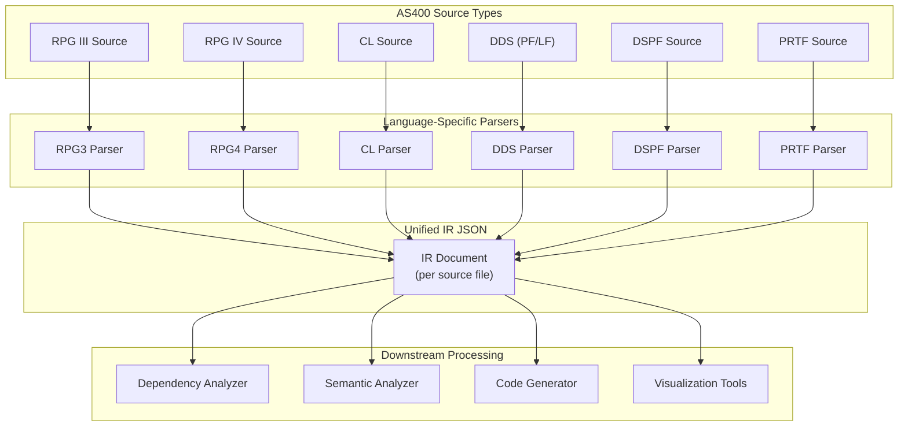
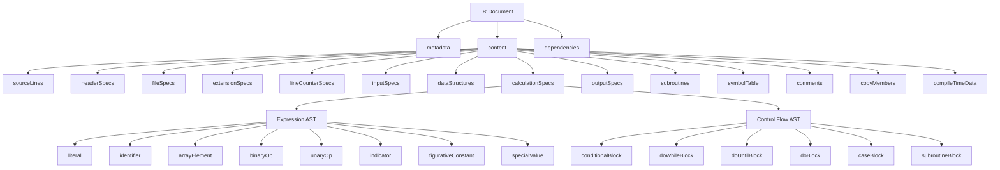
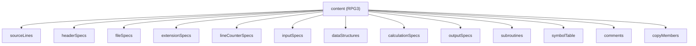

# System Design & Architecture

## Architecture Overview

**Where the IR fits in the overall system:**

The IR JSON template sits between the parsing stage and all downstream processing stages. Every AS400 source type is parsed into a unified IR format, enabling all downstream tools to operate against a single, consistent contract.



**Key principles:**

- **One IR document per source file** — each parsed source produces exactly one IR JSON document
- **Uniform envelope** — every IR document shares the same top-level structure (metadata, content, dependencies)
- **Type-specific content** — the `content` section is polymorphic; its internal structure depends on the source type
- **Extensibility** — new source types are added by defining new content schemas; the envelope never changes
- **Full fidelity** — every part of every source line is captured, including raw source text, comments, and all column positions
- **Full AST expressions** — factors and conditions are represented as full expression trees, not just raw strings

---

## Data Models

### Top-Level IR Document Structure

Every IR document has three major sections:

| Section | Purpose |
|---|---|
| `metadata` | Identity, provenance, and classification of the source |
| `content` | Structured representation of the source's logical contents |
| `dependencies` | References to external objects (files, programs, data areas, etc.) |

> **Note:** Indicators are not stored as a separate top-level section. They are captured inline on each statement where they are used (conditioning indicators, resulting indicators, field indicators, output indicators).

### 1. `metadata` Section

Captures the identity and provenance of the source file.

| Field | Type | Description |
|---|---|---|
| `$schema` | `string` | Optional URI to the JSON Schema for this IR version (enables editor auto-validation) |
| `irVersion` | `string` | Version of the IR schema (semver) |
| `sourceType` | `string` | AS400 source type identifier: `RPG3`, `RPG4`, `CL`, `DDS_PF`, `DDS_LF`, `DSPF`, `PRTF` |
| `sourceMember` | `string` | Source member name |
| `sourceFile` | `string` | Source physical file name (e.g., `QRPGSRC`) |
| `sourceLibrary` | `string` | Library containing the source |
| `description` | `string` | Source member description/text |
| `createdDate` | `string` | ISO 8601 date when the source was created (if available) |
| `modifiedDate` | `string` | ISO 8601 date when the source was last modified (if available) |
| `recordLength` | `integer` | Record length of the source member |
| `totalLines` | `integer` | Total number of source lines |
| `parseInfo` | `object` | Information about the parse operation (see below) |

#### `parseInfo` Sub-object

| Field | Type | Description |
|---|---|---|
| `parserVersion` | `string` | Version of the parser that produced the IR |
| `parsedAt` | `string` | ISO 8601 timestamp of when parsing occurred |
| `parseStatus` | `string` | Status: `complete`, `partial`, `failed` |
| `errors` | `array<object>` | Array of parse errors (each with `line`, `column`, `message`, `severity`) |
| `warnings` | `array<object>` | Array of parse warnings (same structure as errors) |

---

### 2. `content` Section

The content section is **polymorphic** — its internal structure depends on `metadata.sourceType`. This section captures the logical contents of the source in a structured, ordered representation.



#### Content Design Principles

- **Preservation of source order**: All items within arrays are ordered as they appear in the source
- **Specification-based grouping**: Content is grouped by specification type / logical section, not by line number
- **Node identity**: Every significant node has an optional `name` or `id` for cross-referencing
- **Source location tracking**: Every node includes a `location` object with `startLine`, `endLine`, `startColumn`, `endColumn`
- **Raw source preservation**: Every specification node includes the `rawSourceLine` containing the original source text
- **Full fidelity**: Every column position / field from the source line is captured as a discrete field in the IR
- **Comment preservation**: Both standalone comment lines and inline comments are captured
- **Full AST expressions**: Factor1, factor2, and conditions are represented as full expression AST trees
- **Explicit data types**: Every field/variable carries an explicit `dataType` using native AS400 type codes for reliable downstream type mapping

#### Null and Empty Value Conventions

To ensure consistent interpretation across all downstream tools:

| Value | Meaning | Example |
|---|---|---|
| `null` | Field is **not applicable** or not present in the source | `factor1: null` (opcode has no factor1) |
| `""` (empty string) | Field **exists but is blank/empty** | `controlLevel: ""` (column is blank) |
| `0` | Numeric **zero** — a meaningful value | `decimalPositions: 0` (zero decimal places) |

> **Important:** For integer fields where the column is blank/not applicable, use `null` instead of `0`. For example, `fieldLength: null` means no length was specified, whereas `fieldLength: 0` would mean a length of zero was explicitly coded.

#### Common `location` Object

| Field | Type | Description |
|---|---|---|
| `startLine` | `integer` | Starting line number (1-based) |
| `endLine` | `integer` | Ending line number (1-based) |
| `startColumn` | `integer` | Starting column (1-based) |
| `endColumn` | `integer` | Ending column (1-based) |

#### Common Fields on Every Specification Node

Every specification node includes at minimum these common fields:

| Field | Type | Description |
|---|---|---|
| `location` | `location` | Source position (see Common `location` Object above) |
| `rawSourceLine` | `string` | The complete original source line text exactly as it appears |
| `inlineComment` | `string` | Inline comment text (columns 60–74 in C-specs, or trailing comments) |
| `formType` | `string` | Specification form type character (column 6: `H`, `F`, `E`, `L`, `I`, `C`, `O`) |

> **Note:** Standalone comment lines (lines with `*` in column 7) are captured separately in the `comments` array, not as a field on spec nodes. Source sequence numbers (columns 1–5) are captured in the `sourceLines` array.

---

#### RPG3 Content Structure (Primary / Fully Defined)

RPG III source is organized by specification types identified by the character in column 6. The IR reflects this structure.



##### `sourceLines`

A complete ordered array of every source line, preserving the raw source. This enables full round-trip reconstruction.

Each entry:

| Field | Type | Description |
|---|---|---|
| `lineNumber` | `integer` | 1-based line number |
| `rawText` | `string` | Complete raw source line text |
| `specType` | `string` | Specification type: `H`, `F`, `E`, `L`, `I`, `C`, `O`, `comment`, `blank`, `directive`, `compileTimeData` |
| `sequenceNumber` | `string` | Source sequence number (columns 1–5), extracted by the normalizer. Preserved as-is from the original source |
| `isComment` | `boolean` | Whether this is a full-line comment |
| `isBlank` | `boolean` | Whether this is a blank/empty line |

##### `headerSpecs` (H-spec)

Controls compilation and runtime options for the program. Every column position is captured.

| Field | Type | Description |
|---|---|---|
| `location` | `location` | Source position |
| `rawSourceLine` | `string` | Original source text |
| `inlineComment` | `string` | Inline comment if present |
| `formType` | `string` | `H` |
| `programName` | `string` | Program name (columns 75–80, if present) |
| `debugOption` | `string` | Debug/1P indicator option (column 15) |
| `currencySymbol` | `string` | Currency symbol (column 18) |
| `dateFormat` | `string` | Date format (column 19) |
| `dateEdit` | `string` | Date edit code (column 20) |
| `decimalNotation` | `string` | Decimal notation (column 21): `I` (comma), `J` (period) |
| `alteringSequence` | `string` | Alternate collating sequence (column 26) |
| `fileTranslation` | `string` | File translation / sign handling (column 43) |
| `invertedPrint` | `string` | Inverted print (column 41) |
| `sharedIO` | `string` | Shared I/O (column 42) |
| `options` | `array<object>` | Additional parsed options: `{ name, value, column, location }` |

##### `fileSpecs` (F-spec)

Declares files used by the program. Every column position is captured.

Each file specification entry:

| Field | Type | Description |
|---|---|---|
| `location` | `location` | Source position |
| `rawSourceLine` | `string` | Original source text |
| `inlineComment` | `string` | Inline comment if present |
| `formType` | `string` | `F` |
| `fileName` | `string` | File name (columns 7–14) |
| `fileType` | `string` | File type (column 15): `I` (Input), `O` (Output), `U` (Update), `C` (Combined) |
| `fileDesignation` | `string` | File designation (column 16): `P` (Primary), `S` (Secondary), `R` (Record addr), `T` (Table), `F` (Full procedural) |
| `endOfFile` | `string` | End of file (column 17): `E` or blank |
| `fileSequence` | `string` | Sequence (column 18): `A` (Ascending), `D` (Descending), or blank |
| `fileFormat` | `string` | File format (column 19): `F` (Fixed/Program-described) or `E` (Externally-described) |
| `recordLength` | `integer` | Record length (columns 24–27) |
| `limitsProcessing` | `string` | Limits processing (column 28): `L` or blank |
| `keyLength` | `integer` | Key field length (columns 29–33) |
| `recordAddressType` | `string` | Record address type (column 31): `A`, `P`, `K`, `D`, `F`, `T` |
| `fileOrganization` | `string` | File organization (column 32): `I` (Indexed), `T` (Table), etc. |
| `overflowIndicator` | `string` | Overflow indicator (columns 33–34): `OA`–`OG`, `OV` |
| `blockLength` | `integer` | Block length / record address length (columns 20–23) |
| `device` | `string` | Device (columns 40–46): `DISK`, `PRINTER`, `WORKSTN`, `SPECIAL`, `SEQ` |
| `symbolicDevice` | `string` | Symbolic device name (if applicable) |
| `continuationLines` | `array<FileKeyword>` | Continuation keywords (see below), merged from continuation F-spec lines (blank fileName) into parent |
| `externalName` | `string` | External file name (if different from fileName) |
| `additionType` | `string` | Addition area (column 66): `A` or blank |
| `fileConditionIndicator` | `string` | File condition indicator (columns 71–72, U1–U8 external indicator) |

**`FileKeyword` — F-spec continuation keyword (cols 47–80):**

Continuation lines (F in col 6, blank cols 7–14) are parsed and merged into the parent FileSpec. The keyword and its arguments are extracted from the `KEYWORD(arg:arg)` syntax.

| Field | Type | Description |
|---|---|---|
| `keyword` | `string` | Keyword name: `RENAME`, `IGNORE`, `INCLUDE`, `SFILE` |
| `originalName` | `string` | First argument (before colon): original record name |
| `newName` | `string` | Second argument (after colon): new record name. `null` for single-argument keywords |
| `rawText` | `string` | Full raw text for fallback (e.g., `RENAME(STUREC:S1REC)`) |

**Example:**
```json
"continuationLines": [
  { "keyword": "RENAME", "originalName": "STUREC", "newName": "S1REC", "rawText": "RENAME(STUREC:S1REC)" }
]
```

##### `extensionSpecs` (E-spec)

Defines arrays, tables, and compile-time data. Every column position is captured.

Each entry:

| Field | Type | Description |
|---|---|---|
| `location` | `location` | Source position |
| `rawSourceLine` | `string` | Original source text |
| `inlineComment` | `string` | Inline comment if present |
| `formType` | `string` | `E` |
| `fromFileName` | `string` | Input file for table/array data (columns 11–18) |
| `toFileName` | `string` | Output file for table/array data (columns 19–26) |
| `tableName` | `string` | Table or array name (columns 27–32) |
| `entriesPerRecord` | `integer` | Number of entries per input record (columns 33–35) |
| `entriesPerTable` | `integer` | Total number of entries in table/array (columns 36–39) |
| `length` | `integer` | Length of each entry (columns 40–42) |
| `dataFormat` | `string` | Data format (column 43): `P` (Packed), `B` (Binary), `L` (Left-justified) |
| `decimalPositions` | `integer` | Decimal positions (column 44) |
| `sequence` | `string` | Sequence (column 45): `A` (Ascending), `D` (Descending) |
| `alternateName` | `string` | Alternate table/array name (columns 46–51) |
| `alternateLength` | `integer` | Alternate entry length (columns 52–54) |
| `alternateDataFormat` | `string` | Alternate data format (column 55) |
| `alternateDecimalPositions` | `integer` | Alternate decimal positions (column 56) |
| `alternateSequence` | `string` | Alternate sequence (column 57) |

##### `lineCounterSpecs` (L-spec)

Controls printer line and page overflow settings.

Each entry:

| Field | Type | Description |
|---|---|---|
| `location` | `location` | Source position |
| `rawSourceLine` | `string` | Original source text |
| `inlineComment` | `string` | Inline comment if present |
| `formType` | `string` | `L` |
| `fileName` | `string` | Printer file name (columns 7–14) |
| `linesPerPage` | `integer` | Lines per page (columns 15–17) |
| `formLength` | `integer` | Form length (columns 18–19) |
| `overflowLine` | `integer` | Overflow line number (columns 20–22) |

##### `inputSpecs` (I-spec)

Describes record identification, field definitions, compiler directives, and DS initialization constants for input files. Every column position is captured.

The `specLevel` field classifies each I-spec entry:
- `"recordIdentification"` — file name or DS/SDS declaration
- `"fieldDefinition"` — field with from/to positions
- `"compilerDirective"` — `/COPY` or `/INCLUDE` directive

Structure: array of input record definitions, each containing:

| Field | Type | Description |
|---|---|---|
| `location` | `location` | Source position |
| `rawSourceLine` | `string` | Original source text |
| `specLevel` | `string` | Entry type: `recordIdentification`, `fieldDefinition`, `compilerDirective` |
| `fileName` | `string` | Associated file name (cols 7–14), or `/COPY` target (e.g., `QCPYSRC,STUDNTCPY`) |
| `recordName` | `string` | Record format name (cols 7–14 on record identification lines for externally-described files) |
| `sequenceNumber` | `string` | Sequence (column 17): alpha character for matching |
| `option` | `string` | Option (column 20): `O` (Optional), `/COPY`, `/INCLUDE`, `DS`, `SDS`, or blank |
| `recordIdIndicator` | `string` | Record-identifying indicator (columns 21–22) |
| `fieldName` | `string` | Field name (columns 53–58) |
| `fromPosition` | `integer` | Starting position in record (columns 44–47) |
| `toPosition` | `integer` | Ending position in record (columns 48–51) |
| `decimalPositions` | `integer` | Decimal positions (column 52): integer value or `null` if character type |
| `dataFormat` | `string` | Data format (column 43): `P` (Packed), `B` (Binary), `L` (Left-adjust), `R` (Right-adjust) |
| `fieldIndicators` | `object` | Field indicators (see below) |
| `initializationValue` | `string` | DS initialization constant (e.g., `FILE I/O ERROR` from `I   I    'FILE I/O ERROR'`) |

**Compiler directive example (`/COPY`):**
```json
{
  "specLevel": "compilerDirective",
  "option": "/COPY",
  "fileName": "QCPYSRC,STUDNTCPY"
}
```

**DS initialization constant example:**
```json
{
  "specLevel": "fieldDefinition",
  "fieldName": "EMERRF",
  "fromPosition": 1,
  "toPosition": 50,
  "initializationValue": "FILE I/O ERROR"
}
```

**Record identification entry:**

| Field | Type | Description |
|---|---|---|
| `position` | `integer` | Position in record (columns 21–24, 28–31, 35–38) |
| `not` | `boolean` | Negated comparison (column 25, 32, 39): `N` |
| `comparisonType` | `string` | Comparison type (column 26, 33, 40): `C` (Character), `Z` (Zone), `D` (Digit) |
| `character` | `string` | Comparison character (column 27, 34, 41) |

**Input field definition:**

> **Note on column overlap:** In RPG3 I-specs, columns 44–47 serve dual purpose. For program-described files, `fromPosition` occupies columns 44–47. For externally-described files, `dataAttributes` (column 43), `dateTimeFormat` (column 44), and `dateSeparator` (column 45) are used instead. These fields are **mutually exclusive** based on file description type.

| Field | Type | Description |
|---|---|---|
| `location` | `location` | Source position |
| `rawSourceLine` | `string` | Original source text |
| `inlineComment` | `string` | Inline comment if present |
| `dataAttributes` | `string` | Data attributes (column 43, externally-described only): `P` (Packed), `B` (Binary), `L` (Left-adjust), `R` (Right-adjust) |
| `dateTimeFormat` | `string` | Date/time format (column 44, externally-described only) |
| `dateSeparator` | `string` | Date separator (column 45, externally-described only) |
| `fieldName` | `string` | Field name (columns 53–58) |
| `dataType` | `string` | AS400 data type code: `A` (Character), `S` (Zoned decimal), `P` (Packed), `B` (Binary), `D` (Date), `T` (Time), `Z` (Timestamp), `G` (Graphic), `O` (Object) |
| `fromPosition` | `integer` | Starting position in record (columns 44–47, program-described only) |
| `toPosition` | `integer` | Ending position in record (columns 48–51) |
| `decimalPositions` | `integer` | Decimal positions (column 52): integer value or `null` if character type |
| `controlLevel` | `string` | Control level (columns 59–60): `L1`–`L9` |
| `matchingFields` | `string` | Matching field indicator (columns 61–62): `M1`–`M9` |
| `fieldRecordRelation` | `string` | Field record relation indicator (columns 63–64) |
| `fieldIndicators` | `object` | Resulting indicators (see below) |

**Field indicators:**

| Field | Type | Description |
|---|---|---|
| `plus` | `string` | Plus indicator (columns 65–66) — set when field value > 0 |
| `minus` | `string` | Minus indicator (columns 67–68) — set when field value < 0 |
| `zeroOrBlank` | `string` | Zero/blank indicator (columns 69–70) — set when field is zero or blank |

**Data structure definition:**

| Field | Type | Description |
|---|---|---|
| `location` | `location` | Source position |
| `rawSourceLine` | `string` | Original source text |
| `inlineComment` | `string` | Inline comment if present |
| `dataStructureName` | `string` | Data structure name (columns 7–12 or 53–58) |
| `dataStructureType` | `string` | Type: `standard`, `programStatus`, `fileInformation`, `dataArea`, `indicator` |
| `externalName` | `string` | External name (if externally described) |
| `fromPosition` | `integer` | From position (columns 44–47) |
| `toPosition` | `integer` | To position (columns 48–51) |
| `occurrences` | `integer` | Number of occurrences |
| `length` | `integer` | Total DS length |
| `subfields` | `array<object>` | Subfield definitions (see below) |

**Data structure subfield:**

| Field | Type | Description |
|---|---|---|
| `location` | `location` | Source position |
| `rawSourceLine` | `string` | Original source text |
| `name` | `string` | Subfield name (columns 53–58) |
| `dataType` | `string` | AS400 data type code: `A` (Character), `S` (Zoned decimal), `P` (Packed), `B` (Binary), `D` (Date), `T` (Time), `Z` (Timestamp), `G` (Graphic), `O` (Object) |
| `fromPosition` | `integer` | Start position (columns 44–47) |
| `toPosition` | `integer` | End position (columns 48–51) |
| `decimalPositions` | `integer` | Decimal positions (column 52): integer value or `null` if character type |
| `dataFormat` | `string` | Raw data format code from source (`P`, `B`, `L`, etc.) |
| `externalFieldName` | `string` | External field name (if externally described) |
| `inlineComment` | `string` | Inline comment if present |

##### `calculationSpecs` (C-spec)

Contains the program logic — the most critical section for code generation. Represented as a **full AST** with expression trees for factors and conditions.

> **Scope:** `calculationSpecs` contains **ALL** calculation operations, including `subroutineBlock` nodes for BEGSR/ENDSR blocks. The top-level `subroutines` array is a **convenience index** derived from the same data for easier navigation.

Structure: ordered array of calculation operation nodes. Every node has a `nodeType` field:
- `"operation"` — a flat operation (CHAIN, READ, MOVEL, ADD, etc.)
- Control flow types — `"doWhileBlock"`, `"conditionalBlock"`, `"subroutineBlock"`, etc.

**Common fields on every C-spec node (both `operation` and control flow):**

| Field | Type | Description |
|---|---|---|
| `nodeType` | `string` | Node type: `operation`, `doWhileBlock`, `doUntilBlock`, `doBlock`, `conditionalBlock`, `caseBlock`, `subroutineBlock`, `labelNode`, `gotoNode`, `callSubroutine`, `unparsedSpec` |
| `parseQuality` | `string` | Parse quality: `"full"` (normal AST), `"columnOnly"` (raw column values, no AST), `"raw"` (raw text + column map). Default: `"full"`. See Error Handling in implementation doc |
| `location` | `location` | Source position |
| `rawSourceLine` | `string` | Original source text |
| `inlineComment` | `string` | Inline comment (columns 60–74) |
| `formType` | `string` | `C` |
| `controlLevel` | `string` | Control level indicator (columns 7–8): `L0`–`L9`, `LR`, `SR`, `AN`, `OR` |
| `conditioningIndicators` | `object` | Conditioning indicators (see below) |
| `resultingIndicators` | `object` | Resulting indicators (see below) |

**Additional fields on `operation` nodes:**

| Field | Type | Description |
|---|---|---|
| `factor1` | `object` | Factor 1 as expression AST (see Expression AST below) |
| `opcode` | `string` | Operation code (columns 28–32): e.g., `ADD`, `SUB`, `MULT`, `DIV`, `CHAIN`, `READ`, `WRITE`, `EXSR`, `GOTO`, `TAG`, `COMP`, `MOVE`, `MOVEL`, `Z-ADD`, `Z-SUB`, `SETOF`, `SETON`, etc. |
| `extendedOpcode` | `string` | Extended opcode modifier (column 53): `H` (half-adjust), `N` (no lock), `P` (pad), etc. |
| `factor2` | `object` | Factor 2 as expression AST (see Expression AST below) |
| `resultField` | `object` | Result field as expression AST (see Expression AST below) |
| `fieldLength` | `integer` | Result field length (columns 49–51), `null` if not specified |
| `decimalPositions` | `integer` | Result decimal positions (column 52), `null` if not specified |

**Conditioning indicators (columns 9–17):**

| Field | Type | Description |
|---|---|---|
| `indicators` | `array<object>` | Array of conditioning indicator entries |

Each conditioning indicator entry:

| Field | Type | Description |
|---|---|---|
| `not` | `boolean` | Negated (`N` in position before indicator) |
| `indicator` | `string` | Indicator value (e.g., `01`–`99`, `L1`–`L9`, `LR`, `MR`, `OA`–`OV`, `U1`–`U8`, `H1`–`H9`, `1P`, `KA`–`KY`, `RT`) |
| `position` | `string` | Which conditioning position: `first` (cols 9–11), `second` (cols 12–14), `third` (cols 15–17) |

**Resulting indicators (columns 54–59):**

Each slot is an `IndicatorRef` object (or `null` if unused):

| Field | Type | Description |
|---|---|---|
| `high` | `IndicatorRef` | High/plus indicator (columns 54–55) — set when result > comparison / positive |
| `low` | `IndicatorRef` | Low/minus indicator (columns 56–57) — set when result < comparison / negative |
| `equal` | `IndicatorRef` | Equal/zero indicator (columns 58–59) — set when result = comparison / zero |

**`IndicatorRef` object:**

| Field | Type | Description |
|---|---|---|
| `name` | `string` | Indicator value (e.g., `50`, `99`, `LR`, `H1`) |
| `type` | `string` | Classification: `numeric`, `special`, `halt`, `level`, `overflow` |
| `meaning` | `string` | Opcode-specific semantic meaning (e.g., `recordNotFound`, `error`, `eof`, `plus`, `minus`, `zero`, `equal`, `greater`, `less`, `set`). `null` if the slot is unused for the opcode |

**Example (CHAIN with indicators 50, 99):**
```json
"resultingIndicators": {
  "high": { "name": "50", "type": "numeric", "meaning": "recordNotFound" },
  "low":  { "name": "99", "type": "numeric", "meaning": "error" },
  "equal": null
}
```

---

##### Expression AST

Factors and conditions in calculation specs are represented as full expression AST trees rather than raw strings. This enables downstream tools to analyze logic without re-parsing.

**Expression node types:**

| Node Type | Description | Fields |
|---|---|---|
| `literal` | A literal value (numeric or string) | `value`, `dataType` |
| `identifier` | A field/variable reference with resolved type | `name`, `isArray`, `arrayIndex`, `dataType`, `length`, `decimalPositions` |
| `arrayElement` | An array element reference | `arrayName`, `index` (expression node) |
| `binaryOp` | A binary operation (for compound expressions) | `operator`, `left`, `right` |
| `unaryOp` | A unary operation | `operator`, `operand` |
| `indicator` | An indicator reference | `indicator`, `category` |
| `figurativeConstant` | Figurative constants (`*BLANKS`, `*ZEROS`, `*HIVAL`, `*LOVAL`, `*ALL`, `*ON`, `*OFF`) | `constant` |
| `specialValue` | Special values (`*IN`, `*INxx`, `UDATE`, `UMONTH`, `UDAY`, `UYEAR`, `PAGE`, etc.) | `value` |

**Common expression node fields:**

| Field | Type | Description |
|---|---|---|
| `nodeType` | `string` | One of the node types listed above |
| `rawText` | `string` | Original raw text from the source columns |
| `location` | `location` | Source position of this expression |

**Example expression node structures:**

- **`literal`**: `{ nodeType: "literal", rawText: "100", value: 100, dataType: "S" }`
- **`identifier`**: `{ nodeType: "identifier", rawText: "CUSTNO", name: "CUSTNO", isArray: false, dataType: "S", length: 5, decimalPositions: 0 }`
- **`arrayElement`**: `{ nodeType: "arrayElement", rawText: "ARR,X", arrayName: "ARR", index: { nodeType: "identifier", name: "X" } }`
- **`indicator`**: `{ nodeType: "indicator", rawText: "*IN50", indicator: "50", category: "numeric" }`
- **`figurativeConstant`**: `{ nodeType: "figurativeConstant", rawText: "*BLANKS", constant: "*BLANKS" }`

---

**Control flow nodes** (structured AST representation for block constructs):

Some opcodes define structured blocks. The IR captures these as nested AST structures within the calculation specs:

| Construct | Node Type | Fields |
|---|---|---|
| `IFxx` / `ELSE` / `END` | `conditionalBlock` | `condition` (expression AST — factor1), `comparisonType` (xx: GT, LT, EQ, GE, LE, NE), `comparisonValue` (expression AST — factor2), `thenOps` (array), `elseOps` (array), `location` |
| `DOWxx` / `END` | `doWhileBlock` | `condition` (expression AST — factor1), `comparisonType`, `comparisonValue` (expression AST — factor2), `bodyOps` (array), `location` |
| `DOUxx` / `END` | `doUntilBlock` | `condition` (expression AST — factor1), `comparisonType`, `comparisonValue` (expression AST — factor2), `bodyOps` (array), `location` |
| `DO` / `END` | `doBlock` | `startValue` (expression AST), `endValue` (expression AST), `indexField`, `bodyOps` (array), `location` |
| `CASxx` / `END` | `caseBlock` | `cases` (array of `{ condition, comparisonType, comparisonValue, subroutineName, location }`), `defaultSubroutine`, `location` |
| `TAG` | `labelNode` | `name`, `location` |
| `GOTO` | `gotoNode` | `targetLabel`, `location` |
| `BEGSR` / `ENDSR` | `subroutineBlock` | `name`, `operations` (array), `location` |
| `EXSR` | `callSubroutine` | `subroutineName`, `location` |

For each control flow node, the node includes:
- All common operation fields (`rawSourceLine`, `inlineComment`, `conditioningIndicators`, `resultingIndicators`)
- The nested `thenOps`, `elseOps`, `bodyOps` arrays contain the same operation node structures recursively

##### `dataStructures`

Top-level array of all data structure definitions in the program, extracted from input specs for easier access.

> **Note:** Data structures also appear nested within `inputSpecs` for source fidelity. This top-level array is the **canonical reference** for downstream tools that need to discover all DS definitions without scanning input specs.

| Field | Type | Description |
|---|---|---|
| `location` | `location` | Source position |
| `rawSourceLine` | `string` | Original source text |
| `inlineComment` | `string` | Inline comment if present |
| `dataStructureName` | `string` | Data structure name (columns 7–12 or 53–58) |
| `dataStructureType` | `string` | Type: `standard`, `programStatus`, `fileInformation`, `dataArea`, `indicator` |
| `externalName` | `string` | External name (if externally described) |
| `fromPosition` | `integer` | From position (columns 44–47) |
| `toPosition` | `integer` | To position (columns 48–51) |
| `occurrences` | `integer` | Number of occurrences |
| `length` | `integer` | Total DS length |
| `subfields` | `array<object>` | Subfield definitions (same structure as in input specs) |

##### `subroutines`

**Convenience index** — extracts subroutine definitions from `calculationSpecs` for easier navigation. The same `subroutineBlock` nodes also exist within the `calculationSpecs` AST.

| Field | Type | Description |
|---|---|---|
| `name` | `string` | Subroutine name (BEGSR operand) |
| `location` | `location` | Source position (BEGSR to ENDSR) |
| `operations` | `array<object>` | Ordered array of calculation operation AST nodes within the subroutine |
| `calledFrom` | `array<location>` | Locations of EXSR calls to this subroutine |

##### `symbolTable`

A unified registry of all fields and variables used in the program. This is the **primary reference** for downstream code generators that need to emit variable declarations.

Each entry:

| Field | Type | Description |
|---|---|---|
| `name` | `string` | Field/variable name |
| `dataType` | `string` | AS400 data type code: `A` (Character), `S` (Zoned decimal), `P` (Packed), `B` (Binary), `D` (Date), `T` (Time), `Z` (Timestamp), `G` (Graphic), `O` (Object) |
| `length` | `integer` | Total field length |
| `decimalPositions` | `integer` | Decimal positions (`null` for character types) |
| `definedIn` | `string` | Where the field is defined: `inputField`, `dataStructure`, `resultField`, `extensionSpec` |
| `definedAtLine` | `integer` | Line number where the field is first defined |
| `isDataStructure` | `boolean` | Whether this entry is a data structure (not a simple field) |
| `dataStructureName` | `string` | Parent DS name if this is a DS subfield (null otherwise) |

##### `outputSpecs` (O-spec)

Defines output record formats and field placements. Every column position is captured.

> **Note on O-spec line types:** RPG3 O-specs have two distinct line types: **record-level lines** (with `fileName`, `recordType`, spacing/skipping) and **field-level lines** (in the `fields` array). Some columns serve different purposes depending on the line type. Fields like `logicalRelationship`, `recordType`, `addDelete`, and `fetchOverflow` overlap on columns 14–16 because they are **mutually exclusive** — `logicalRelationship` appears only on AND/OR continuation lines, while `recordType` and `addDelete`/`fetchOverflow` appear on primary record lines.

Structure: array of output record definitions:

| Field | Type | Description |
|---|---|---|
| `location` | `location` | Source position |
| `rawSourceLine` | `string` | Original source text |
| `inlineComment` | `string` | Inline comment if present |
| `formType` | `string` | `O` |
| `fileName` | `string` | Output file name (columns 7–14) |
| `logicalRelationship` | `string` | AND/OR relationship (columns 14–16, continuation lines only) |
| `recordType` | `string` | Record type (column 15, primary record lines): `H` (Heading), `D` (Detail), `T` (Total), `E` (Exception) |
| `addDelete` | `string` | Add/delete (column 16, primary record lines): `A` (Add), `D` (Delete), `R` (Release), or blank |
| `fetchOverflow` | `string` | Fetch overflow flag (column 16, primary record lines): `F` or blank |
| `exceptName` | `string` | EXCPT name (columns 32–37) |
| `spaceBeforeLines` | `integer` | Space before (columns 17–18) |
| `spaceAfterLines` | `integer` | Space after (columns 19–20) |
| `skipBeforeLine` | `integer` | Skip before (columns 21–22) |
| `skipAfterLine` | `integer` | Skip after (columns 23–24) |
| `outputIndicators` | `object` | Output conditioning indicators (see below) |
| `fields` | `array<object>` | Output field definitions (see below) |

**Output conditioning indicators:**

| Field | Type | Description |
|---|---|---|
| `indicators` | `array<object>` | Array of `{ not, indicator, position }` — same structure as C-spec conditioning |

**Output field definition:**

| Field | Type | Description |
|---|---|---|
| `location` | `location` | Source position |
| `rawSourceLine` | `string` | Original source text |
| `inlineComment` | `string` | Inline comment if present |
| `fieldName` | `string` | Field name (columns 32–37) or literal |
| `editCode` | `string` | Edit code (column 38) |
| `blankAfter` | `string` | Blank after output (column 39): `B` or blank |
| `endPosition` | `integer` | End position in output record (columns 40–43) |
| `dataFormat` | `string` | Data format code (column 44): `P`, `B`, `L`, `R`, `Z` |
| `editWord` | `string` | Edit word (columns 45–70) |
| `fieldOutputIndicators` | `object` | Field-level output conditioning indicators |
| `constantOrEditWord` | `string` | Constant value or edit word |

##### `comments`

Array of standalone comment lines (lines with `*` in column 7). The `*` marker is stripped from `text`.

| Field | Type | Description |
|---|---|---|
| `location` | `location` | Source position |
| `lineNumber` | `integer` | Line number |
| `rawSourceLine` | `string` | Complete raw source line |
| `text` | `string` | Comment content (columns 8–74, `*` marker at col 7 is stripped) |
| `specContext` | `string` | The specification type where this comment appears: `H`, `F`, `E`, `I`, `C`, `O`, `*` |

##### `compileTimeData`

Captures the raw compile-time data that follows a `**` separator line at the end of RPG3 source. This data populates arrays/tables defined in E-specs.

> **Design decision:** Compile-time data is preserved as **raw text blocks** keyed by associated array/table name. Parsing the data into structured arrays is a downstream concern.

| Field | Type | Description |
|---|---|---|
| `startLine` | `integer` | Line number of the `**` separator |
| `blocks` | `array<object>` | Ordered array of data blocks |

Each block:

| Field | Type | Description |
|---|---|---|
| `arrayName` | `string` | Associated E-spec array/table name (matched by order of E-spec definitions that specify compile-time data) |
| `rawLines` | `array<string>` | Raw text lines of the compile-time data |
| `location` | `location` | Source position of this data block |

**Association rule:** Blocks are associated with E-spec arrays in source order. The first block after `**` maps to the first E-spec without a `fromFileName`, the second block to the second such E-spec, etc.

##### `copyMembers`

References to copy members (e.g., `/COPY`). Supports both **inlined** and **referenced** modes.

| Field | Type | Description |
|---|---|---|
| `location` | `location` | Source position (location of the /COPY directive) |
| `rawSourceLine` | `string` | Original source text of the /COPY directive |
| `memberName` | `string` | Copy member name |
| `fileName` | `string` | Source file containing the member |
| `libraryName` | `string` | Library name (if specified) |
| `qualifiedPath` | `string` | Fully qualified path: `library/file,member` |
| `resolved` | `boolean` | Whether the copy member content has been resolved |
| `inlined` | `boolean` | Whether the copy member content is inlined below |
| `inlinedContent` | `object` | If `inlined` is true: nested content structure matching the appropriate spec types. Contains the parsed IR of the copy member's content |
| `inlinedSourceLines` | `array<string>` | Raw source lines from the copy member (if inlined) |
| `memberMetadata` | `object` | Metadata about the copy member source: `{ sourceMember, sourceFile, sourceLibrary, totalLines }` |

---

#### Other Source Type Content Structures (Extensibility Placeholders)

The following source types will follow the same envelope (`metadata`, `content`, `dependencies`) but with type-specific content sections. These are listed here as placeholders for future design iterations.

##### RPG4 Content (Placeholder)

Content organized around free-format and fixed-format sections:
- `controlSpecs` — H-spec equivalent (CTL-OPT)
- `fileDeclarations` — F-spec / DCL-F
- `dataDefinitions` — D-spec / DCL-S, DCL-DS, DCL-C
- `procedures` — P-spec / DCL-PROC with embedded calculation logic
- `mainlineCalculations` — Main-line C-specs
- `outputSpecs` — O-specs (if present)

##### CL Content (Placeholder)

Content organized as a command sequence:
- `programAttributes` — PGM/ENDPGM level attributes
- `variableDeclarations` — DCL variables
- `commands` — Ordered array of CL commands with parameters
- `subroutines` — SUBR/ENDSUBR blocks
- `monitorBlocks` — MONMSG handling

##### DDS Physical File Content (Placeholder)

- `recordFormats` — Record format definitions
- `fields` — Field-level definitions with attributes
- `keys` — Key field specifications
- `selectOmit` — Select/omit criteria (logical files)

##### DDS Logical File Content (Placeholder)

- `basedOnFile` — Physical file reference
- `recordFormats` — Record format overrides
- `joinSpecs` — Join logical file specifications
- `keys` — Key field specifications
- `selectOmit` — Select/omit criteria

##### DSPF Content (Placeholder)

- `fileAttributes` — Display file attributes
- `recordFormats` — Screen record format definitions
- `fields` — Field definitions (input, output, both)
- `indicators` — Indicator-based conditioning
- `helpSpecs` — Help specifications

##### PRTF Content (Placeholder)

- `fileAttributes` — Print file attributes
- `recordFormats` — Print record format definitions
- `fields` — Field definitions and positioning
- `keywords` — File/record/field-level keywords

---

### 3. `dependencies` Section

Captures references to external objects. This section is the same across all source types.

| Field | Type | Description |
|---|---|---|
| `referencedFiles` | `array<object>` | Files referenced (read, written, updated) |
| `calledPrograms` | `array<object>` | Programs called via CALL opcode |
| `referencedDataAreas` | `array<object>` | Data areas referenced (IN, OUT, UNLOCK) |
| `referencedDataQueues` | `array<object>` | Data queues referenced |
| `copyMembers` | `array<object>` | Copy members included |
| `referencedAPIs` | `array<object>` | System APIs called |
| `customReferences` | `array<object>` | Extensible array for other reference types |

**Common reference object structure:**

| Field | Type | Description |
|---|---|---|
| `name` | `string` | Name of the referenced object |
| `library` | `string` | Library (if known) |
| `referenceType` | `string` | Type of reference: `read`, `write`, `update`, `call`, `copy`, etc. |
| `locations` | `array<location>` | All source locations where this reference appears |
| `qualifiedName` | `string` | Fully qualified name (library/file.member) |

---

## Design Decisions

### Decision 1: One Document Per Source File

**Choice:** Each source file produces exactly one IR JSON document.
**Rationale:** This keeps the IR generation pipeline simple and parallelizable. System-wide views (dependency graphs) are constructed by aggregating individual IR documents downstream.
**Alternative considered:** A single monolithic IR for the entire system — rejected because it would be unwieldy for large systems with thousands of sources.

### Decision 2: Polymorphic Content Section

**Choice:** The `content` section varies by `sourceType`; the envelope is fixed.
**Rationale:** Different AS400 source types have fundamentally different structures (column-based RPG specs vs. command-sequence CL vs. record-format DDS). Forcing a single content schema would lose fidelity or require excessive abstraction.
**Alternative considered:** Fully generic AST-style nodes — rejected because the IR would lose semantic meaning and become harder for downstream tools to consume.

### Decision 3: Full AST Expression Trees

**Choice:** Factor1, factor2, and result fields in calculation specifications are represented as full expression AST trees with typed nodes (`literal`, `identifier`, `arrayElement`, `indicator`, `figurativeConstant`, etc.).
**Rationale:** Full AST enables downstream tools (code generators, semantic analyzers) to analyze program logic directly from the IR without re-parsing raw column text. This is essential for accurate modernization.
**Alternative considered:** Raw strings only — rejected because downstream tools would need to re-parse column-positional text, duplicating parser work.

### Decision 4: Raw Source Preservation on Every Node

**Choice:** Every specification node includes `rawSourceLine` containing the original source text, plus `inlineComment` for inline comments and standalone comment nodes for full-line comments.
**Rationale:** Enables full round-trip reconstruction of the source, supports debugging by showing exactly what the parser consumed, and preserves programmer comments for documentation extraction.

### Decision 5: Inline-Only Indicator Representation

**Choice:** Indicators are stored only inline on each statement where they are used (conditioning indicators, resulting indicators, field indicators, output indicators). There is no separate global indicator section.
**Rationale:** Indicators are a central concept in RPG3 but are most naturally captured at the point of use. Each spec node captures its indicators in context, preserving local readability and keeping the IR structure simple. Cross-referencing and impact analysis ("where is indicator 50 set and tested?") can be derived by scanning the statement-level indicator data.

### Decision 6: Copy Members Support Both Inline and Reference

**Choice:** Copy members can be both inlined (parsed content embedded in `inlinedContent`) and referenced (symbolic reference via `memberName`, `fileName`, `libraryName`). The `inlined` boolean flag controls which mode.
**Rationale:** Inlined content enables complete analysis within a single IR document. Referenced mode supports cases where the copy member is not available at parse time. Supporting both maximizes flexibility.

### Decision 7: Symbolic References in Dependencies

**Choice:** Dependencies are stored as symbolic references (name, library, type), not resolved/inlined.
**Rationale:** Resolution is a downstream concern (dependency analyzer). The IR parser may not have access to all referenced objects. Keeping references symbolic keeps the IR self-contained per source file.

### Decision 8: Source Location on Every Node

**Choice:** Every significant node carries a `location` object.
**Rationale:** Enables source-level diagnostics, error reporting, and round-tripping back to original source positions. Critical for IDE integration and debugging tools.

### Decision 9: Every Column Position Captured

**Choice:** Every discrete column position / field from each RPG3 specification line is captured as a separate field in the IR, even if a particular position is blank.
**Rationale:** RPG3 is a column-positional language where every column has semantic meaning. Missing any column would lose information that could be needed by downstream analysis or code generation tools.

### Decision 10: Symbol Table for Modernization

**Choice:** A top-level `symbolTable` array in content provides a unified registry of all fields/variables with explicit data types, lengths, and definition sources.
**Rationale:** Legacy RPG3 defines variables implicitly (in I-specs, DS subfields, and C-spec result fields). A code generator targeting modern languages needs a single, consolidated list to emit variable declarations. Without this, downstream tools must scan every spec type to discover variables.

### Decision 11: Top-Level Data Structures

**Choice:** Data structures are captured both within `inputSpecs` (for source fidelity) and as a top-level `dataStructures` array (for easy access).
**Rationale:** In RPG3 source, data structures are defined on I-specs. However, for modernization, they are logically separate constructs (equivalent to classes/structs). A top-level array enables downstream tools to find all DS definitions without scanning every input spec.

### Decision 12: Explicit Data Types

**Choice:** Every field, subfield, and variable carries an explicit `dataType` field using native AS400 type codes: `A` (Character), `S` (Zoned decimal), `P` (Packed), `B` (Binary), `D` (Date), `T` (Time), `Z` (Timestamp), `G` (Graphic), `O` (Object).
**Rationale:** RPG3 uses implicit typing conventions (presence/absence of decimal positions, single-character format codes). Using the native AS400 codes preserves the original system semantics while making types explicit. Downstream modernization tools can map these codes to target language types as needed.

### Decision 13: Uniform nodeType on All AST Nodes

**Choice:** Every node in `calculationSpecs` has a `nodeType` field — `"operation"` for flat operations, and specific types for control flow blocks.
**Rationale:** A consistent `nodeType` field enables uniform AST traversal via switch/match patterns. Without it, downstream tools must use different heuristics to distinguish operations from control flow nodes.

---

## Non-Functional Requirements

### Extensibility
- Adding a new source type requires only defining its content schema
- The envelope (`metadata`, `content`, `dependencies`) never changes
- New fields can be added to any section without breaking existing consumers (forward compatibility)

### Readability
- All field names are descriptive and camelCase
- Arrays preserve source order
- The IR is valid JSON and can be pretty-printed, inspected, and diffed

### Performance Considerations
- The IR is designed to be streamable — each document is independent
- Large programs produce proportionally larger IR documents; downstream tools should handle streaming if needed
- No circular references in the IR structure

### Validation
- The IR template should eventually be formalized as a JSON Schema for automated validation
- `irVersion` enables schema evolution and migration
