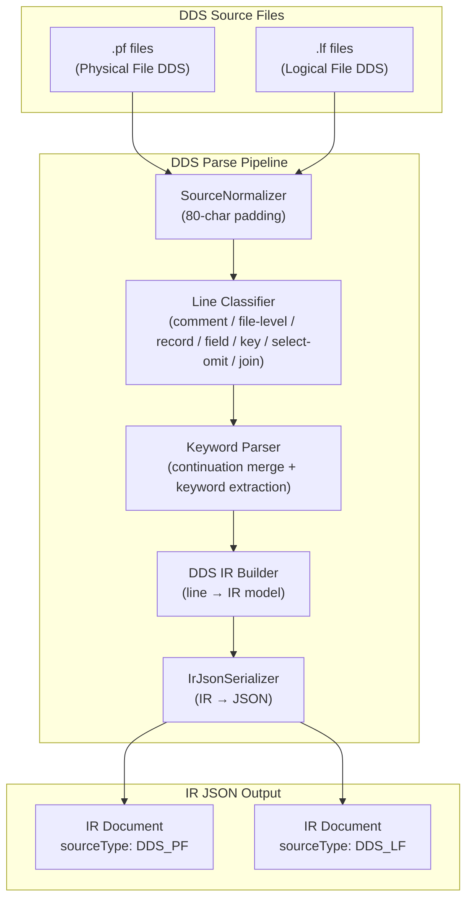
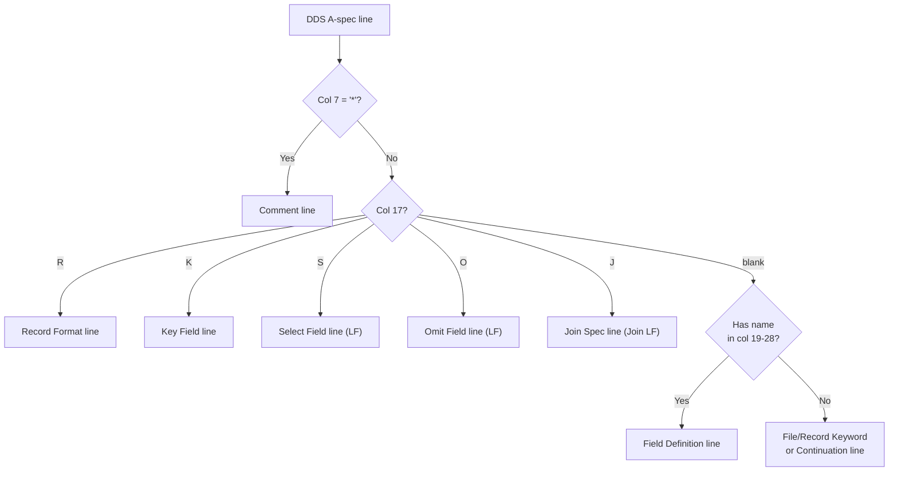
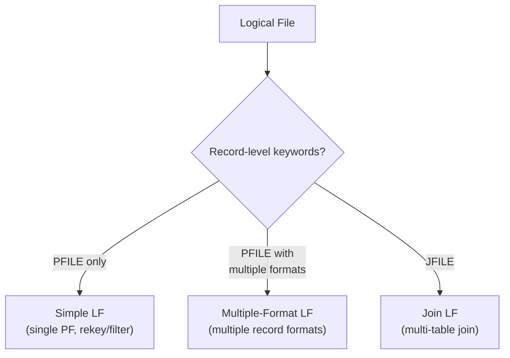
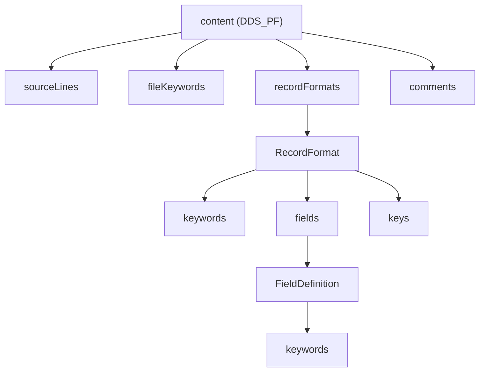
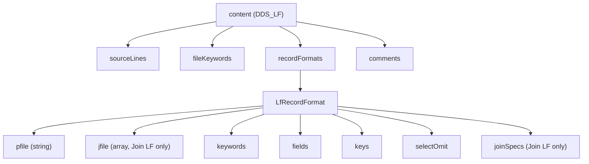

# System Design & Architecture — PF/LF DDS Parser

## Architecture Overview

The PF/LF parser plugs into the existing `As400Parser` framework, reusing the common infrastructure (normalizer, serializer, `IrDocument` model) established by the RPG3 parser. Since DDS A-spec is a simpler, more regular format than RPG3, the parser uses a **raw-line column-position approach** (same strategy as the refactored RPG3 parser) — no ANTLR grammar is needed.



### Reuse from RPG3 Parser

| Component | Reuse | Notes |
|---|---|---|
| `SourceNormalizer` | ✅ Reuse | Standard 80-char padding works for DDS |
| `IrDocument` / `Metadata` / `Location` | ✅ Reuse | Same envelope, new content type |
| `IrJsonSerializer` | ✅ Reuse | Serializes any `IrDocument` |
| `As400Parser` interface | ✅ Implement | `DdsParserFacade implements As400Parser` |
| `ParseOptions` | ✅ Reuse | Add record width option |
| ANTLR grammar | ❌ Not needed | DDS is simple enough for raw-line parsing |

---

## DDS A-Spec Column Layout

DDS uses a single specification type (`A` in column 6) with the following fixed column layout:

```
Columns  1- 5: Sequence number
Column      6: Form type (always 'A')
Column      7: Comment indicator ('*' = comment line)
Columns  8-16: Conditioning indicators (stored raw, not parsed for PF/LF)
Column     17: Name type / Entry type indicator:
                 blank = field definition
                 'R'   = record format
                 'K'   = key field
                 'S'   = select field (LF only)
                 'O'   = omit field (LF only)
                 'J'   = join specification (Join LF only)
Columns 19-28: Name (field name, record name, or key field name)
Column     29: Reference indicator ('R' = use REF/REFFLD field attributes)
Columns 30-34: Length (numeric, right-justified)
Column     35: Data type (A, S, P, B, F, H, L, T, Z, G)
Columns 36-37: Decimal positions (numeric)
Column     38: Usage (B=Both, I=Input, O=Output, N=Neither, H=Hidden, M=Message)
Columns 39-44: Location (line/position — used by DSPF, stored raw for PF/LF)
Columns 45-80: Keywords and comments
Column     80: Continuation indicator ('+' = line continues on next)
```

> [!IMPORTANT]
> **Column layout corrections from DDS reference:**
> - Column 35 is a single-column data type code (not 35-36)
> - Columns 36-37 are decimal positions
> - Column 38 is usage (primarily for DSPF but also valid in PF/LF for certain scenarios)
> - Columns 39-44 are location (line/position for DSPF; stored as raw string for PF/LF)
> - Keywords start at column 45

### Line Type Classification

Each DDS line is classified based on column 17 (name type / entry type) and context:



---

## Logical File Types

LF has three subtypes, detected by which keywords appear on the record format line:



| LF Type | Required Keywords | Entry Types Used | Description |
|---|---|---|---|
| **Simple** | `PFILE(pfname)` | R, K, S, O, blank | View on one PF with different key/filter |
| **Multiple-format** | `PFILE(pfname)` per format | R, K, S, O, blank | Multiple record formats from different PFs |
| **Join** | `JFILE(pf1 pf2 ...)` | R, J, K, blank | Join fields from multiple PFs |

---

## Data Models — IR Content Structure

### DDS Physical File Content (`DDS_PF`)



#### `content` for `DDS_PF`

| Field | Type | Description |
|---|---|---|
| `sourceLines` | `array<SourceLine>` | All raw source lines (same structure as RPG3) |
| `fileKeywords` | `array<DdsKeyword>` | File-level keywords: `UNIQUE`, `REF(file)`, `FIFO`, `LIFO`, `FCFO`, `ALTSEQ` |
| `recordFormats` | `array<RecordFormat>` | Record format definitions (PF typically has exactly 1) |
| `comments` | `array<Comment>` | Standalone comment lines |

#### `Comment`

| Field | Type | Description |
|---|---|---|
| `lineNumber` | `integer` | Source line number (1-based) |
| `text` | `string` | Comment text (after `A*`, trimmed) |

#### `RecordFormat` (PF)

| Field | Type | Description |
|---|---|---|
| `location` | `location` | Source position |
| `rawSourceLine` | `string` | Original source text |
| `conditioningIndicators` | `string` | Cols 8-16 raw string. Stored but not parsed for PF/LF |
| `name` | `string` | Record format name (e.g., `STUREC`) |
| `text` | `string` | Record text from `TEXT(...)` keyword, extracted for convenience |
| `keywords` | `array<DdsKeyword>` | Record-level keywords: `TEXT(...)`, `FORMAT(recname)` |
| `fields` | `array<FieldDefinition>` | Field definitions within this format |
| `keys` | `array<KeyDefinition>` | Key field specifications |

#### `FieldDefinition`

| Field | Type | Description |
|---|---|---|
| `location` | `location` | Source position (may span multiple lines if continuation) |
| `rawSourceLines` | `array<string>` | All source lines for this field (including continuations) |
| `conditioningIndicators` | `string` | Cols 8-16 raw string. Stored but not parsed for PF/LF |
| `name` | `string` | Field name (e.g., `STUID`) |
| `reference` | `string` | Reference indicator: `R` if using REF/REFFLD, `null` otherwise |
| `length` | `integer` | Field length (e.g., `6`). `null` if inherited via REF |
| `dataType` | `string` | DDS data type code (see Data Type table below) |
| `decimalPositions` | `integer` | Decimal positions (`null` for character/non-numeric types) |
| `usage` | `string` | Usage code: `B` (Both), `I` (Input), `O` (Output), `N` (Neither), `H` (Hidden), `M` (Message). `null` for PF (always implicitly Both) |
| `fieldLocation` | `string` | Cols 39-44 raw string. DSPF: line/position; PF/LF: comment area. `null` if blank |
| `source` | `string` | Field source: `direct`, `reference` (REF/REFFLD), or `derived` (CONCAT/SST/RENAME). Computed from col 29 + keywords |
| `keywords` | `array<DdsKeyword>` | Field-level keywords (see Core Keywords section) |

#### Data Type Codes

| Code | Type | Description |
|---|---|---|
| `A` | Character | Alphanumeric |
| `P` | Packed | Packed decimal |
| `S` | Zoned | Zoned decimal |
| `B` | Binary | Binary integer |
| `F` | Float | Floating point |
| `H` | Hex | Hexadecimal |
| `L` | Date | Date |
| `T` | Time | Time |
| `Z` | Timestamp | Timestamp |
| `G` | Graphic | DBCS graphic |

#### `KeyDefinition`

| Field | Type | Description |
|---|---|---|
| `location` | `location` | Source position |
| `rawSourceLine` | `string` | Original source text |
| `conditioningIndicators` | `string` | Cols 8-16 raw string. Stored but not parsed for PF/LF |
| `fieldName` | `string` | Key field name (e.g., `STUSCL`) |
| `sortOrder` | `string` | `ascending` (default) or `descending` (if `DESCEND` keyword) |
| `keywords` | `array<DdsKeyword>` | Key-level keywords: `DESCEND`, `SIGNED`, `UNSIGNED`, `ABSVAL`, `NOALTSEQ`, `DIGIT`, `ZONE` |

#### `DdsKeyword`

A unified representation for all DDS keywords at any level (file, record, field, key, select/omit):

| Field | Type | Description |
|---|---|---|
| `name` | `string` | Keyword name (e.g., `TEXT`, `COLHDG`, `UNIQUE`, `DFT`, `VALUES`, `PFILE`, `COMP`, `RANGE`, `CONCAT`, `SST`, `RENAME`, etc.) |
| `value` | `string` | Simple single-value: `UNIQUE` → `null`; `DFT('A')` → `"A"`; `PFILE(STUDNTPF)` → `"STUDNTPF"` |
| `values` | `array<string>` | Multi-value: `VALUES('A' 'B' 'C')` → `["A", "B", "C"]`; `COLHDG('学校' 'コード')` → `["学校", "コード"]`; `JFILE(PF1 PF2)` → `["PF1", "PF2"]`; `CONCAT(FLD1 FLD2 FLD3)` → `["FLD1", "FLD2", "FLD3"]` |
| `rawText` | `string` | Full raw keyword text for round-tripping (e.g., `TEXT('学生ID')`) |
| `comparisonOperator` | `string` | For `COMP` keyword: `EQ`, `NE`, `GT`, `GE`, `LT`, `LE`. `null` for non-COMP keywords |
| `comparisonValue` | `string` | For `COMP` keyword: the comparison value. `null` for non-COMP keywords |
| `rangeFrom` | `string` | For `RANGE` keyword: low value. `null` for non-RANGE keywords |
| `rangeTo` | `string` | For `RANGE` keyword: high value. `null` for non-RANGE keywords |

---

### DDS Logical File Content (`DDS_LF`)



#### `content` for `DDS_LF`

| Field | Type | Description |
|---|---|---|
| `sourceLines` | `array<SourceLine>` | All raw source lines |
| `fileKeywords` | `array<DdsKeyword>` | File-level keywords |
| `recordFormats` | `array<LfRecordFormat>` | Record format definitions (may have multiple for multi-format LF) |
| `comments` | `array<Comment>` | Standalone comment lines |

#### `LfRecordFormat`

| Field | Type | Description |
|---|---|---|
| `location` | `location` | Source position |
| `rawSourceLine` | `string` | Original source text |
| `conditioningIndicators` | `string` | Cols 8-16 raw string. Stored but not parsed for PF/LF |
| `name` | `string` | Record format name |
| `lfType` | `string` | LF subtype: `simple`, `multipleFormat`, or `join` |
| `pfile` | `string` | Physical file name from `PFILE(name)`. `null` for join LFs |
| `jfile` | `array<string>` | Physical file names from `JFILE(pf1 pf2 ...)`. `null` for simple/multiple LFs |
| `text` | `string` | Record text from `TEXT(...)` keyword |
| `keywords` | `array<DdsKeyword>` | Record-level keywords: `PFILE`, `JFILE`, `TEXT`, `FORMAT` |
| `fields` | `array<FieldDefinition>` | Field definitions/overrides (LFs may inherit from PF, or define derived fields via `CONCAT`/`SST`/`RENAME`) |
| `keys` | `array<KeyDefinition>` | Key fields (defines the access path) |
| `selectOmit` | `array<SelectOmitSpec>` | Select/omit criteria (simple/multiple LF only) |
| `joinSpecs` | `array<JoinSpec>` | Join specifications (join LF only) |

#### `SelectOmitSpec`

| Field | Type | Description |
|---|---|---|
| `location` | `location` | Source position |
| `rawSourceLine` | `string` | Original source text |
| `conditioningIndicators` | `string` | Cols 8-16 raw string. Stored but not parsed for PF/LF |
| `type` | `string` | `select` or `omit` (from `S` or `O` in column 17) |
| `fieldName` | `string` | Field name being tested |
| `rule` | `string` | `all` if `ALL` keyword is present (catch-all rule), `null` otherwise |
| `keywords` | `array<DdsKeyword>` | Keywords: `COMP(op 'val')`, `RANGE('lo' 'hi')`, `VALUES('v1' 'v2' ...)`, `ALL` |

#### `JoinSpec`

| Field | Type | Description |
|---|---|---|
| `location` | `location` | Source position |
| `rawSourceLine` | `string` | Original source text |
| `conditioningIndicators` | `string` | Cols 8-16 raw string. Stored but not parsed for PF/LF |
| `fromFile` | `string` | From-file in the join (first arg of `JOIN`) |
| `toFile` | `string` | To-file in the join (second arg of `JOIN`) |
| `joinFields` | `array<JoinFieldPair>` | Join field pairs from `JFLD` keywords |
| `keywords` | `array<DdsKeyword>` | Join-level keywords: `JOIN(from to)`, `JFLD(fld1 fld2)`, `JDUPSEQ`, `JDFTVAL` |

#### `JoinFieldPair`

| Field | Type | Description |
|---|---|---|
| `fromField` | `string` | Field from the "from" file |
| `toField` | `string` | Corresponding field in the "to" file |

---

### Core Keywords Reference

All keywords are captured via the unified `DdsKeyword` structure. This table lists the keywords the parser must recognize and their impact on the IR:

#### File-Level Keywords

| Keyword | Syntax | IR Impact |
|---|---|---|
| `UNIQUE` | `UNIQUE` | Marks file as having unique keys |
| `REF` | `REF(filename)` | Reference file for field attributes |
| `FIFO` | `FIFO` | First-in-first-out access |
| `LIFO` | `LIFO` | Last-in-first-out access |
| `FCFO` | `FCFO` | First-changed-first-out access |
| `ALTSEQ` | `ALTSEQ(tblname)` | Alternate collating sequence table |
| `REFACCPTH` | `REFACCPTH(filename)` | Reference file for access path (LF only) |

#### Record-Level Keywords

| Keyword | Syntax | IR Impact |
|---|---|---|
| `TEXT` | `TEXT('description')` | Record description → extracted to `RecordFormat.text` |
| `PFILE` | `PFILE(pfname)` | Based-on physical file → `LfRecordFormat.pfile` |
| `JFILE` | `JFILE(pf1 pf2 ...)` | Join physical files → `LfRecordFormat.jfile[]` |
| `FORMAT` | `FORMAT(recname)` | Use format from another file |
| `DYNSLT` | `DYNSLT` | Dynamic select/omit at runtime (LF only) |
| `TRNTBL` | `TRNTBL(tblname)` | Translation table for field (LF only) |

#### Field-Level Keywords

| Keyword | Syntax | IR Impact |
|---|---|---|
| `TEXT` | `TEXT('description')` | Field description |
| `COLHDG` | `COLHDG('hdr1' 'hdr2' ...)` | Column headings (multi-value) |
| `DFT` | `DFT('value')` or `DFT(value)` | Default value |
| `VALUES` | `VALUES('v1' 'v2' ...)` | Valid values list |
| `EDTCDE` | `EDTCDE(code)` | Edit code |
| `EDTWRD` | `EDTWRD('word')` | Edit word |
| `REFFLD` | `REFFLD(fieldname [file])` | Reference field for attributes |
| `CONCAT` | `CONCAT(fld1 fld2 ...)` | Derived: concatenation of fields (LF) |
| `SST` | `SST(fldname start length)` | Derived: substring of a field (LF) |
| `RENAME` | `RENAME(oldfldname)` | Derived: rename a field (LF) |
| `VARLEN` | `VARLEN(maxlen)` | Variable-length field |
| `CHECK` | `CHECK(code)` | Validity checking |
| `COMP` | `COMP(op value)` | Field-level comparison validation |
| `RANGE` | `RANGE(low high)` | Field-level range validation |
| `ALIAS` | `ALIAS(longname)` | Alternative long field name |
| `CCSID` | `CCSID(value [options])` | Character encoding ID |
| `ALWNULL` | `ALWNULL` | Allow NULL values (PF only) |
| `CHKMSGID` | `CHKMSGID(msgid)` | Check message ID for validity check |
| `CMP` | `CMP(op value)` | Alias for COMP — comparison validation |
| `DATFMT` | `DATFMT(*ISO)` | Date format for date fields |
| `DATSEP` | `DATSEP('-')` | Date separator character |
| `FLTPCN` | `FLTPCN(precision)` | Floating point precision |
| `REFSHIFT` | `REFSHIFT(n)` | Reference shift for DBCS fields |
| `TIMFMT` | `TIMFMT(*ISO)` | Time format for time fields |
| `TIMSEP` | `TIMSEP(':')` | Time separator character |

#### Key-Level Keywords

| Keyword | Syntax | IR Impact |
|---|---|---|
| `DESCEND` | `DESCEND` | Descending sort order → `KeyDefinition.sortOrder = "descending"` |
| `SIGNED` | `SIGNED` | Signed numeric key |
| `UNSIGNED` | `UNSIGNED` | Unsigned numeric key |
| `ABSVAL` | `ABSVAL` | Absolute value for key comparison |
| `NOALTSEQ` | `NOALTSEQ` | Ignore alternate collating sequence for this key |
| `DIGIT` | `DIGIT` | Use digit portion of each byte |
| `ZONE` | `ZONE` | Use zone portion of each byte |

#### Select/Omit Keywords

| Keyword | Syntax | IR Impact |
|---|---|---|
| `COMP` | `COMP(EQ 'A')` | Comparison test |
| `RANGE` | `RANGE('lo' 'hi')` | Range test |
| `VALUES` | `VALUES('v1' 'v2' ...)` | Values list test |
| `ALL` | `ALL` | Catch-all (select all remaining / omit all remaining) |

#### Join-Level Keywords

| Keyword | Syntax | IR Impact |
|---|---|---|
| `JOIN` | `JOIN(from to)` | Join specification between two files |
| `JFLD` | `JFLD(fld1 fld2)` | Join field pair → `JoinFieldPair` |
| `JREF` | `JREF(n)` | Join reference number (for multi-path joins) |
| `JDFTVAL` | `JDFTVAL` | Use default values for unmatched join records |
| `JDUPSEQ` | `JDUPSEQ(field [*DESCEND])` | Duplicate key sequencing |

#### Parameter Types

The keyword parser must handle these parameter value formats:

| Type | Example | Parsing |
|---|---|---|
| Number | `123` | Unquoted numeric → parse as string |
| Identifier | `FIELD1` | Unquoted alpha → field/file name |
| Qualified name | `LIB/FILE` | Unquoted with `/` → library-qualified reference |
| Special value | `*NULL`, `*DESCEND` | Starts with `*` → special value string |
| String | `'TEXT'` | Single-quoted → strip quotes |
| Hex literal | `X'F1F2'` | `X` + single-quoted → hex value, store as-is |

#### Keyword Conflict Rules

The following keyword conflicts are relevant for the IR (parser stores all keywords; consumers apply rules):

| Rule | Effect |
|---|---|
| `ABSVAL` present | Overrides `ALTSEQ` for this key |
| `SIGNED` present | Overrides `ALTSEQ` for this key |
| `ALTSEQ` present | Default is `UNSIGNED` for zoned decimal keys |

#### Select/Omit Evaluation Semantics

The parser stores select/omit rules in order. Consumers evaluate as follows:

- Evaluate rules **top to bottom** (array order)
- First matching rule is applied
- Logic between S/O entries on same field: **OR**
- Blank conditioning indicator between entries: **AND**
- If no `ALL` rule: default is **opposite** of the last explicit rule

---

### Example IR JSON Output

#### Physical File (STUDNTPF.pf)

```json
{
  "metadata": {
    "irVersion": "1.0.0",
    "sourceType": "DDS_PF",
    "sourceMember": "STUDNTPF",
    "description": "学生マスター物理ファイル",
    "totalLines": 57,
    "parseInfo": {
      "parseStatus": "complete",
      "errors": [],
      "warnings": []
    }
  },
  "content": {
    "sourceLines": [ "..." ],
    "fileKeywords": [
      { "name": "UNIQUE", "value": null, "rawText": "UNIQUE" }
    ],
    "recordFormats": [
      {
        "name": "STUREC",
        "text": "学生マスターレコード",
        "keywords": [
          { "name": "TEXT", "value": "学生マスターレコード", "rawText": "TEXT('学生マスターレコード')" }
        ],
        "fields": [
          {
            "name": "STUID",
            "length": 6,
            "dataType": "A",
            "decimalPositions": null,
            "usage": null,
            "reference": null,
            "keywords": [
              { "name": "TEXT", "value": "学生ID", "rawText": "TEXT('学生ID')" },
              { "name": "COLHDG", "values": ["学生", "ID"], "rawText": "COLHDG('学生' 'ID')" }
            ]
          },
          {
            "name": "STUBDT",
            "length": 8,
            "dataType": "S",
            "decimalPositions": 0,
            "usage": null,
            "reference": null,
            "keywords": [
              { "name": "TEXT", "value": "生年月日 YYYYMMDD", "rawText": "TEXT('生年月日 YYYYMMDD')" },
              { "name": "COLHDG", "values": ["生年", "月日"], "rawText": "COLHDG('生年' '月日')" }
            ]
          },
          {
            "name": "STUGND",
            "length": 1,
            "dataType": "A",
            "decimalPositions": null,
            "usage": null,
            "reference": null,
            "keywords": [
              { "name": "TEXT", "value": "性別 M/F", "rawText": "TEXT('性別 M/F')" },
              { "name": "COLHDG", "values": ["性別"], "rawText": "COLHDG('性別')" },
              { "name": "VALUES", "values": ["M", "F"], "rawText": "VALUES('M' 'F')" }
            ]
          },
          {
            "name": "STUSTS",
            "length": 1,
            "dataType": "A",
            "decimalPositions": null,
            "usage": null,
            "reference": null,
            "keywords": [
              { "name": "TEXT", "value": "状態 A=有効 D=削除 G=卒業", "rawText": "TEXT('状態 A=有効 D=削除 G=卒業')" },
              { "name": "COLHDG", "values": ["状態"], "rawText": "COLHDG('状態')" },
              { "name": "DFT", "value": "A", "rawText": "DFT('A')" }
            ]
          }
        ],
        "keys": [
          { "fieldName": "STUSCL", "sortOrder": "ascending", "keywords": [] },
          { "fieldName": "STUID", "sortOrder": "ascending", "keywords": [] }
        ]
      }
    ],
    "comments": [
      { "lineNumber": 1, "text": "================================================================" },
      { "lineNumber": 2, "text": " ファイル名: STUDNTPF" }
    ]
  },
  "dependencies": {
    "referencedFiles": [],
    "calledPrograms": [],
    "copyMembers": []
  }
}
```

#### Logical File with Select/Omit (STUDNTL2.lf)

```json
{
  "metadata": {
    "irVersion": "1.0.0",
    "sourceType": "DDS_LF",
    "sourceMember": "STUDNTL2",
    "description": "学生論理ファイル（学校別）",
    "totalLines": 16,
    "parseInfo": {
      "parseStatus": "complete",
      "errors": [],
      "warnings": []
    }
  },
  "content": {
    "sourceLines": [ "..." ],
    "fileKeywords": [],
    "recordFormats": [
      {
        "name": "STUREC",
        "lfType": "simple",
        "pfile": "STUDNTPF",
        "jfile": null,
        "text": null,
        "keywords": [
          { "name": "PFILE", "value": "STUDNTPF", "rawText": "PFILE(STUDNTPF)" }
        ],
        "fields": [],
        "keys": [
          { "fieldName": "STUSCL", "sortOrder": "ascending", "keywords": [] },
          { "fieldName": "STUID", "sortOrder": "ascending", "keywords": [] }
        ],
        "selectOmit": [
          {
            "type": "select",
            "fieldName": "STUSTS",
            "rule": null,
            "keywords": [
              { "name": "COMP", "comparisonOperator": "EQ", "comparisonValue": "A", "rawText": "COMP(EQ 'A')" }
            ]
          }
        ],
        "joinSpecs": null
      }
    ],
    "comments": [
      { "lineNumber": 1, "text": "================================================================" }
    ]
  },
  "dependencies": {
    "referencedFiles": [
      { "name": "STUDNTPF", "referenceType": "pfile" }
    ],
    "calledPrograms": [],
    "copyMembers": []
  }
}
```

#### Join Logical File Example

```json
{
  "metadata": {
    "irVersion": "1.0.0",
    "sourceType": "DDS_LF",
    "sourceMember": "STUCLSJF",
    "description": "Student-Class Join Logical File",
    "totalLines": 20,
    "parseInfo": { "parseStatus": "complete", "errors": [], "warnings": [] }
  },
  "content": {
    "sourceLines": ["..."],
    "fileKeywords": [],
    "recordFormats": [
      {
        "name": "JREC",
        "lfType": "join",
        "pfile": null,
        "jfile": ["STUDNTPF", "CLASSPF"],
        "text": "Student-Class Join",
        "keywords": [
          { "name": "JFILE", "values": ["STUDNTPF", "CLASSPF"], "rawText": "JFILE(STUDNTPF CLASSPF)" },
          { "name": "TEXT", "value": "Student-Class Join", "rawText": "TEXT('Student-Class Join')" }
        ],
        "fields": [
          {
            "name": "STUID", "length": 6, "dataType": "A",
            "decimalPositions": null, "usage": "I", "reference": null,
            "keywords": []
          },
          {
            "name": "CLSNAM", "length": 30, "dataType": "A",
            "decimalPositions": null, "usage": "I", "reference": null,
            "keywords": []
          }
        ],
        "keys": [
          { "fieldName": "STUID", "sortOrder": "ascending", "keywords": [] }
        ],
        "selectOmit": null,
        "joinSpecs": [
          {
            "fromFile": "STUDNTPF",
            "toFile": "CLASSPF",
            "joinFields": [
              { "fromField": "STUSCL", "toField": "CLSID" }
            ],
            "keywords": [
              { "name": "JOIN", "values": ["STUDNTPF", "CLASSPF"], "rawText": "JOIN(STUDNTPF CLASSPF)" },
              { "name": "JFLD", "values": ["STUSCL", "CLSID"], "rawText": "JFLD(STUSCL CLSID)" }
            ]
          }
        ]
      }
    ],
    "comments": []
  },
  "dependencies": {
    "referencedFiles": [
      { "name": "STUDNTPF", "referenceType": "jfile" },
      { "name": "CLASSPF", "referenceType": "jfile" }
    ],
    "calledPrograms": [],
    "copyMembers": []
  }
}
```

---

## Component Breakdown

### 1. DDS Line Classifier

**Responsibility:** Classify each normalized line into a line type based on column positions.

```java
public enum DdsLineType {
    COMMENT,           // col 7 = '*'
    BLANK,             // blank line
    FILE_KEYWORD,      // no name type, no field name, has keywords (before first R)
    RECORD_FORMAT,     // col 17 = 'R'
    FIELD_DEFINITION,  // col 17 = blank, has field name in 19-28
    KEY_FIELD,         // col 17 = 'K'
    SELECT_FIELD,      // col 17 = 'S'
    OMIT_FIELD,        // col 17 = 'O'
    JOIN_SPEC,         // col 17 = 'J'
    CONTINUATION       // no name, no name type, has keywords (continuation of previous line)
}
```

### 2. DDS Keyword Parser

**Responsibility:** Parse the keyword area (columns 45-80) and handle continuation lines.

Key capabilities:
- Parse `KEYWORD` (no arguments) — e.g., `UNIQUE`, `DESCEND`, `ALL`
- Parse `KEYWORD(value)` — e.g., `PFILE(STUDNTPF)`, `DFT('A')`
- Parse `KEYWORD('quoted value')` — e.g., `TEXT('学生ID')`
- Parse `KEYWORD('val1' 'val2' ...)` (multi-value) — e.g., `VALUES('A' 'B')`, `COLHDG('学校' 'コード')`
- Parse `KEYWORD(val1 val2 ...)` (multi-value, unquoted) — e.g., `CONCAT(FLD1 FLD2)`, `JFILE(PF1 PF2)`
- Parse `KEYWORD(OPERATOR 'value')` — e.g., `COMP(EQ 'A')`
- Parse `KEYWORD('lo' 'hi')` — e.g., `RANGE('100' '999')`
- Parse `KEYWORD(field start length)` — e.g., `SST(STUNAM 1 10)`
- Merge continuation lines (identified by `+` at col 80) into parent keyword list

```java
public class DdsKeywordParser {
    public List<DdsKeyword> parseKeywords(String keywordArea);
    public List<DdsKeyword> parseKeywordsWithContinuation(List<String> keywordLines);
}
```

### 3. DDS IR Builder

**Responsibility:** Build the IR content model from classified lines.

```java
public class DdsIrBuilder {
    public Object buildContent(List<String> normalizedLines, String sourceType);
}
```

Processing steps:
1. Classify each line (comment, field, record, key, select/omit, join, continuation)
2. Merge continuation lines with their parent
3. Parse keywords for each line
4. Group fields under record formats
5. Group keys under record formats
6. Group select/omit under record formats (LF only)
7. Group join specs under record formats (Join LF only)
8. Extract file-level keywords
9. Detect LF subtype (`simple`, `multipleFormat`, `join`) from keywords
10. Extract PFILE/JFILE from keywords into convenience fields
11. Build `sourceLines` array
12. Build `comments` array
13. Populate `dependencies.referencedFiles` from PFILE/JFILE/REF references

### 4. DDS Parser Facade

**Responsibility:** Public API entry point, implements `As400Parser`.

```java
public class DdsParserFacade implements As400Parser {
    @Override
    public IrDocument parse(Path sourceFile, ParseOptions options);

    @Override
    public IrDocument parse(String sourceText, ParseOptions options);

    @Override
    public String getSourceType(); // returns "DDS_PF" or "DDS_LF"

    @Override
    public List<String> getSupportedExtensions(); // [".pf", ".lf"]
}
```

**Pipeline execution:**
```
1. Detect sourceType from file extension (.pf → DDS_PF, .lf → DDS_LF)
2. SourceNormalizer.normalize(sourceFile)       // standard 80-char padding
3. DdsLineClassifier.classify(normalizedLines)
4. DdsKeywordParser.parseKeywords(lines)        // with continuation merge
5. DdsIrBuilder.buildContent(classifiedLines, sourceType)
6. Set metadata (sourceType, sourceMember, etc.)
7. IrJsonSerializer.serialize(irDocument)        // → JSON string
```

### 5. Model Classes (`dds/model/`)

```
parser-core/src/main/java/com/as400parser/dds/
├── DdsParserFacade.java
├── DdsIrBuilder.java
├── DdsLineClassifier.java
├── DdsKeywordParser.java
└── model/
    ├── DdsPfContent.java        # content for DDS_PF
    ├── DdsLfContent.java        # content for DDS_LF
    ├── RecordFormat.java        # PF record format
    ├── LfRecordFormat.java      # LF record format (adds pfile, jfile, selectOmit, joinSpecs, lfType)
    ├── FieldDefinition.java     # Field with name, type, length, decimal, usage, keywords
    ├── KeyDefinition.java       # Key with fieldName, sortOrder, keywords
    ├── SelectOmitSpec.java      # Select/omit with type, fieldName, rule, keywords
    ├── JoinSpec.java            # Join with fromFile, toFile, joinFields, keywords
    ├── JoinFieldPair.java       # Join field pair (fromField, toField)
    └── DdsKeyword.java          # Unified keyword with name, value, values, rawText, comparison, range
```

---

## Design Decisions

### Decision 1: Raw-Line Parsing (No ANTLR Grammar)

**Choice:** Parse DDS using column-position extraction from normalized lines, not ANTLR.
**Rationale:** DDS A-spec is a simple, regular format — every line has the same column layout. The complexity is in keyword parsing (which is essentially `KEYWORD(args)` syntax), not in grammar ambiguity. An ANTLR grammar would be overkill and add unnecessary build complexity. This mirrors the RPG3 parser's successful refactoring to raw-line parsing.

### Decision 2: Unified DDS Parser (PF + LF Together)

**Choice:** A single `DdsParserFacade` handles both PF and LF files, detecting the type from file extension and content.
**Rationale:** PF and LF share 90%+ of the parsing logic (line classification, keyword parsing, field/record extraction). The only LF-specific features are `PFILE`/`JFILE` keywords, select/omit, and join specs. Separate parsers would duplicate code.

### Decision 3: DdsKeyword as Unified Keyword Representation

**Choice:** A single `DdsKeyword` class represents all keyword types (file-level, record-level, field-level, key-level) with optional fields for different keyword patterns.
**Rationale:** DDS keywords all follow the same syntax (`NAME`, `NAME(arg)`, `NAME(arg1 arg2)`). Using a single representation simplifies the keyword parser and avoids a class explosion for each keyword type. Type-specific semantics (e.g., `COMP` operator, `RANGE` values) are captured in optional fields.

### Decision 4: Standard 80-Character Line Width

**Choice:** Use standard 80-character line width for DDS (same as RPG).
**Rationale:** DDS keywords occupy columns 45-80. Continuation is indicated by `+` at column 80. Standard SEU source members are 80 columns. No need for special line width handling — the same `SourceNormalizer` configuration works for both RPG and DDS.

### Decision 5: Nest Select/Omit and Join Under Record Format

**Choice:** Select/omit specs and join specs are nested under the record format, not at file level.
**Rationale:** In DDS, both select/omit criteria and join specifications are specific to a record format. Nesting them preserves the logical relationship and makes it easy for downstream tools to find all criteria for a given record format.

### Decision 6: Include Join LF Support

**Choice:** Support all three LF subtypes (simple, multiple-format, join) from the start.
**Rationale:** The knowledge document highlights join LFs as a distinct LF type with unique constructs (`J` entry type, `JFILE`, `JOIN`, `JFLD`). Including join support from the start avoids a partial implementation that would need significant refactoring later. The additional complexity is contained in `JoinSpec` and `JoinFieldPair` models.

### Decision 7: Derived Field Keywords

**Choice:** Capture derived field keywords (`CONCAT`, `SST`, `RENAME`) as standard `DdsKeyword` entries with `values` array.
**Rationale:** Derived fields in LFs create new fields by combining/subsetting PF fields. These are critical for understanding data transformations. Storing them as keywords is consistent with how DDS source represents them, and downstream tools can detect derived fields by checking for these keywords.

### Decision 8: Ignore Conditioning Indicators for PF/LF

**Choice:** Do not capture conditioning indicators (columns 7-16) for PF/LF scope.
**Rationale:** Conditioning indicators on DDS PF/LF lines are extremely rare in practice. They are primarily used in DSPF (display files) to conditionally show/hide fields based on runtime indicator state. For PF/LF, the parser treats columns 7-16 as opaque and does not extract indicator values. If future DSPF support requires indicators, the `FieldDefinition` model can be extended then.

---

## Non-Functional Requirements

### Performance
- DDS files are typically small (10-100 lines) — performance is not a concern
- Target: < 100ms per file

### Error Recovery
- Parse errors are collected into `parseInfo.errors[]` — parsing continues
- Each error has `line`, `column`, `message`, `severity`
- Unknown keywords are captured in `rawText` but still generate a parseable `DdsKeyword`

### Extensibility
- The keyword parser is reusable for DSPF and PRTF parsers (which also use DDS A-spec)
- Adding new keyword types requires only adding constants, not new parser logic
- The `DdsLineClassifier` handles all DDS line types including DSPF-specific ones
- `FieldDefinition.usage` field is ready for DSPF (I/O/B/H/M)
