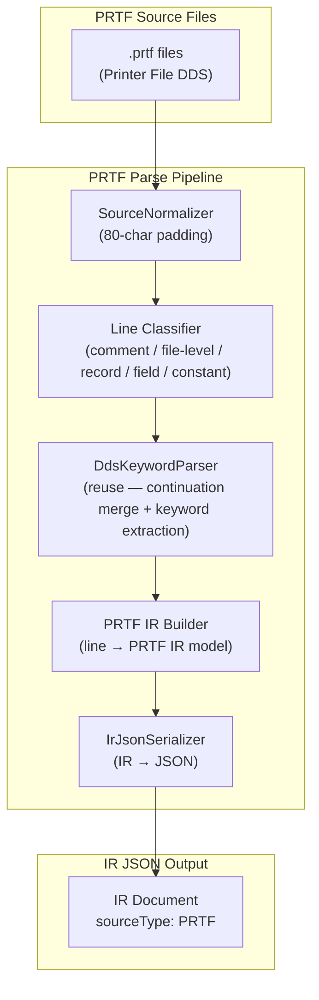
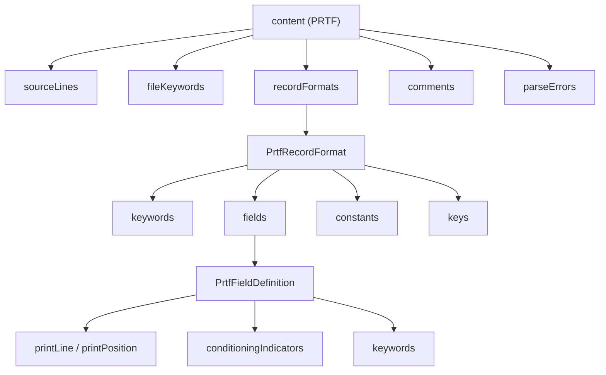

# System Design & Architecture — PRTF Parser

## Architecture Overview

The PRTF parser plugs into the existing `As400Parser` framework exactly like the DSPF parser. It reuses the common infrastructure (normalizer, serializer, keyword parser) and **reuses DSPF model classes** for fields, constants, and conditioning indicators since the column layout is identical.



### Reuse from DSPF / PF/LF Parsers

| Component | Reuse | Notes |
|---|---|---|
| `SourceNormalizer` | ✅ Reuse | Standard 80-char padding |
| `IrDocument` / `Metadata` / `Location` | ✅ Reuse | Same envelope, new content type |
| `IrJsonSerializer` | ✅ Reuse | Serializes any `IrDocument` |
| `As400Parser` interface | ✅ Implement | `PrtfParserFacade implements As400Parser` |
| `ParseOptions` | ✅ Reuse | No changes needed |
| `DdsKeywordParser` | ✅ Reuse | Same keyword syntax as PF/LF/DSPF |
| `DdsKeyword` model | ✅ Reuse | Same keyword representation |
| `ConditioningIndicator` model | ✅ Reuse | From `dspf.model` — same indicator columns |
| `ConditionedKeyword` model | ✅ Reuse | From `dspf.model` — keyword + conditioning |
| `KeyDefinition` model | ✅ Reuse | From `dds.model` — for key specs |
| `DdsComment` model | ✅ Reuse | `{lineNumber, text}` structure |
| `SourceLine` model | ✅ Reuse | Raw source line model |
| `DdsRefResolver` | ✅ Extend | Add PRTF support for REFFLD resolution |
| `PrtfContent` model | ❌ New | Top-level PRTF content container |
| `PrtfRecordFormat` model | ❌ New | PRTF record format (simpler than DSPF — no subfile types) |
| `PrtfFieldDefinition` model | ❌ New | PRTF field — similar to DSPF but no usage column, renamed screen→print coords |
| `PrtfConstant` model | ❌ New | PRTF constant — text/system keyword at print position |
| `PrtfIrBuilder` | ❌ New | Builder — simpler than DSPF (no subfile detection, no conditioned keyword merging complexity) |
| `PrtfParserFacade` | ❌ New | Facade — implements `As400Parser` |

> [!TIP]
> PRTF parsing is **simpler than DSPF** — no subfile constructs, no usage column variations (all output), no display attribute conditions. The main PRTF-specific semantics are the spacing/skipping keywords which are captured generically by `DdsKeywordParser`.

---

## DDS A-Spec Column Layout for PRTF

Same column layout as DSPF with print-specific semantics:

```
Columns  1- 5: Sequence number
Column      6: Form type (always 'A')
Column      7: Comment indicator ('*' = comment line)
Columns  8-16: Conditioning indicators (3 slots of 3 cols: 8-10, 11-13, 14-16)
Column     17: Name type:
                 blank = field/constant definition
                 'R'   = record format
                 'K'   = key field
Columns 19-28: Name (field or record format name)
Column     29: Reference indicator ('R' = use REF/REFFLD)
Columns 30-34: Length (numeric, right-justified)
Column     35: Data type (A, S, P, B, etc.)
Columns 36-37: Decimal positions
Column     38: Usage (typically blank for PRTF — output-only implied)
Columns 39-41: Print line number
Columns 42-44: Print position (horizontal column)
Columns 45-80: Keywords and comments
Column     80: Continuation indicator ('+' = line continues on next)
```

> [!IMPORTANT]
> **Key PRTF differences from DSPF:**
> - Columns 39-44 contain **print coordinates** (line/position on paper) rather than screen coordinates
> - Column 38 (Usage) is typically **blank** — PRTF fields are output-only
> - **No subfile constructs** — SFL/SFLCTL are DSPF-specific
> - **No function keys** — CAxx/CFxx are DSPF-specific
> - **No display attributes** — DSPATR is DSPF-specific
> - **Print-specific keywords**: SPACEA/SPACEB, SKIPA/SKIPB, FONT, BARCODE, OVERLAY, etc.

---

## Data Models — IR Content Structure

### PRTF Content (`PRTF`)



#### `content` for `PRTF`

| Field | Type | Description |
|---|---|---|
| `sourceLines` | `array<SourceLine>` | All raw source lines (same structure as RPG3/DDS/DSPF) |
| `fileKeywords` | `array<DdsKeyword>` | File-level keywords: `REF`, `INDARA`, etc. |
| `recordFormats` | `array<PrtfRecordFormat>` | Record format definitions |
| `comments` | `array<Comment>` | Standalone comment lines |
| `parseErrors` | `array<ParseError>` | Parse errors/warnings |

#### `PrtfRecordFormat`

| Field | Type | Description |
|---|---|---|
| `location` | `location` | Source position |
| `rawSourceLine` | `string` | Original source text |
| `conditioningIndicators` | `array<ConditioningIndicator>` | Conditioning indicators on the record format line |
| `name` | `string` | Record format name |
| `text` | `string` | Record text from `TEXT(...)` keyword |
| `keywords` | `array<DdsKeyword>` | Record-level keywords (SPACEA, SPACEB, SKIPA, SKIPB, FORCE, etc.) |
| `fields` | `array<PrtfFieldDefinition>` | Named field definitions |
| `constants` | `array<PrtfConstant>` | Constant entries (text/system keywords) |
| `keys` | `array<KeyDefinition>` | Key field specifications (rare in PRTF) |

#### `PrtfFieldDefinition`

| Field | Type | Description |
|---|---|---|
| `location` | `location` | Source position (may span multiple lines) |
| `rawSourceLines` | `array<string>` | All source lines for this field (including continuations) |
| `conditioningIndicators` | `array<ConditioningIndicator>` | Conditioning indicators on field definition line |
| `name` | `string` | Field name |
| `reference` | `string` | Reference indicator: `R` if using REF/REFFLD, `null` otherwise |
| `referenceField` | `string` | Referenced field name from REFFLD |
| `referenceFile` | `string` | Referenced file from REFFLD |
| `referenceRecordFormat` | `string` | Referenced record format from REFFLD |
| `length` | `integer` | Field length. `null` if inherited via REF |
| `dataType` | `string` | DDS data type code: `A`, `S`, `P`, etc. |
| `decimalPositions` | `integer` | Decimal positions (`null` for character types) |
| `usage` | `string` | Usage (typically `null` or `O` for PRTF) |
| `printLine` | `integer` | Print line number (cols 39-41). `null` if not specified |
| `printPosition` | `integer` | Print column position (cols 42-44). `null` if not specified |
| `source` | `string` | Field source: `direct`, `reference` (REF/REFFLD) |
| `keywords` | `array<ConditionedKeyword>` | Field-level keywords with optional conditioning indicators |

#### `PrtfConstant`

Represents unnamed print elements: **quoted literal text** (column headers, labels) or **system keyword constants** (`DATE`, `TIME`, `PAGNBR`).

| Field | Type | Description |
|---|---|---|
| `location` | `location` | Source position |
| `rawSourceLines` | `array<string>` | Original source text (may span continuation lines) |
| `conditioningIndicators` | `array<ConditioningIndicator>` | Conditioning indicators controlling output |
| `printLine` | `integer` | Print line number |
| `printPosition` | `integer` | Print column position |
| `text` | `string` | Literal text content. `null` for system keyword constants |
| `systemKeyword` | `string` | System keyword (`DATE`, `TIME`, `PAGNBR`). `null` for text constants |
| `keywords` | `array<ConditionedKeyword>` | Keywords on the constant (e.g., `EDTCDE`, `UNDERLINE`) |

#### Reused Models

- **`ConditioningIndicator`** — `{not, indicator}` from cols 8-16 (reuse from `dspf.model`)
- **`ConditionedKeyword`** — `{keyword, conditioningIndicators}` wrapper (reuse from `dspf.model`)
- **`KeyDefinition`** — Reuse from `dds.model` (rare in PRTF)

---

### PRTF Keywords Reference (IBM DDS for Printer Files)

> [!NOTE]
> The `DdsKeywordParser` captures **all** keywords generically. This list documents known PRTF keywords from the IBM i 7.2+ DDS Reference for Printer Files. No special handling is needed per keyword.

#### File-Level Keywords

| Keyword | Description |
|---|---|
| `REF(file)` | Reference file for field attributes |
| `INDARA` | Separate indicator area |
| `INDTXT(indicator 'text')` | Indicator text description |
| `CHRID(graphic-char-set coded-char-set)` | Character identifier |

#### Record-Level Keywords

| Keyword | Description |
|---|---|
| `TEXT('description')` | Record description |
| `SPACEA(n)` | Space after printing (1-255 lines) |
| `SPACEB(n)` | Space before printing (1-255 lines) |
| `SKIPA(n)` | Skip after printing to line n |
| `SKIPB(n)` | Skip before printing to line n |
| `FORCE` | Force record to print immediately |
| `CPI(n)` | Characters per inch |
| `LPI(n)` | Lines per inch |
| `FONT(font-id)` | Font identifier |
| `FONTNAME(name)` | Font name |
| `FNTCHRSET(set library)` | Font character set |
| `CDEFNT(font library)` | Coded font name |
| `PRTQLTY(*STD \| *NLQ \| *FASTDRAFT \| *DRAFT)` | Print quality |
| `DRAWER(n)` | Paper drawer |
| `OUTBIN(n)` | Output bin |
| `DUPLEX(*YES \| *NO \| *TUMBLE)` | Duplex printing |
| `PAGRTT(0 \| 90 \| 180 \| 270)` | Page rotation |
| `STAPLE` | Staple output |
| `ZFOLD` | Z-fold output |
| `ENDPAGE` | End of page |
| `STRPAGGRP(name)` | Start page group |
| `ENDPAGGRP` | End page group |
| `OVERLAY(name library)` | Page overlay |
| `INVDTAMAP(name)` | Invoke data map |
| `INVMMAP(name)` | Invoke medium map |
| `DOCIDXTAG(tag-name attribute-name value)` | Document index tag |

#### Field-Level Keywords

| Keyword | Description |
|---|---|
| `EDTCDE(code)` | Edit code for numeric formatting |
| `EDTWRD('edit-word')` | Edit word for custom numeric formatting |
| `REFFLD(field [record] [file])` | Reference field |
| `ALIAS('name')` | Alternative name |
| `DATFMT(format)` | Date format |
| `DATSEP(separator)` | Date separator |
| `TIMFMT(format)` | Time format |
| `TIMSEP(separator)` | Time separator |
| `DFT('value')` | Default value |
| `DLTEDT` | Delete edit |
| `FLTFIXDEC(n)` | Float to fixed decimal |
| `FLTPCN(*SINGLE \| *DOUBLE)` | Floating-point precision |
| `BARCODE(type height human-readable)` | Bar code |
| `CHRSIZ(w h)` | Character size multiplier |
| `COLOR(*color)` | Color |
| `HIGHLIGHT` | Highlight text |
| `UNDERLINE` | Underline text |
| `TXTRTT(0 \| 90 \| 180 \| 270)` | Text rotation |
| `POSITION(line position)` / `RELPOS(n)` | Precise positioning |
| `BLKFOLD` | Blank fold |
| `CVTDTA` | Convert data |
| `TRNSPY('hex-string')` | Transparency |
| `MSGCON(length message-id file [library])` | Message constant |
| `BOX(line-width line-height corner-radius)` | Draw box |
| `LINE(length direction line-width)` | Draw line |
| `GDF(name library)` | Graphic data file |
| `AFPRSC(name library)` | AFP resource |
| `PAGSEG(name library)` | Page segment |

#### System Keyword Constants

| Keyword | Description |
|---|---|
| `DATE` | System date (with optional `DATFMT`, `DATSEP`, `EDTCDE`) |
| `TIME` | System time (with optional `TIMFMT`, `TIMSEP`) |
| `PAGNBR` | Page number (with optional `EDTCDE`) |

---

## Design Decisions

| Decision | Rationale |
|---|---|
| Create new PRTF model classes | PRTF field semantics differ (print coords vs screen coords), cleaner separation |
| Reuse `ConditioningIndicator` / `ConditionedKeyword` from DSPF | Same indicator columns 8-16, identical structure |
| Single-pass builder (same as DSPF) | Proven pattern, same column layout |
| Extend `DdsRefResolver` for PRTF | REFFLD resolution follows same PF-first pattern |
| Name coordinates `printLine`/`printPosition` | Distinguish from DSPF's `screenLine`/`screenPosition` for clarity |
| Keep `usage` field on model | Even though PRTF rarely uses it, preserve for completeness |
