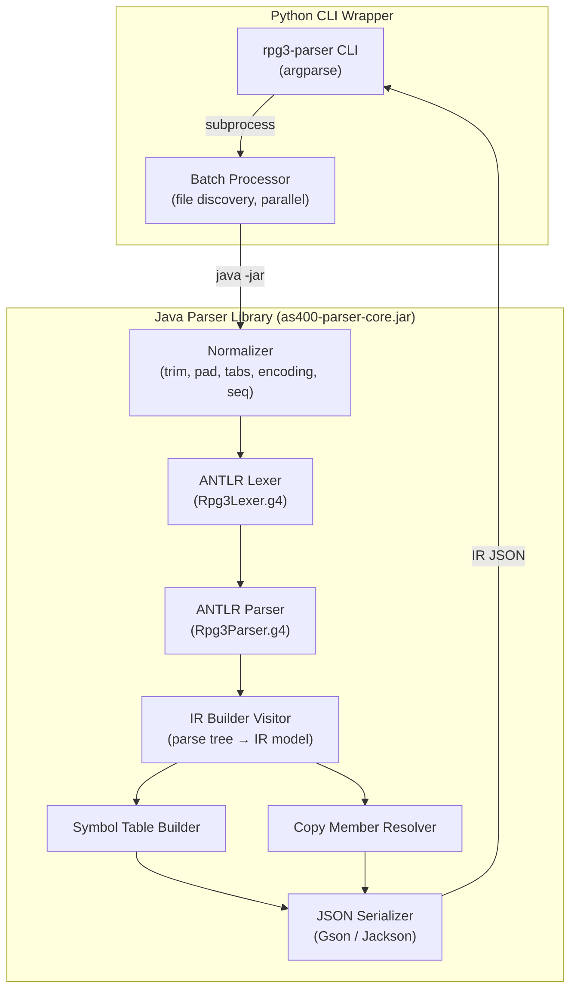
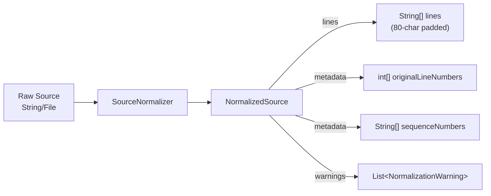
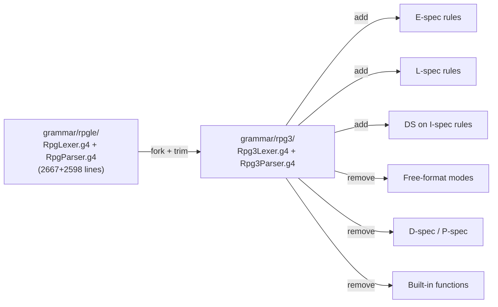
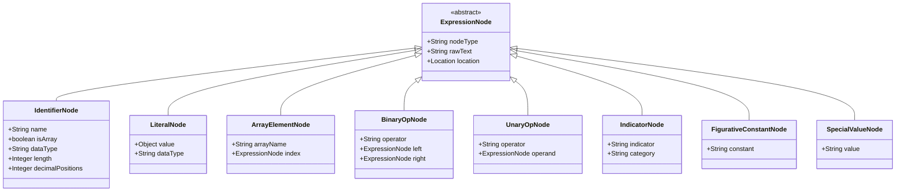
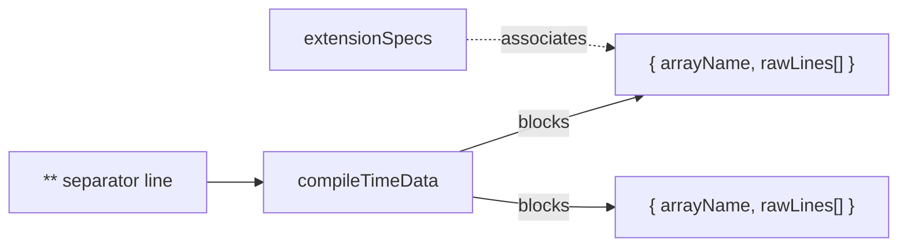
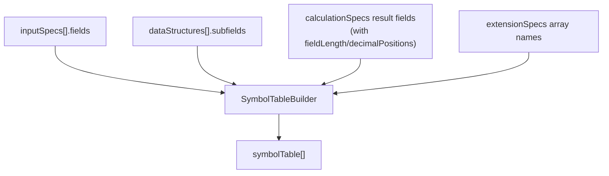
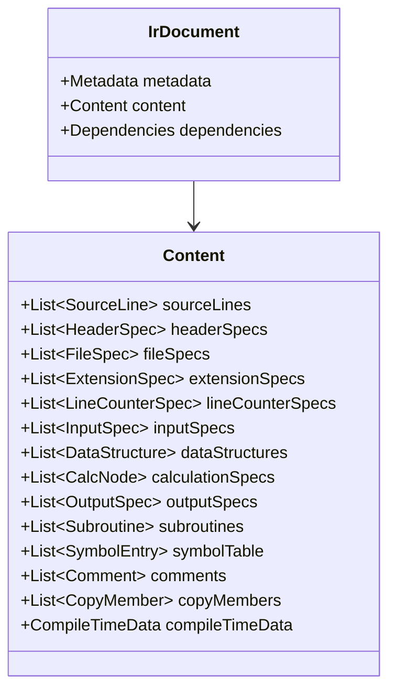

# System Design & Architecture — RPG3 Parser

## Architecture Overview



### Technology Stack

| Layer | Technology | Version |
|---|---|---|
| Grammar | ANTLR4 | 4.13+ |
| Parser Core | Java | 17+ |
| JSON Serialization | Gson or Jackson | Latest |
| Build Tool | Gradle | 8+ |
| Testing | JUnit 5 + AssertJ | Latest |
| CLI Wrapper | Python | 3.10+ |
| CLI Framework | argparse | stdlib |

---

## Project Structure

```
AS400_Parser/
├── grammar/
│   ├── rpgle/                     # Existing RPG IV/ILE grammar (reference)
│   │   ├── RpgLexer.g4
│   │   └── RpgParser.g4
│   └── rpg3/                      # [NEW] RPG3 grammar (forked from rpgle)
│       ├── Rpg3Lexer.g4
│       └── Rpg3Parser.g4
│
├── parser-core/                   # [NEW] Java library (Gradle project)
│   ├── build.gradle
│   ├── src/main/java/com/as400parser/
│   │   ├── common/                # Shared framework (reusable for DDS, CL, etc.)
│   │   │   ├── normalizer/
│   │   │   │   ├── SourceNormalizer.java
│   │   │   │   ├── NormalizedSource.java
│   │   │   │   └── NormalizationWarning.java
│   │   │   ├── model/
│   │   │   │   ├── IrDocument.java
│   │   │   │   ├── Metadata.java
│   │   │   │   ├── Location.java
│   │   │   │   ├── SourceLine.java
│   │   │   │   └── ParseError.java
│   │   │   ├── parser/
│   │   │   │   └── As400Parser.java         # Base parser interface
│   │   │   └── serializer/
│   │   │       └── IrJsonSerializer.java
│   │   │
│   │   └── rpg3/                  # RPG3-specific implementation
│   │       ├── Rpg3ParserFacade.java        # Public API entry point
│   │       ├── Rpg3IrBuilder.java           # ANTLR visitor → IR model
│   │       ├── Rpg3SymbolTableBuilder.java  # Symbol table construction
│   │       ├── Rpg3CopyResolver.java        # /COPY member resolution
│   │       └── model/
│   │           ├── HeaderSpec.java
│   │           ├── FileSpec.java
│   │           ├── ExtensionSpec.java
│   │           ├── LineCounterSpec.java
│   │           ├── InputSpec.java
│   │           ├── CalcSpec.java
│   │           ├── OutputSpec.java
│   │           ├── DataStructure.java
│   │           ├── SymbolEntry.java
│   │           ├── Subroutine.java
│   │           ├── CompileTimeData.java      # Compile-time data model
│   │           ├── ExpressionNode.java       # AST node hierarchy
│   │           └── Dependency.java
│   │
│   └── src/test/java/com/as400parser/
│       ├── common/normalizer/
│       │   └── SourceNormalizerTest.java
│       └── rpg3/
│           ├── Rpg3ParserFacadeTest.java
│           ├── Rpg3IrBuilderTest.java
│           └── Rpg3SymbolTableBuilderTest.java
│
├── cli/                           # [NEW] Python CLI wrapper
│   ├── rpg3_parser_cli.py
│   ├── requirements.txt
│   └── setup.py
│
├── example/
│   ├── ir/rpg3.json               # Sample IR JSON output
│   └── source/                    # [NEW] Sample RPG3 source files
│       └── CUSTINQ.rpg
│
└── docs/ai/
    ├── requirements/feature-rpg3-parser.md
    └── design/feature-rpg3-parser.md  ← this file
```

---

## Component Breakdown

### 1. Source Normalizer (`common/normalizer/`)

**Responsibility:** Basic text cleanup — no semantic awareness.



**Key class: `SourceNormalizer.java`**
```java
public class SourceNormalizer {
    public NormalizedSource normalize(String rawSource);
    public NormalizedSource normalize(Path sourceFile);
    public NormalizedSource normalize(Path sourceFile, Charset charset);
}
```

**Processing steps (in order):**
1. Split input by line (handle CR, LF, CRLF)
2. Expand tabs → spaces (tab stops at positions 1, 6, 7, then every 8)
3. Strip control characters (0x00–0x1F) EXCEPT shift-out `0x0E` and shift-in `0x0F` (DBCS delimiters for Japanese/CJK). Preserve all printable characters including multi-byte (Japanese, CJK).
4. For each line: strip trailing whitespace, then right-pad to 80 chars
   - **DBCS-aware:** Each DBCS character (between SO/SI delimiters) occupies 2 column positions. Padding must account for this.
5. Extract cols 1–5 as sequence number, replace with spaces
6. Track original line number mapping (1-based)

**Encoding support:**
- EBCDIC CCSID 930/5035 (Japanese DBCS)
- Shift-JIS, EUC-JP
- UTF-8 (default)
- Configurable via `ParseOptions.charset`

---

### 2. ANTLR Grammar (`grammar/rpg3/`)

**Responsibility:** Tokenize and parse normalized RPG3 source into a parse tree.

#### Fork Strategy



#### Lexer Modes (Rpg3Lexer.g4)

| Mode | Source | Columns | Status |
|---|---|---|---|
| `Selector` | Form type detection | Col 6 | Reuse from RPGLE |
| `FIXED_CalcSpec` | C-spec tokenization | 7–74 | Reuse from RPGLE |
| `FIXED_InputSpec` | I-spec records + fields | 7–74 | Reuse from RPGLE |
| `FIXED_FileSpec` | F-spec file declarations | 7–74 | Reuse from RPGLE |
| `FIXED_OutputSpec` | O-spec records + fields | 7–74 | Reuse from RPGLE |
| `HeaderSpecMode` | H-spec options | 7–74 | Reuse from RPGLE |
| `FIXED_CommentMode` | Comment lines | 7–80 | Reuse from RPGLE |
| `IndicatorMode` | Indicator parsing | various | Reuse from RPGLE |
| `FIXED_ExtensionSpec` | E-spec arrays/tables | 7–74 | **NEW** |
| `FIXED_LineCounterSpec` | L-spec line counter | 7–74 | **NEW** |
| `EndOfSourceMode` | `**` compile-time data | all | Reuse from RPGLE |

#### Parser Rules (Rpg3Parser.g4)

Top-level rule:
```antlr
rpg3Program
    : (headerSpec | fileSpec | extensionSpec | lineCounterSpec
       | inputSpec | calculationSpec | outputSpec
       | commentLine | directive | blankLine)*
      compileTimeData?
      EOF
    ;
```

---

### 3. IR Builder Visitor (`rpg3/Rpg3IrBuilder.java`)

**Responsibility:** Walk ANTLR parse tree and construct the IR data model.

Implements `Rpg3ParserBaseVisitor<Void>` with visit methods per spec type:

| Visitor Method | Builds |
|---|---|
| `visitHeaderSpec` | `headerSpecs[]` |
| `visitFileSpec` | `fileSpecs[]` + `dependencies.files[]` |
| `visitExtensionSpec` | `extensionSpecs[]` |
| `visitLineCounterSpec` | `lineCounterSpecs[]` |
| `visitInputSpec` | `inputSpecs[]` + `dataStructures[]` |
| `visitCalcSpec` / `visitBlock` | `calculationSpecs[]` (with `nodeType`: `operation`, `conditionalBlock`, `doWhileBlock`, `doUntilBlock`, `doBlock`, `caseBlock`, `subroutineBlock`, `labelNode`, `gotoNode`, `callSubroutine`) |
| `visitOutputSpec` | `outputSpecs[]` |
| `visitSubroutine` | `subroutines[]` (convenience index, includes `calledFrom` cross-references) |
| `visitDirective` | `copyMembers[]` + `dependencies.copyMembers[]` |
| `visitCompileTimeData` | `compileTimeData` (raw text blocks keyed by array name) |

#### Expression AST Construction

For C-spec factors (factor1, factor2, resultField), the visitor builds expression AST nodes:



> **Note on `OperationNode` removal:** The previous `OperationNode` (with opcode/factor1/factor2/resultField) was incorrectly placed in the expression hierarchy — it described a C-spec operation, not a sub-expression. C-spec operations are represented as `operation` nodes in `calculationSpecs`, not as expression AST nodes. The new `BinaryOpNode` and `UnaryOpNode` cover compound expression scenarios.

---

### 3.1. Compile-Time Data (`compileTimeData`)

**Responsibility:** Capture the raw text data that follows a `**` line at the end of RPG3 source. This data populates arrays/tables defined in E-specs.

**Design decision:** Compile-time data is preserved as **raw text blocks** keyed by associated array/table name. The parser does **not** parse the data into structured arrays — that is a downstream concern. This keeps the parser simple and avoids encoding assumptions.



**IR section: `content.compileTimeData`**

| Field | Type | Description |
|---|---|---|
| `startLine` | `integer` | Line number of the `**` separator |
| `blocks` | `array<object>` | Ordered array of data blocks |

Each block:

| Field | Type | Description |
|---|---|---|
| `arrayName` | `string` | Associated E-spec array/table name (matched by order of E-spec definitions with compile-time data) |
| `rawLines` | `array<string>` | Raw text lines of the compile-time data |
| `location` | `location` | Source position of this data block |

**Association rule:** Compile-time data blocks are associated with E-spec arrays in the order the E-specs appear in the source. The first block after `**` maps to the first E-spec that specifies compile-time data (no `fromFileName`), the second block maps to the second such E-spec, etc.

---

### 4. Symbol Table Builder (`rpg3/Rpg3SymbolTableBuilder.java`)

**Responsibility:** Collect all field declarations from I-specs, E-specs, C-spec result fields, and DS subfields into a unified `symbolTable[]`.

**Runs as a second pass** after the IR Builder has populated the spec arrays:



Each symbol entry contains:
- `name`, `dataType` (AS400 code: A/S/P/B/D/T/Z/G/O), `length`, `decimalPositions`
- `definedIn` (source: `inputField`, `dataStructure`, `resultField`, `extensionSpec`)
- `definedAtLine` (original source line)
- `isDataStructure`, `dataStructureName` (if subfield)

**Conflict resolution:** If a field appears in multiple places (e.g., I-spec and C-spec result), the I-spec definition wins (it has explicit type info). C-spec result fields only create entries if not already defined.

**Subroutine `calledFrom` population:** During the visitor pass, the builder collects all `EXSR` operations. After subroutine blocks are built, each subroutine's `calledFrom` field is populated with the `location` of every `EXSR` that references it by name.

---

### 5. Copy Member Resolver (`rpg3/Rpg3CopyResolver.java`)

**Responsibility:** Resolve `/COPY` directives to actual source files.

```java
public class Rpg3CopyResolver {
    public Rpg3CopyResolver(List<Path> copyPaths, Path sourceRoot);
    public ResolvedCopy resolve(String directive);  // e.g., "QCPYSRC,COPYMBR"
}
```

**`ResolvedCopy` return type:**
```java
public class ResolvedCopy {
    private boolean found;              // whether the member was located
    private Path resolvedPath;          // absolute path to the resolved member file (null if not found)
    private String content;             // full text content of the member (null if not found)
    private String memberName;          // parsed member name
    private String fileName;            // parsed file name (e.g., QCPYSRC)
    private String libraryName;         // parsed library name (null if not specified)
    private String qualifiedPath;       // fully qualified: "LIB/FILE,MEMBER"
    private NormalizationWarning warning; // warning if not found or ambiguous
}
```

**Search order** (per requirements):
1. Parse directive → extract `file` and `member` (or `lib/file/member`)
2. Search `--copy-path` entries left-to-right for `MEMBER.{rpg,rpg3,mbr,""}`
3. Return `ResolvedCopy` — if not found, `found=false` with a warning

---

### 6. JSON Serializer (`common/serializer/`)

**Responsibility:** Serialize the `IrDocument` model to JSON conforming to the IR schema.

Uses Gson or Jackson with:
- Null inclusion: `null` fields included (per IR convention: `null` = N/A)
- Empty strings: preserved as `""` (per IR convention: blank)
- Indented output for readability

---

### 7. Parser Facade (`rpg3/Rpg3ParserFacade.java`)

**Responsibility:** Public API entry point. Orchestrates the full pipeline.

```java
public class Rpg3ParserFacade {
    // Core parsing
    public IrDocument parse(String sourceText);
    public IrDocument parse(Path sourceFile);

    // With options
    public IrDocument parse(Path sourceFile, ParseOptions options);

    // Batch
    public List<IrDocument> parseBatch(List<Path> sourceFiles, ParseOptions options);
}

public class ParseOptions {
    private List<Path> copyPaths;     // /COPY search paths
    private Path sourceRoot;          // root for LIB/FILE/MEMBER resolution
    private boolean resolveCopies;    // enable /COPY resolution
    private Charset charset;          // default: UTF-8
}
```

**Pipeline execution:**
```
1. SourceNormalizer.normalize(sourceFile)
2. Rpg3Lexer → token stream
3. Rpg3Parser → parse tree
4. Rpg3IrBuilder.visit(tree) → IrDocument (partial)
5. Rpg3CopyResolver.resolve() → populate copyMembers
6. Rpg3SymbolTableBuilder.build() → populate symbolTable
7. IrJsonSerializer.serialize(irDocument) → JSON string
```

---

### 8. Python CLI Wrapper (`cli/`)

**Responsibility:** User-facing CLI that invokes the Java library.

```bash
# Single file
rpg3-parser parse source/CUSTINQ.rpg -o output/CUSTINQ.json

# Batch
rpg3-parser batch source/ -o output/ --copy-path lib/QCPYSRC:lib/QRPGSRC

# Validate IR output
rpg3-parser validate output/CUSTINQ.json
```

Implemented as Python calling `java -jar parser-core.jar` via subprocess.

---

## Data Models

### IR Document Model — Schema Contract

> [!CAUTION]
> The IR JSON output **must strictly conform** to the schema defined in [feature-ir-json-template.md](file:///d:/Code/AS400_Parser/docs/ai/design/feature-ir-json-template.md) and the reference sample [rpg3.json](file:///d:/Code/AS400_Parser/example/ir/rpg3.json). This is a non-negotiable contract:
>
> - **Field names, nesting, and structure** must match the template exactly
> - **Null conventions:** `null` = N/A, `""` = blank, `0` = zero
> - **Data types** must use native AS400 codes: `A`, `S`, `P`, `B`, `D`, `T`, `Z`, `G`, `O`
> - **`nodeType`** must be present on all C-spec AST nodes
> - **`symbolTable`**, **`dataStructures`**, **`subroutines`** sections are mandatory
> - **`identifier`** expression nodes must carry resolved `dataType`, `length`, `decimalPositions`
> - Any deviation from the template requires explicit design approval

All Java model classes (`IrDocument`, `Content`, `Metadata`, spec classes, expression AST nodes) are direct 1:1 mappings of the template's JSON structure. The JSON serializer must produce output indistinguishable from the template.



---

## Design Decisions

### Decision 1: Normalizer in Java (not Python)

**Choice:** Build the normalizer as a Java class inside the parser library, not as a separate Python stage.
**Rationale:** Eliminates inter-language communication overhead. The normalizer is simple text processing — no benefit from Python. Keeps the entire parse pipeline in one JVM call.

### Decision 2: Visitor Pattern (not Listener)

**Choice:** Use ANTLR `BaseVisitor` with explicit return types, not `BaseListener`.
**Rationale:** Visitors allow controlled tree traversal and can return computed values. Better for building a structured IR model where child results feed into parent construction. Listeners are better for side-effect processing.

### Decision 3: Two-Pass IR Construction

**Choice:** Build specs in pass 1 (visitor), then build `symbolTable` in pass 2.
**Rationale:** Symbol table entries need cross-referencing across multiple spec types (I-spec fields, DS subfields, C-spec result fields, E-spec arrays). A single pass would require complex forward-reference handling.

### Decision 4: Grammar Fork (not Grammar Extension)

**Choice:** Fork the RPGLE grammar files into separate `Rpg3Lexer.g4` / `Rpg3Parser.g4` rather than extending or importing.
**Rationale:** RPG3 is a subset of RPG IV, but the grammar diverges significantly (no free-format, no D-spec, different spec types). A clean fork is easier to maintain than conditional grammar rules. The grammars will evolve independently.

### Decision 5: Gradle Build

**Choice:** Use Gradle with the ANTLR plugin for grammar compilation and Java build.
**Rationale:** The ANTLR Gradle plugin auto-generates Java sources from `.g4` files. Single `gradle build` produces the fat JAR. Standard Java ecosystem tooling.

---

## Non-Functional Requirements

### Performance
- Target: < 1 second for 1000-line source
- JVM warm-up: first parse may be slower; batch mode amortizes startup
- ANTLR `SLL` prediction mode (fast path) before falling back to `LL`

### Error Recovery
- Use ANTLR's `DefaultErrorStrategy` with custom error messages
- Parse errors are collected into `IrDocument.errors[]` — parsing continues
- Each error has: `severity` (ERROR/WARNING), `message`, `location` (original line/col)

### Extensibility
- `As400Parser` interface allows new parsers (DDS, CL) to plug into the same framework
- `SourceNormalizer` is configurable (tab stops, line width) for different source types
- `IrDocument` model is shared — all parsers produce the same envelope structure

### Security
- No external network calls
- Source files read-only
- No eval/exec of source content
