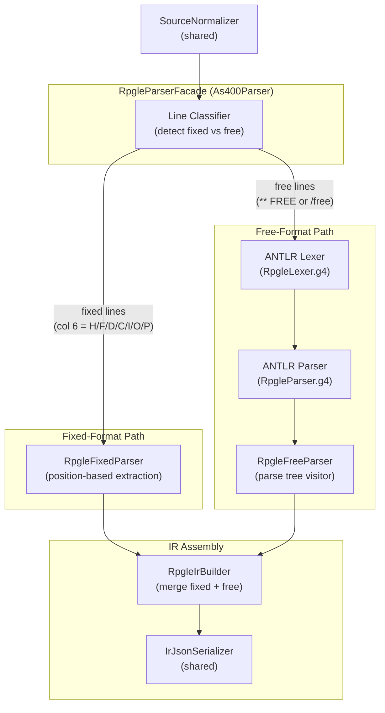
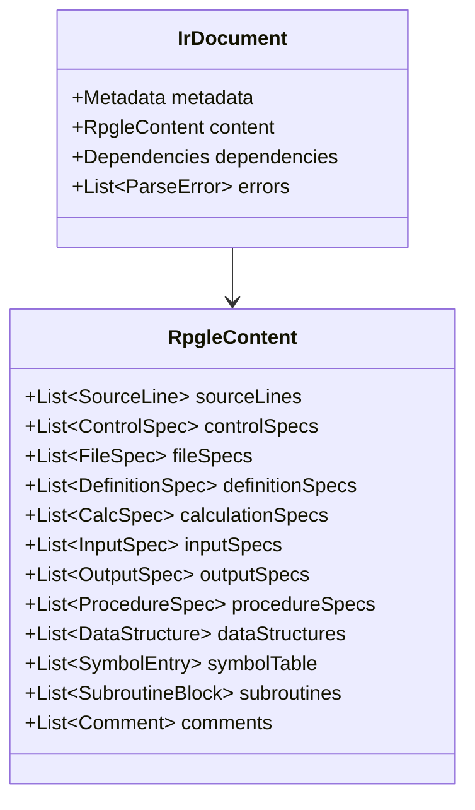

# System Design & Architecture — RPGLE Parser

## Architecture Overview



### Technology Stack

| Layer | Technology | Version |
|---|---|---|
| Fixed Parser | Java position-based | Column extraction per rpgle-fixed-doc.json |
| Free Parser | ANTLR4 | Existing RpgleLexer.g4 + RpgleParser.g4 |
| Parser Core | Java | 17+ |
| JSON Serialization | Gson | Latest |
| Build Tool | Gradle | 8+ |
| Testing | JUnit 5 + AssertJ | Latest |

---

## Project Structure (new/modified files)

```
parser-core/src/main/java/com/as400parser/rpgle/
├── RpgleParserFacade.java         # Public API entry point (As400Parser impl)
├── RpgleFixedParser.java          # Fixed-format position-based parser
├── RpgleFreeParser.java           # Free-format ANTLR-based parser
├── RpgleIrBuilder.java            # IR assembly from parsed specs
└── model/
    ├── RpgleContent.java          # RPGLE IR content (all spec arrays)
    ├── ControlSpec.java           # H-spec model (header/control)
    ├── FileSpec.java              # F-spec model (file declarations)
    ├── DefinitionSpec.java        # D-spec model (definitions)
    ├── CalcSpec.java              # C-spec model (calculations)
    ├── InputSpec.java             # I-spec model (input)
    ├── OutputSpec.java            # O-spec model (output)
    ├── ProcedureSpec.java         # P-spec model (procedure boundary)
    └── FreeFormatStatement.java   # Free-format statement model
```

---

## Component Breakdown

### 1. RpgleParserFacade (`rpgle/RpgleParserFacade.java`)

**Responsibility:** Public API entry point implementing `As400Parser`. Orchestrates the full pipeline.

```java
public class RpgleParserFacade implements As400Parser {
    IrDocument parse(Path sourceFile, ParseOptions options);
    IrDocument parse(String sourceText, ParseOptions options);
    String getSourceType(); // "RPGLE"
    List<String> getSupportedExtensions(); // .rpgle, .sqlrpgle, .rpgleinc
}
```

**Pipeline execution:**
1. `SourceNormalizer.normalize(source)` — shared normalizer
2. Classify lines as fixed or free format
3. `RpgleFixedParser.parse(fixedLines)` — position-based extraction
4. `RpgleFreeParser.parse(freeLines)` — ANTLR-based parsing
5. `RpgleIrBuilder.build(fixedResult, freeResult)` — merge into IrDocument
6. Copy resolution (if enabled)
7. Populate metadata

---

### 2. RpgleFixedParser (`rpgle/RpgleFixedParser.java`)

**Responsibility:** Parse fixed-format RPGLE lines using column-position extraction. Same approach as `Rpg3IrBuilder` but with RPGLE-specific spec types.

**Spec types handled:**

| Spec | Col 6 | Key Positions | Model Class |
|------|-------|---------------|-------------|
| H-spec | 'H' | cols 7-80 keywords | `ControlSpec` |
| F-spec | 'F' | cols 7-16 filename, 17 type, 22 format, 36-42 device, 44-80 keywords | `FileSpec` |
| D-spec | 'D' | cols 7-21 name, 24-25 type (DS/S/C/PR/PI), 26-32 from, 33-39 to, 40 datatype, 44-80 keywords | `DefinitionSpec` |
| C-spec | 'C' | cols 7-8 level, 9-11 indicators, 12-25 factor1, 26-35 opcode, 36-49 factor2, 50-63 result, 71-76 resulting indicators | `CalcSpec` |
| I-spec | 'I' | Same as RPG3 | `InputSpec` |
| O-spec | 'O' | Same as RPG3 | `OutputSpec` |
| P-spec | 'P' | cols 7-21 name, 24 begin/end (B/E), 44-80 keywords | `ProcedureSpec` |

**D-spec type detection (cols 24-25):**
- `DS` → Data structure
- `S ` → Standalone field
- `C ` → Named constant
- `PR` → Prototype
- `PI` → Procedure interface
- `  ` → Data structure subfield

**Column positions follow `rpgle-fixed-doc.json` (1-based).**

---

### 3. RpgleFreeParser (`rpgle/RpgleFreeParser.java`)

**Responsibility:** Parse free-format RPGLE using the existing ANTLR4 grammar.

**Key free-format constructs:**
- `CTL-OPT` — Control options
- `DCL-F` — File declaration
- `DCL-S` — Standalone field
- `DCL-DS ... END-DS` — Data structure
- `DCL-C` — Named constant
- `DCL-PR ... END-PR` — Prototype
- `DCL-PI ... END-PI` — Procedure interface
- `DCL-PROC ... END-PROC` — Procedure
- `IF / ELSEIF / ELSE / ENDIF`
- `DOW / DOU / ENDDO`
- `FOR / ENDFOR`
- `SELECT / WHEN / OTHER / ENDSL`
- `MONITOR / ON-ERROR / ENDMON`
- `EVAL / EVALR / EVAL-CORR`
- `CALLP` — Procedure call
- All RPG3 opcodes that carry forward

**Implementation:** Uses ANTLR visitor pattern on parse tree from existing grammar.

---

### 4. RpgleIrBuilder (`rpgle/RpgleIrBuilder.java`)

**Responsibility:** Assemble final `IrDocument` from fixed and free parser outputs. Key tasks:

1. **Merge specs** — Combine fixed-format and free-format specs in source order
2. **Build symbol table** — Collect all field definitions from D-specs, I-specs, C-spec results
3. **Extract dependencies** — `/COPY`, `/INCLUDE`, `CALL`, `CALLP`, `CALLB`, file references
4. **Build subroutines** — Extract `BEGSR`/`ENDSR` blocks, populate `calledFrom`
5. **Build procedures** — Extract `P-spec B`/`P-spec E` blocks
6. **Populate source lines** — Line-by-line source with metadata

---

### 5. Model Classes

#### RpgleContent (`model/RpgleContent.java`)

Top-level content matching RPG3 structure:

```java
public class RpgleContent {
    List<SourceLine> sourceLines;
    List<ControlSpec> controlSpecs;       // H-specs (replaces headerSpecs)
    List<FileSpec> fileSpecs;             // F-specs
    List<DefinitionSpec> definitionSpecs;  // D-specs
    List<Object> calculationSpecs;        // C-specs + control flow blocks
    List<InputSpec> inputSpecs;           // I-specs
    List<OutputSpec> outputSpecs;         // O-specs
    List<ProcedureSpec> procedureSpecs;   // P-specs
    List<DataStructure> dataStructures;   // From D-spec DS
    List<SymbolEntry> symbolTable;
    List<SubroutineBlock> subroutines;
    List<Comment> comments;
    List<FreeFormatStatement> freeFormatStatements; // Free-format ops
}
```

#### ControlSpec (`model/ControlSpec.java`)
RPGLE H-spec with keyword area. Unlike RPG3, RPGLE H-specs use keywords instead of fixed columns.

#### FileSpec (`model/FileSpec.java`)
RPGLE F-spec. Same fixed columns as RPG3 F-spec plus keyword area (cols 44-80) for keywords like RENAME, SFILE, USROPN, etc.

#### DefinitionSpec (`model/DefinitionSpec.java`)
RPGLE D-spec — the major addition versus RPG3. Represents standalone fields, data structures, constants, prototypes, and procedure interfaces.

#### CalcSpec (`model/CalcSpec.java`)
RPGLE C-spec. Superset of RPG3 C-spec with additional opcodes (EVAL, EVALR, CALLP, FOR, MONITOR, etc.) and extended factor 2 (free-form expressions in cols 36-80).

#### ProcedureSpec (`model/ProcedureSpec.java`)
RPGLE P-spec — procedure boundary markers (Begin/End).

#### FreeFormatStatement (`model/FreeFormatStatement.java`)
Represents a free-format statement parsed by ANTLR. Includes operation type, operands, and nested structure for block statements.

---

## Design Decisions

### Decision 1: Dual Parser Strategy (Fixed + Free)

**Choice:** Use position-based extraction for fixed-format lines and ANTLR for free-format lines.
**Rationale:** Fixed-format is column-positional (identical approach as RPG3). Free-format uses complex syntax (expressions, keywords, nested blocks) that requires a grammar. The dual approach leverages existing code patterns.

### Decision 2: Line Classification First

**Choice:** Classify each line as fixed/free before parsing, then dispatch to appropriate parser.
**Rationale:** RPGLE source can mix styles. A `**FREE` directive at line 1 indicates fully free. Otherwise, lines with col 6 filled are fixed, and `/free`...`/end-free` blocks (deprecated) contain free-format code.

### Decision 3: Same IR Structure as RPG3

**Choice:** Output the same `IrDocument` envelope and content structure as RPG3Parser.
**Rationale:** Downstream tools (code generators, analyzers) should not need to distinguish between RPG3 and RPGLE IR documents. The IR is a universal representation.

### Decision 4: Reuse ANTLR Grammar As-Is

**Choice:** Use the existing `RpgleLexer.g4` / `RpgleParser.g4` without modification.
**Rationale:** The grammar is comprehensive (105KB + 64KB). Modifying it risks breaking existing behavior. The free parser wraps the grammar's parse tree into our IR model.

### Decision 5: Shared Model Where Possible

**Choice:** Reuse RPG3 model classes for I-spec, O-spec, and expression AST nodes where column layouts are identical.
**Rationale:** RPG3 and RPGLE I/O specs are identical. Expression AST nodes (identifier, literal, binary, etc.) are reusable.

---

## Data Models

### IR Document Model — Schema Contract

> [!CAUTION]
> The IR JSON output **must strictly conform** to the same structure as RPG3Parser output. The `IrDocument` envelope (metadata, content, dependencies, errors) is shared. Content sections use the same field naming conventions.



---

## Non-Functional Requirements

### Performance
- Target: < 1 second for 1000-line source
- ANTLR `SLL` prediction mode (fast path) before falling back to `LL`

### Error Recovery
- ANTLR's `DefaultErrorStrategy` with custom error messages
- Parse errors collected into `IrDocument.errors[]` — parsing continues
- Each error has: `severity`, `message`, `location` (original line/col)

### Extensibility
- `As400Parser` interface for CLI integration
- Shared `SourceNormalizer` and `IrJsonSerializer`
- Model classes designed for IR schema compliance
