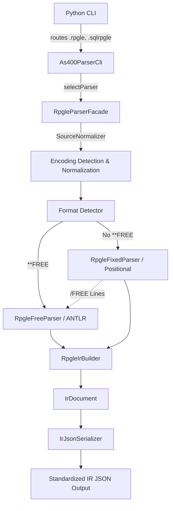

# System Design & Architecture

## Architecture Overview
**What is the high-level system structure?**

- **Common Framework Integration:**
  - `RpgleParserFacade` implements `As400Parser` interface (from `com.as400parser.common.parser`).
  - Uses `SourceNormalizer` for encoding detection (from `com.as400parser.common.normalizer`).
  - Returns `IrDocument` with `Metadata`, `Dependencies`, `ParseError` (from `com.as400parser.common.model`).
  - Registered in `As400ParserCli.PARSERS` list for auto-dispatch by file extension.
  - JSON output produced by `IrJsonSerializer` (from `com.as400parser.common.serializer`).

- **Format Detection & Routing:**
  - **Fixed Format:** Does not use ANTLR. Parses strictly by column position exactly like the RPG3 parser.
  - **Free Format:** Processed exclusively via the existing ANTLR grammar (`grammar/rpgle/RpgLexer.g4` and `RpgParser.g4`).
  - **Mixed Fixed and Free:** Handled line-by-line. If a line is identified as free-format (inside a `/FREE` block), it is routed to ANTLR. Fixed lines evaluate using strict column positions.
- **IR JSON Builder:** Translates the syntax constructs into `IrDocument` using the common model framework.

## Data Models
**What data do we need to manage?**

- **Common Models (reused from `com.as400parser.common.model`):**
  - `IrDocument` — top-level parse result (content, metadata, dependencies, errors).
  - `Metadata` + `Metadata.ParseInfo` — source type, member, library, parse status, encoding.
  - `IrDocument.Dependencies` — referenced files, called programs, copy members.
  - `IrDocument.DependencyRef` — individual dependency with name, type, locations.
  - `IrDocument.CopyMemberRef` — `/COPY` and `/INCLUDE` directive references.
  - `ParseError` — error/warning entries with severity.
  - `Location` — line/column tracking.

- **RPGLE-Specific Content Model (`com.as400parser.rpgle.model`):**
  - `RpgleContent` — language-specific content set on `IrDocument.setContent()`.
  - **Control Specs (H):** Mapped to `programMetadata`.
  - **File Description Specs (F):** Mapped to `files`.
  - **Definition Specs (D):** Mapped to `variables` (Standalone, Data Structures, Constants, Prototypes).
  - **Input Specs (I):** Mapped to `recordIdentifications`.
  - **Calculation Specs (C):** Mapped to `calculations` (supporting Operations and Built-In Functions).
  - **Output Specs (O):** Mapped to `outputs`.
  - **Procedure Specs (P):** Mapped to `procedures`.

## API Design
**How do components communicate?**
- **Interface:** `RpgleParserFacade` implements `As400Parser` with two `parse()` overloads:
  - `IrDocument parse(Path sourceFile, ParseOptions options)` — file-based, uses `SourceNormalizer` for encoding.
  - `IrDocument parse(String sourceText, ParseOptions options)` — string-based, for testing/programmatic use.
- **Registration:** `getSourceType()` → `"RPGLE"`, `getSupportedExtensions()` → `[".rpgle", ".sqlrpgle"]`.
- **Output:** Returns `IrDocument` with `null` for missing values, `""` for intentionally blank fields.
- **Pipeline (following `ClParserFacade` pattern):**
  1. Normalize source via `SourceNormalizer`.
  2. Detect format (`**FREE` vs fixed/mixed).
  3. Parse via appropriate engine.
  4. Build `RpgleContent` model.
  5. Extract dependencies into `IrDocument.Dependencies`.
  6. Populate `Metadata` with parse info.
  7. Return fully populated `IrDocument`.

## Component Breakdown
**What are the major building blocks?**
1. `as400_parser_cli.py`: Python CLI — updated extensions routing.
2. `As400ParserCli.java`: Java CLI entry point — register `RpgleParserFacade` in `PARSERS`.
3. `RpgleParserFacade.java`: Core facade implementing `As400Parser`.
4. `RpgleFixedParser.java`: Positional column parser for fixed-format specs.
5. `RpgleFreeParser.java`: ANTLR-based parser for free-format code.
6. `RpgleIrBuilder.java`: Builds `IrDocument` from parsed spec data.
7. `com.as400parser.rpgle.model.*`: RPGLE-specific content models.

## Design Decisions
- **Unified Interface:** We implement `As400Parser` to fit seamlessly with the existing multi-language framework. The facade follows the same pipeline pattern established by `ClParserFacade`.
- **Common Framework Reuse:** All common infrastructure (`IrDocument`, `Metadata`, `SourceNormalizer`, `IrJsonSerializer`, `ParseOptions`, `ParseError`, `Location`) is reused — no duplication.
- **Format Detection First:** This approach enables completely separated parsing models since fixed and totally free (`**FREE`) formats are fundamentally different.

## Non-Functional Requirements
- **Performance targets:** Must parse files within an acceptable latency (usually milliseconds per thousands of lines of code).
- **Correctness:** Handling fixed format positions absolutely requires correct alignment logic.
- **Consistency:** JSON output structure must match the IR standard used by all other parsers (RPG3, DDS, CL, DSPF, PRTF).
