# Implementation Guide — DSPF Parser

## Document References

| Document | Path |
|---|---|
| Requirements | [feature-dspf-parser.md](file:///d:/Code/AS400_Parser/docs/ai/requirements/feature-dspf-parser.md) |
| Design | [feature-dspf-parser.md](file:///d:/Code/AS400_Parser/docs/ai/design/feature-dspf-parser.md) |
| Knowledge | [dspf-knowledge.md](file:///d:/Code/AS400_Parser/docs/ai/knowledge/dspf-knowledge.md) |
| PF/LF Parser (reference) | [DdsParserFacade.java](file:///d:/Code/AS400_Parser/parser-core/src/main/java/com/as400parser/dds/DdsParserFacade.java) |
| PF/LF Implementation | [feature-pf-lf-parser.md](file:///d:/Code/AS400_Parser/docs/ai/implementation/feature-pf-lf-parser.md) |
| Implementation | `docs/ai/implementation/feature-dspf-parser.md` ← this file |

---

## Development Setup

**Prerequisites:**

- Java 17+ JDK (matches existing project)
- Gradle 8+ (existing build)
- No new dependencies required — reuses Gson and existing framework

**Dependencies (already in build.gradle, no changes needed):**

- `com.google.code.gson:gson:2.11.0`
- `org.junit.jupiter:junit-jupiter:5.11.0`
- `org.assertj:assertj-core:3.26.0`

**New package:**

```
parser-core/src/main/java/com/as400parser/dspf/
```

---

## Source Layout

**New DSPF package to create:**

```
parser-core/src/main/java/com/as400parser/dspf/
├── DspfParserFacade.java        # Phase 3 — implements As400Parser
├── DspfIrBuilder.java           # Phase 2 — build DSPF IR from normalized lines
└── model/
    ├── DspfContent.java          # Phase 1 — top-level content
    ├── DspfRecordFormat.java     # Phase 1 — record format (normal/sfl/sflctl)
    ├── DspfFieldDefinition.java  # Phase 1 — named field with screen coords
    ├── DspfConstant.java         # Phase 1 — screen constant/label or system keyword
    ├── ConditioningIndicator.java # Phase 1 — indicator entry from cols 8-16
    └── ConditionedKeyword.java   # Phase 1 — DdsKeyword + conditioning indicators

parser-core/src/test/java/com/as400parser/dspf/
├── DspfIrBuilderTest.java        # Phase 4
└── DspfIntegrationTest.java      # Phase 4
```

**Reused from existing packages:**

| Component | Package | Notes |
|---|---|---|
| `SourceNormalizer` | `common.normalizer` | 80-char padding |
| `IrDocument`, `Metadata`, `Location` | `common.model` | Same envelope |
| `IrJsonSerializer` | `common.serializer` | Serializes any IrDocument |
| `As400Parser`, `ParseOptions` | `common.parser` | Interface to implement |
| `DdsKeywordParser` | `dds` | Same keyword syntax |
| `DdsKeyword` | `dds.model` | Same keyword representation |
| `KeyDefinition` | `dds.model` | For rare key specs |
| `DdsComment` | `dds.model` | `{lineNumber, text}` structure |
| `SourceLine` | `common.model` | Raw source line model |

---

## Implementation Phases

### Overview

```mermaid
gantt
    title DSPF Parser Implementation Phases
    dateFormat X
    axisFormat %s
    section Foundation
        Phase 1 - Model Classes       :p1, 0, 2
    section Core Parser
        Phase 2 - IR Builder           :p2, 2, 3
    section Integration
        Phase 3 - Facade + CLI         :p3, 5, 1
    section Validation
        Phase 4 - Testing              :p4, 6, 2
```



---

### DDS A-Spec Column Layout for DSPF

Same column layout as PF/LF with DSPF-specific semantics in cols 38–44:

```
Col  1- 5: Sequence number          → extractColumn(line, 1, 5)    → sourceSequence
Col     6: Form type (always 'A')   → line.charAt(5)               → formType
Col     7: Comment indicator        → line.charAt(6)               → '*' = comment
Col  8-16: Conditioning indicators  → extractColumn(line, 8, 16)   → 3 slots of 3 chars
Col    17: Name type / Entry type   → line.charAt(16)              → R/K/blank (DSPF: H for help, future)
Col    18: Reserved                 → line.charAt(17)
Col 19-28: Name                     → extractColumn(line, 19, 28)  → name/fieldName
Col    29: Reference indicator      → line.charAt(28)              → 'R' or blank
Col 30-34: Length                    → extractColumn(line, 30, 34)  → length (parseInt)
Col    35: Data type                → line.charAt(34)              → A/S/P/B/F/Y/L/T/Z/O/G/etc.
Col 36-37: Decimal positions        → extractColumn(line, 36, 37)  → decimalPositions (parseInt)
Col    38: Usage                    → line.charAt(37)              → B/I/O/H/M/P (DSPF-active)
Col 39-41: Screen line              → extractColumn(line, 39, 41)  → parseInt (DSPF-specific)
Col 42-44: Screen position          → extractColumn(line, 42, 44)  → parseInt (DSPF-specific)
Col 45-80: Keywords and comments    → extractColumn(line, 45, 80)  → keywords
Col    80: Continuation indicator   → line.charAt(79)              → '+' = continues
```

> [!IMPORTANT]
> **Key DSPF differences from PF/LF:**
> - Columns 38 has **Usage** (`B`/`I`/`O`/`H`/`M`/`P`) — actively used for every field
> - Columns 39–44 contain **screen coordinates** (line/position) instead of being a comment area
> - Columns 8–16 **conditioning indicators** are actively used for field visibility, display attributes

#### Column Extraction Per Line Type (DSPF)

| Line Type | Key Columns | Fields to Extract |
|---|---|---|
| **COMMENT** | col 7 = `*`, cols 8-80 | `text = line.substring(7).trim()` |
| **FILE_KEYWORD** | col 17 = blank, cols 19-28 = blank, cols 45-80 | keywords (before first R) |
| **RECORD_FORMAT** | col 17 = `R`, cols 8-16, 19-28, 45-80 | `conditioningIndicators`, `name`, `keywords` |
| **NAMED_FIELD** | col 17 = blank, has name, ALL cols | ALL fields (name, length, type, dec, usage, screenLine, screenPos, keywords) |
| **CONSTANT** | cols 19-28 = blank, has screen pos, has `'text'` or system keyword | `screenLine`, `screenPos`, `text` or `systemKeyword`, `keywords` |
| **KEY_FIELD** | col 17 = `K`, cols 19-28, 45-80 | `fieldName`, `keywords` |
| **CONTINUATION** | no name, no name type, cols 45-80 | `keywords` (append to previous) |
| **CONDITIONED_KW** | has indicators (cols 8-16), keyword only, no name/pos | merge into preceding field/constant |

---

### Phase 1: Model Classes (`dspf/model/`)

**Goal:** Create all DSPF-specific model classes mapping to the IR JSON design.

> [!IMPORTANT]
> Follow same patterns as PF/LF models:
> - All list fields initialize as `new ArrayList<>()` (never null)
> - Every named entity has `location` (Location) and `rawSourceLine`/`rawSourceLines` fields
> - Use `Integer` (not `int`) for nullable numeric fields (length, screenLine, screenPosition, decimalPositions)
> - JSON output must match PF/LF structure at `IrDocument` envelope level

#### Task 1.1: `ConditioningIndicator.java`

```java
public class ConditioningIndicator {
    private boolean not;          // 'N' prefix → true
    private String indicator;     // "60", "03", "40", etc.
    // getters + setters
}
```

**Parsing algorithm (cols 8-16, 3 slots of 3 chars):**

```java
// slot1 = line.substring(7, 10), slot2 = line.substring(10, 13), slot3 = line.substring(13, 16)
// For each slot:
//   blank → skip
//   "N60" → ConditioningIndicator(true, "60")
//   " 60" → ConditioningIndicator(false, "60")
```

#### Task 1.2: `ConditionedKeyword.java`

```java
public class ConditionedKeyword {
    private DdsKeyword keyword;                              // reuse DdsKeyword
    private List<ConditioningIndicator> conditioningIndicators = new ArrayList<>();
    // getters + setters
}
```

> Lines like `A N60 DSPATR(PR)` are **conditioned keyword-only lines** — they have indicator(s) + keyword but no name or screen position. These are merged into the preceding field/constant's keyword list as a `ConditionedKeyword` entry.

#### Task 1.3: `DspfConstant.java`

```java
public class DspfConstant {
    private Location location;
    private String rawSourceLine;
    private List<ConditioningIndicator> conditioningIndicators = new ArrayList<>();
    private Integer screenLine;          // cols 39-41
    private Integer screenPosition;      // cols 42-44
    private String text;                 // quoted text, stripped quotes; null for system keywords
    private String systemKeyword;        // "DATE", "TIME", "SYSNAME", "USER", "PAGNBR"; null for text
    private List<ConditionedKeyword> keywords = new ArrayList<>();
    // getters + setters
}
```

> `text` and `systemKeyword` are **mutually exclusive** — exactly one is non-null.

**System keyword detection:**
```java
// After extracting cols 45-80 keyword area:
// If the first token is an unquoted DATE/TIME/SYSNAME/USER/PAGNBR
// and the line has no name (cols 19-28 blank), no length:
//   → DspfConstant with systemKeyword set, text = null
//
// Otherwise if keyword area starts with quoted literal '...':
//   → DspfConstant with text set (stripped quotes), systemKeyword = null
```

#### Task 1.4: `DspfFieldDefinition.java`

```java
public class DspfFieldDefinition {
    private Location location;                                // may span multiple lines
    private List<String> rawSourceLines = new ArrayList<>();  // incl. continuations
    private List<ConditioningIndicator> conditioningIndicators = new ArrayList<>();
    private String name;                  // field name (cols 19-28)
    private String reference;             // "R" if REF/REFFLD (col 29), null otherwise
    private Integer length;               // field length (cols 30-34), null if inherited
    private String dataType;              // A, S, P, B, F, Y, L, T, Z, O, G, etc. (col 35)
    private Integer decimalPositions;     // cols 36-37, null for char types
    private String usage;                 // "B", "I", "O", "H", "M", "P" (col 38)
    private Integer screenLine;           // cols 39-41, null if not specified
    private Integer screenPosition;       // cols 42-44, null if not specified
    private String source;                // "direct" or "reference"
    private List<ConditionedKeyword> keywords = new ArrayList<>();
    // getters + setters
}
```

**`source` detection:**
```
if reference == "R" or keywords contain REFFLD → source = "reference"
else → source = "direct"
```

#### Task 1.5: `DspfRecordFormat.java`

```java
public class DspfRecordFormat {
    private Location location;
    private String rawSourceLine;
    private List<ConditioningIndicator> conditioningIndicators = new ArrayList<>();
    private String name;                  // record format name
    private String recordType;            // "normal", "sfl", "sflctl"
    private String sflControlFor;         // from SFLCTL(name), null for non-sflctl
    private String text;                  // from TEXT(...) keyword, null if absent
    private List<DdsKeyword> keywords = new ArrayList<>();         // record-level keywords
    private List<DspfFieldDefinition> fields = new ArrayList<>();  // named fields
    private List<DspfConstant> constants = new ArrayList<>();      // unnamed display constants
    private List<KeyDefinition> keys = new ArrayList<>();          // key fields (rare, reuse)
    // getters + setters
}
```

**Record type detection:**
```java
if (hasKeyword("SFL") && !hasKeyword("SFLCTL")) → recordType = "sfl"
else if (hasKeyword("SFLCTL")) → recordType = "sflctl", sflControlFor = SFLCTL.value
else → recordType = "normal"
```

#### Task 1.6: `DspfContent.java`

```java
public class DspfContent {
    private List<SourceLine> sourceLines = new ArrayList<>();
    private List<DdsKeyword> fileKeywords = new ArrayList<>();
    private List<DspfRecordFormat> recordFormats = new ArrayList<>();
    private List<DdsComment> comments = new ArrayList<>();
    private List<ParseError> parseErrors = new ArrayList<>();
    // getters + setters
}
```

---

### Phase 2: IR Builder (`DspfIrBuilder`)

**Goal:** Build `DspfContent` from normalized lines. Central processing class.

#### Task 2.1: `DspfIrBuilder.java`

```java
public class DspfIrBuilder {
    public DspfContent buildContent(List<String> normalizedLines);
}
```

**Processing steps (12 steps, single pass):**

```
State: currentRecordFormat = null, seenRecord = false, previousElement = null

For each line:
  1. Build SourceLine entry → add to sourceLines[]

  2. If COMMENT (col 7 = '*'):
       → add DdsComment(lineNumber, text) to comments[]
       → continue

  3. If BLANK → continue

  4. Extract conditioning indicators from cols 8-16 (3 slots)

  5. Identify line type by col 17:
       'R' → RECORD_FORMAT
       'K' → KEY_FIELD
       blank → check further (field, constant, or keyword)

  6. If RECORD_FORMAT:
       - Create DspfRecordFormat with name (cols 19-28)
       - Parse keywords (cols 45-80) via DdsKeywordParser
       - Detect recordType from SFL/SFLCTL keywords
       - Extract sflControlFor from SFLCTL(name)
       - Extract text from TEXT(...) keyword
       - Set as currentRecordFormat, seenRecord = true
       - continue

  7. If col 17 = blank AND no name (cols 19-28 blank) AND no screen position
       AND seenRecord:
       a. If has indicators in cols 8-16 AND has keyword in cols 45-80:
            → CONDITIONED KEYWORD LINE
            → Parse keyword, create ConditionedKeyword with indicators
            → Merge into previousElement's keyword list
            → continue
       b. Else if has keyword in cols 45-80:
            → CONTINUATION LINE
            → Append keyword to previousElement (continuation merge)
            → continue
       c. If NOT seenRecord and has keyword:
            → FILE_KEYWORD
            → Parse keyword, add to fileKeywords[]
            → continue

  8. If col 17 = blank AND has name (cols 19-28):
       → NAMED FIELD
       - Extract all column fields (name, ref, length, type, dec, usage, screenLine, screenPos)
       - Parse keywords (cols 45-80)
       - Create DspfFieldDefinition
       - Detect source ("direct" / "reference")
       - Add to currentRecordFormat.fields
       - Set previousElement = this field
       - continue

  9. If col 17 = blank AND no name AND has screen position AND (has quoted text or system keyword):
       → CONSTANT or SYSTEM KEYWORD CONSTANT
       - Extract screenLine (cols 39-41), screenPosition (cols 42-44)
       - Detect if system keyword (DATE/TIME/SYSNAME/USER in cols 45-80 unquoted)
       - If system keyword: DspfConstant(systemKeyword=X, text=null)
       - Else: DspfConstant(text=quoted_text, systemKeyword=null)
       - Parse remaining keywords
       - Add to currentRecordFormat.constants
       - Set previousElement = this constant
       - continue

  10. If KEY_FIELD (col 17 = 'K'):
       - Extract fieldName (cols 19-28)
       - Parse keywords → detect DESCEND
       - Create KeyDefinition (reuse from dds.model)
       - Add to currentRecordFormat.keys
       - continue

  11. Unrecognized line → create ParseError, add to parseErrors[]

  12. After loop: return DspfContent with all arrays populated
```

> [!NOTE]
> **Conditioned keyword merging (Step 7a):** Lines like `A N60 DSPATR(PR)` have indicators + keyword but no name/position. These are NOT standalone elements — they contribute an additional conditioned keyword to the **preceding** field or constant. The keyword is wrapped in `ConditionedKeyword` with the indicators from that line, then appended to `previousElement.keywords`.

> [!IMPORTANT]
> **Continuation vs conditioned keyword (Step 7):**
> - **Continuation:** col 80 of previous line = `+`, no indicators on current line → append keyword text
> - **Conditioned keyword:** current line has indicators in cols 8-16, has keyword, no name/position → merge as ConditionedKeyword

---

### Phase 3: Facade + CLI Integration

**Goal:** Wire everything together, implement `As400Parser` interface.

#### Task 3.1: `DspfParserFacade.java`

Follow the same pattern as [DdsParserFacade.java](file:///d:/Code/AS400_Parser/parser-core/src/main/java/com/as400parser/dds/DdsParserFacade.java):

```java
public class DspfParserFacade implements As400Parser {
    private static final String IR_VERSION = "1.0.0";

    @Override
    public IrDocument parse(Path sourceFile, ParseOptions options) {
        try {
            SourceNormalizer normalizer = new SourceNormalizer();
            NormalizedSource normalized = normalizer.normalize(sourceFile, options.getCharset());
            IrDocument doc = runPipeline(normalized);
            populateMetadataFromFile(doc, sourceFile);
            return doc;
        } catch (IOException e) {
            return createFailedDocument(e.getMessage());
        }
    }

    @Override
    public IrDocument parse(String sourceText, ParseOptions options) {
        SourceNormalizer normalizer = new SourceNormalizer();
        NormalizedSource normalized = normalizer.normalize(sourceText);
        return runPipeline(normalized);
    }

    @Override
    public String getSourceType() { return "DSPF"; }

    @Override
    public List<String> getSupportedExtensions() { return List.of(".dspf"); }
}
```

**Pipeline execution:**

```
1. SourceNormalizer.normalize(sourceFile, charset)    // reuse, 80-char pad
2. DspfIrBuilder.buildContent(normalizedLines)        // → DspfContent
3. Wrap in IrDocument: set metadata, content, dependencies, errors
4. Populate metadata from file path
5. Return IrDocument
```

**Metadata population** — same pattern as PF/LF:

| Field | Value | Source |
|---|---|---|
| `irVersion` | `"1.0.0"` | Hardcoded constant |
| `sourceType` | `"DSPF"` | From `getSourceType()` |
| `sourceMember` | e.g., `"MNUDSPF"` | Filename without extension, uppercase |
| `sourceFile` | e.g., `"QDDSSRC"` | Parent directory name |
| `sourceLibrary` | e.g., `"rpg3-student-mgmt"` | Grandparent directory name |
| `parseInfo.parserVersion` | `"1.0.0"` | Hardcoded |
| `parseInfo.parsedAt` | ISO timestamp | `Instant.now()` |
| `parseInfo.parseStatus` | `"complete"` / `"partial"` / `"failed"` | Based on error count |
| `parseInfo.totalLines` | Line count | From normalized source |
| `parseInfo.detectedEncoding` | e.g., `"UTF-8"` | From charset detection |

#### Task 3.2: CLI Integration

Update [As400ParserCli.java](file:///d:/Code/AS400_Parser/parser-core/src/main/java/com/as400parser/common/cli/As400ParserCli.java):

```java
// Add to PARSERS list (line ~31):
private static final List<As400Parser> PARSERS = List.of(
    new Rpg3ParserFacade(),
    new DdsParserFacade(),
    new DspfParserFacade()    // ← ADD
);
```

`.dspf` extension is auto-detected via `getSupportedExtensions()`. No other CLI changes needed.

---

### Phase 4: Testing & Verification

**Goal:** Validate correctness with unit tests and integration tests.

#### Task 4.1: Unit Tests — `DspfIrBuilderTest.java`

Test all DSPF-specific parsing logic:

```java
// File-level keywords
@Test void parseFileKeywords_dspsizAndCaKeys() { ... }

// Record format — normal
@Test void parseRecordFormat_normalType() { ... }

// Record format — SFL
@Test void parseRecordFormat_sflType() { ... }

// Record format — SFLCTL with sflControlFor
@Test void parseRecordFormat_sflctlWithControlFor() { ... }

// Named field — all column fields
@Test void parseField_allColumns() { ... }

// Named field — screen coordinates
@Test void parseField_screenCoordinates() { ... }

// Named field — usage types (B, I, O, H, M)
@Test void parseField_usageTypes() { ... }

// Named field — reference (col 29 = R)
@Test void parseField_referenceField() { ... }

// Quoted text constant
@Test void parseConstant_quotedText() { ... }

// System keyword constant (DATE)
@Test void parseConstant_systemKeywordDate() { ... }

// System keyword constant (TIME, SYSNAME, USER)
@Test void parseConstant_systemKeywords() { ... }

// Conditioning indicators — basic
@Test void parseIndicators_basic() { ... }

// Conditioning indicators — negated (N60)
@Test void parseIndicators_negated() { ... }

// Conditioned keyword merging
@Test void mergeConditionedKeyword_dspatrWithIndicator() { ... }

// Continuation line merging
@Test void mergeContinuation_plusSign() { ... }

// Comments extraction
@Test void parseComments_correctLineNumberAndText() { ... }

// sourceLines structure matches PF/LF
@Test void sourceLines_matchesPfLfFormat() { ... }

// CJK text preserved
@Test void parseConstant_cjkTextPreserved() { ... }
```

#### Task 4.2: Integration Tests — `DspfIntegrationTest.java`

Parse all 3 sample DSPF files end-to-end:

**Files:**
- `rpg3-student-mgmt/QDDSSRC/MNUDSPF.dspf` — menu screen (file keywords, constants, `CA03`/`CA12`)
- `rpg3-student-mgmt/QDDSSRC/STUDSPF.dspf` — detail screen (`DATE`/`TIME` system keywords, conditioned `DSPATR`, `ERRMSG`)
- `rpg3-student-mgmt/QDDSSRC/STULSTD.dspf` — subfile screen (`SFL`, `SFLCTL`, `SFLSIZ`, `SFLPAG`, conditioned `SFLDSP`/`SFLDSPCTL`/`SFLCLR`/`SFLEND`)

**Assertions per file:**
1. `metadata.sourceType` = `"DSPF"`
2. `metadata.sourceFile` = `"QDDSSRC"`
3. `metadata.parseInfo` present and complete
4. Record format names match source
5. Field screen coordinates, data types, usage correct
6. Constants have `text` or `systemKeyword` (mutually exclusive)
7. Subfile records have correct `recordType` and `sflControlFor`
8. CJK text preserved
9. `dependencies` structure present (all empty)
10. `errors` array present

---

## Patterns & Best Practices

- Follow exact same code patterns as `DdsIrBuilder` and `DdsParserFacade`
- Use `DdsKeywordParser.parseKeywords()` for keyword extraction — do NOT duplicate
- Use nullable `Integer` for screen coordinates (some fields may not have position)
- Preserve raw source lines for round-tripping (`rawSourceLine` / `rawSourceLines`)
- Initialize all lists as `new ArrayList<>()` in constructors, never return null

## Error Handling

- Follow existing pattern: create `ParseError` with warnings for unrecognized lines
- Continue parsing on individual line errors (partial parse → `parseStatus: "partial"`)
- Return failed document on I/O errors (same as DDS/RPG3 parsers)
- Store content-level errors in `DspfContent.parseErrors`
- Store document-level errors in `IrDocument.errors`

## Verification Commands

```bash
# Run all DSPF-specific tests
./gradlew.bat test --tests "com.as400parser.dspf.*"

# Run all tests (including regression for existing DDS/RPG3 parsers)
./gradlew.bat test

# Parse individual files via CLI
./gradlew.bat :parser-core:run --args="--source rpg3-student-mgmt/QDDSSRC/MNUDSPF.dspf"
./gradlew.bat :parser-core:run --args="--source rpg3-student-mgmt/QDDSSRC/STUDSPF.dspf"
./gradlew.bat :parser-core:run --args="--source rpg3-student-mgmt/QDDSSRC/STULSTD.dspf"
```
