# Implementation Guide — PF/LF DDS Parser

## Document References

| Document | Path |
|---|---|
| Requirements | [feature-pf-lf-parser.md](file:///d:/Code/AS400_Parser/docs/ai/requirements/feature-pf-lf-parser.md) |
| Design | [feature-pf-lf-parser.md](file:///d:/Code/AS400_Parser/docs/ai/design/feature-pf-lf-parser.md) |
| Knowledge | [pflf-knowledge.md](file:///d:/Code/AS400_Parser/docs/ai/knowledge/pflf-knowledge.md) |
| RPG3 Parser (reference) | [Rpg3ParserFacade.java](file:///d:/Code/AS400_Parser/parser-core/src/main/java/com/as400parser/rpg3/Rpg3ParserFacade.java) |
| Implementation | `docs/ai/implementation/feature-pf-lf-parser.md` ← this file |

---

## Development Setup

**Prerequisites:**

- Java 17+ JDK (same as RPG3 parser)
- Gradle 8+ (existing build)
- No additional dependencies — reuses Gson already in `build.gradle`
- No ANTLR — raw-line parsing only

**Existing build.gradle plugins:**

- `java-library` — core library
- `com.github.johnrengelman.shadow` — fat JAR (`as400-parser-core-1.0.0-SNAPSHOT-all.jar`)
- `jacoco` — code coverage

**Dependencies (already in build.gradle, no changes needed):**

- `com.google.code.gson:gson:2.11.0`
- `org.junit.jupiter:junit-jupiter:5.11.0`
- `org.assertj:assertj-core:3.26.0`

**New package:**

```
parser-core/src/main/java/com/as400parser/dds/
```

> [!NOTE]
> The current `shadowJar.mainClass` is set to `Rpg3ParserFacade`. For DDS support via the same JAR, we'll need to either update this to a shared entry point or add DDS extension detection into `Rpg3ParserFacade.main()` (see Phase 3, Task 3.2).

---

## Source Layout

**Actual current project structure:**

```
parser-core/
├── build.gradle                           # shadow + jacoco (no ANTLR)
├── src/main/java/com/as400parser/
│   ├── common/                            # Shared framework (REUSE)
│   │   ├── model/
│   │   │   ├── IrDocument.java            # Top-level IR envelope
│   │   │   ├── Metadata.java             # Metadata section
│   │   │   ├── Location.java             # Source position
│   │   │   ├── SourceLine.java           # Raw source line model
│   │   │   ├── ParseError.java           # Parse error model
│   │   │   └── ResolvedCopy.java         # Copy resolution result
│   │   ├── normalizer/
│   │   │   ├── SourceNormalizer.java      # LINE_WIDTH=80, hardcoded
│   │   │   ├── NormalizedSource.java      # Output of normalizer
│   │   │   └── NormalizationWarning.java
│   │   ├── parser/
│   │   │   ├── As400Parser.java           # Interface to implement
│   │   │   └── ParseOptions.java         # Parse configuration
│   │   └── serializer/
│   │       └── IrJsonSerializer.java      # IR → JSON
│   └── rpg3/                              # RPG3 parser (REFERENCE)
│       ├── Rpg3ParserFacade.java          # implements As400Parser + CLI main()
│       ├── Rpg3IrBuilder.java            # Raw-line parser (65KB)
│       ├── Rpg3SymbolTableBuilder.java
│       ├── Rpg3CopyResolver.java
│       ├── ExpressionBuilder.java
│       ├── Rpg3ErrorListener.java
│       └── model/                         # 12 model files
│           ├── Rpg3Content.java           # 749 lines, inner static classes
│           ├── CalcSpec.java
│           ├── ExpressionNode.java + 7 subtype files
│           └── UnparsedSpec.java
└── src/test/java/com/as400parser/
    ├── common/
    │   ├── normalizer/SourceNormalizerTest.java
    │   └── serializer/IrJsonSerializerTest.java
    └── rpg3/                              # 7 test files
        ├── Rpg3IrBuilderTest.java
        ├── Rpg3ParserFacadeTest.java
        ├── Rpg3IntegrationTest.java
        ├── StudentMgmtParserTest.java
        ├── ExpressionBuilderTest.java
        ├── Rpg3CopyResolverTest.java
        └── Rpg3SymbolTableBuilderTest.java
```

**New DDS package to create:**

```
parser-core/src/main/java/com/as400parser/dds/
├── DdsParserFacade.java          # Phase 3 — implements As400Parser
├── DdsLineClassifier.java        # Phase 2 — classify lines by column positions
├── DdsKeywordParser.java         # Phase 2 — parse keyword area (cols 45-80)
├── DdsIrBuilder.java             # Phase 2 — build content models from classified lines
└── model/
    ├── DdsPfContent.java         # Phase 1 — PF content section
    ├── DdsLfContent.java         # Phase 1 — LF content section
    ├── RecordFormat.java         # Phase 1 — PF record format
    ├── LfRecordFormat.java       # Phase 1 — LF record format
    ├── FieldDefinition.java      # Phase 1 — field definition
    ├── KeyDefinition.java        # Phase 1 — key specification
    ├── SelectOmitSpec.java       # Phase 1 — select/omit criteria
    ├── JoinSpec.java             # Phase 1 — join specification
    ├── JoinFieldPair.java        # Phase 1 — join field pair
    ├── DdsKeyword.java           # Phase 1 — unified keyword
    └── DdsComment.java           # Phase 1 — comment line

parser-core/src/test/java/com/as400parser/dds/
├── DdsKeywordParserTest.java     # Phase 4
├── DdsLineClassifierTest.java    # Phase 4
├── DdsIrBuilderTest.java         # Phase 4
└── DdsIntegrationTest.java       # Phase 4
```

---

## Implementation Phases

### Overview

```mermaid
gantt
    title PF/LF DDS Parser Implementation Phases
    dateFormat X
    axisFormat %s
    section Foundation
        Phase 1 - Model Classes       :p1, 0, 2
    section Core Parser
        Phase 2 - Parser Components    :p2, 2, 4
    section Integration
        Phase 3 - Facade + CLI         :p3, 6, 2
    section Validation
        Phase 4 - Testing              :p4, 8, 2
```



---

### DDS A-Spec Column Layout Reference

This is the **master column reference** for all DDS line parsing. All line types share the same positional layout:

```
Col  1- 5: Sequence number          → extractColumn(line, 1, 5)    → sourceSequence
Col     6: Form type (always 'A')   → line.charAt(5)               → formType
Col     7: Comment indicator        → line.charAt(6)               → '*' = comment
Col  8-16: Conditioning indicators  → extractColumn(line, 8, 16)   → conditioningIndicators (raw)
Col    17: Name type / Entry type   → line.charAt(16)              → R/K/S/O/J/blank
Col    18: Reserved                 → line.charAt(17)              → reserved (store raw)
Col 19-28: Name                     → extractColumn(line, 19, 28)  → name/fieldName
Col    29: Reference indicator      → line.charAt(28)              → 'R' or blank
Col 30-34: Length                    → extractColumn(line, 30, 34)  → length (parseInt)
Col    35: Data type                → line.charAt(34)              → A/S/P/B/F/H/L/T/Z/G
Col 36-37: Decimal positions        → extractColumn(line, 36, 37)  → decimalPositions (parseInt)
Col    38: Usage                    → line.charAt(37)              → B/I/O/N/H/M/blank
Col 39-44: Location / comment area  → extractColumn(line, 39, 44)  → fieldLocation (DSPF: line/pos; PF/LF: comment area)
Col 45-80: Keywords and comments    → extractColumn(line, 45, 80)  → keywords
Col    80: Continuation indicator   → line.charAt(79)              → '+' = continues
```

> [!IMPORTANT]
> **Parse ALL columns** — even if not commonly used for PF/LF (e.g., conditioning indicators cols 8-16 and location cols 39-44). Store as raw strings for future extensibility (DSPF will use them).
>
> **0-indexed vs 1-indexed:** All column numbers above are **1-indexed** (DDS standard). Java `substring()` and `charAt()` use **0-indexed**. The `extractColumn()` helper (see bottom of this doc) handles the conversion.

#### Column Extraction Per Line Type

**All line types** share cols 1-7 (sequence, form type, comment). The remaining columns differ by entry type:

| Line Type | Key Columns | Fields to Extract |
|---|---|---|
| **COMMENT** | col 7 = `*`, cols 8-80 | `text = line.substring(7).trim()` |
| **FILE_KEYWORD** | col 17 = blank, cols 8-16, 19-28 = blank, cols 45-80 | `conditioningIndicators`, `keywords` |
| **RECORD_FORMAT** | col 17 = `R`, cols 8-16, 19-28, 45-80 | `conditioningIndicators`, `name`, `keywords` |
| **FIELD_DEFINITION** | col 17 = blank, cols 8-16, 19-28, 29, 30-34, 35, 36-37, 38, 39-44, 45-80 | ALL column fields + `keywords` |
| **KEY_FIELD** | col 17 = `K`, cols 8-16, 19-28, 45-80 | `conditioningIndicators`, `fieldName`, `keywords` |
| **SELECT_FIELD** | col 17 = `S`, cols 8-16, 19-28, 45-80 | `conditioningIndicators`, `fieldName`, `keywords` |
| **OMIT_FIELD** | col 17 = `O`, cols 8-16, 19-28, 45-80 | `conditioningIndicators`, `fieldName`, `keywords` |
| **JOIN_SPEC** | col 17 = `J`, cols 8-16, 45-80 | `conditioningIndicators`, `keywords` |
| **CONTINUATION** | col 17 = blank, cols 19-28 = blank, cols 45-80 | `keywords` (append to previous line) |

**Keyword area extraction** (all non-comment line types):
```java
// cols 45-80 (0-indexed: 44 to min(80, length))
String keywordArea = extractColumn(line, 45, 80);

// Continuation check: col 80 (0-indexed: 79)
boolean continues = line.length() >= 80 && line.charAt(79) == '+';
```

---

### Phase 1: Model Classes (`dds/model/`)

**Goal:** Create all DDS-specific model classes that map 1:1 to the IR JSON template.

> [!IMPORTANT]
> Follow the same pattern as `Rpg3Content.java` (749 lines). RPG3 uses inner static classes within a single content file. For DDS, we use **separate files** in `dds/model/` since DDS models are more complex (join specs, select/omit) and shared between PF/LF content types. Each model is a simple POJO with getter/setter pairs — no inheritance, no builder pattern.
>
> Key RPG3 patterns to follow:
> - All list fields initialize as `new ArrayList<>()` (never null)
> - Every model has `rawSourceLine` (String) and `location` (Location) fields
> - Use `Integer` (not `int`) for numeric fields that can be null/absent

#### Task 1.1: `DdsKeyword.java` — Unified Keyword Model

The core keyword representation. Used at every level (file, record, field, key, select/omit, join).

```java
public class DdsKeyword {
    private String name;                 // "TEXT", "UNIQUE", "COMP", etc.
    private String value;                // single value: DFT('A') → "A"
    private List<String> values;         // multi-value: VALUES('A' 'B') → ["A","B"]
    private String rawText;              // full raw text for round-tripping
    private String comparisonOperator;   // COMP only: "EQ","NE","GT","GE","LT","LE"
    private String comparisonValue;      // COMP only: the value
    private String rangeFrom;            // RANGE only: low value
    private String rangeTo;              // RANGE only: high value
    // getters + setters
}
```

**Key invariants:**
- `name` is always UPPERCASE
- `value` is used for single-value keywords (`PFILE(STUDNTPF)` → `value = "STUDNTPF"`)
- `values` is used for multi-value keywords (`CONCAT(FLD1 FLD2)` → `values = ["FLD1","FLD2"]`)
- `rawText` always stores the full original text including parentheses
- `comparisonOperator`/`comparisonValue` only set for `COMP` keywords
- `rangeFrom`/`rangeTo` only set for `RANGE` keywords

#### Task 1.2: `FieldDefinition.java`

```java
public class FieldDefinition {
    private Location location;
    private List<String> rawSourceLines;    // includes continuation lines
    private String conditioningIndicators;  // cols 8-16, raw string (not parsed for PF/LF)
    private String name;                    // field name (cols 19-28)
    private String reference;               // "R" if REF/REFFLD, null otherwise (col 29)
    private Integer length;                 // field length (cols 30-34), null if inherited
    private String dataType;                // DDS type code: A, P, S, B, F, H, L, T, Z, G (col 35)
    private Integer decimalPositions;       // decimal places (cols 36-37), null for char
    private String usage;                   // B, I, O, N, H, M (col 38), null if blank
    private String fieldLocation;           // cols 39-44, raw string (DSPF: line/pos; PF/LF: comment area)
    private String source;                  // "direct", "reference", or "derived" (from keyword analysis)
    private List<DdsKeyword> keywords;      // field-level keywords (cols 45-80)
    // getters + setters
}
```

**`source` detection algorithm** (after keywords are parsed):
```
if keywords contain CONCAT or SST or RENAME → source = "derived"
else if reference == "R" or keywords contain REFFLD → source = "reference"
else → source = "direct"
```

**Column extraction reference (FIELD_DEFINITION — all columns):**

| Field | Columns | Width | Extract |
|---|---|---|---|
| `conditioningIndicators` | 8-16 | 9 | `extractColumn(line, 8, 16)` → raw string, null if blank |
| `name` | 19-28 | 10 | `extractColumn(line, 19, 28)` |
| `reference` | 29 | 1 | `charAtOrBlank(line, 29)` → `"R"` or null |
| `length` | 30-34 | 5 | `parseIntOrNull(extractColumn(line, 30, 34))` |
| `dataType` | 35 | 1 | `charAtOrBlank(line, 35)` → A/S/P/B/F/H/L/T/Z/G or null |
| `decimalPositions` | 36-37 | 2 | `parseIntOrNull(extractColumn(line, 36, 37))` |
| `usage` | 38 | 1 | `charAtOrBlank(line, 38)` → B/I/O/N/H/M or null |
| `fieldLocation` | 39-44 | 6 | `extractColumn(line, 39, 44)` → raw string, null if blank |
| `keywords` | 45-80 | 36 | `extractColumn(line, 45, 80)` → parsed by `DdsKeywordParser` |

#### Task 1.3: `KeyDefinition.java`

```java
public class KeyDefinition {
    private Location location;
    private String rawSourceLine;
    private String conditioningIndicators;  // cols 8-16, raw string
    private String fieldName;              // key field name (cols 19-28)
    private String sortOrder;              // "ascending" (default) or "descending"
    private List<DdsKeyword> keywords;     // key-level: DESCEND, SIGNED, UNSIGNED, ABSVAL, etc.
    // getters + setters
}
```

**Sort order detection:** If `keywords` contains a keyword with `name == "DESCEND"`, set `sortOrder = "descending"`. Otherwise `"ascending"`.

#### Task 1.4: `SelectOmitSpec.java`

```java
public class SelectOmitSpec {
    private Location location;
    private String rawSourceLine;
    private String conditioningIndicators;  // cols 8-16, raw string
    private String type;              // "select" or "omit" (from S/O in col 17)
    private String fieldName;         // field name (cols 19-28), null for ALL
    private String rule;              // "all" if ALL keyword, null otherwise
    private List<DdsKeyword> keywords;  // COMP, RANGE, VALUES, ALL
    // getters + setters
}
```

#### Task 1.5: `JoinSpec.java` + `JoinFieldPair.java`

```java
public class JoinSpec {
    private Location location;
    private String rawSourceLine;
    private String conditioningIndicators;  // cols 8-16, raw string
    private String fromFile;              // from JOIN(from to) keyword
    private String toFile;                // from JOIN(from to) keyword
    private List<JoinFieldPair> joinFields;  // from JFLD(fld1 fld2) keywords
    private List<DdsKeyword> keywords;    // JOIN, JFLD, JDUPSEQ, JDFTVAL
    // getters + setters
}

public class JoinFieldPair {
    private String fromField;
    private String toField;
    // getters + setters
}
```

#### Task 1.6: `RecordFormat.java` (PF)

```java
public class RecordFormat {
    private Location location;
    private String rawSourceLine;
    private String conditioningIndicators;  // cols 8-16, raw string
    private String name;                   // record format name (cols 19-28)
    private String text;                   // extracted from TEXT() keyword (convenience)
    private List<DdsKeyword> keywords;     // record-level keywords
    private List<FieldDefinition> fields;
    private List<KeyDefinition> keys;
    // getters + setters
}
```

#### Task 1.7: `LfRecordFormat.java` (LF)

```java
public class LfRecordFormat {
    private Location location;
    private String rawSourceLine;
    private String conditioningIndicators;  // cols 8-16, raw string
    private String name;
    private String lfType;                  // "simple", "multipleFormat", "join"
    private String pfile;                   // from PFILE(name) keyword, null for join
    private List<String> jfile;             // from JFILE(pf1 pf2), null for simple
    private String text;
    private List<DdsKeyword> keywords;
    private List<FieldDefinition> fields;
    private List<KeyDefinition> keys;
    private List<SelectOmitSpec> selectOmit;
    private List<JoinSpec> joinSpecs;
    // getters + setters
}
```

**LF subtype detection algorithm:**
```
if record keywords contain JFILE → lfType = "join"
else if file has multiple R lines → lfType = "multipleFormat"
else → lfType = "simple"
```

#### Task 1.8: `DdsPfContent.java` + `DdsLfContent.java`

```java
public class DdsPfContent {
    private List<SourceLine> sourceLines;
    private List<DdsKeyword> fileKeywords;
    private List<RecordFormat> recordFormats;
    private List<DdsComment> comments;
    // getters + setters
}

public class DdsLfContent {
    private List<SourceLine> sourceLines;
    private List<DdsKeyword> fileKeywords;
    private List<LfRecordFormat> recordFormats;
    private List<DdsComment> comments;
    // getters + setters
}
```

#### Task 1.9: `DdsComment.java`

```java
public class DdsComment {
    private int lineNumber;
    private String text;      // comment text after "A*", trimmed
    // getters + setters
}
```

---

### Phase 2: Core Parser Components

**Goal:** Implement the 3 core parsing components: classifier, keyword parser, and IR builder.

#### Task 2.1: `DdsLineClassifier.java`

**Responsibility:** Classify each normalized line into a `DdsLineType`.

```java
public enum DdsLineType {
    COMMENT,            // col 7 = '*'
    BLANK,              // entirely blank
    FILE_KEYWORD,       // no name type, no field name, has keywords (before first R)
    RECORD_FORMAT,      // col 17 = 'R'
    FIELD_DEFINITION,   // col 17 = blank, has name in cols 19-28
    KEY_FIELD,          // col 17 = 'K'
    SELECT_FIELD,       // col 17 = 'S'
    OMIT_FIELD,         // col 17 = 'O'
    JOIN_SPEC,          // col 17 = 'J'
    CONTINUATION        // no name, no name type, has keywords (after a named line)
}
```

**Classification algorithm:**

```java
public DdsLineType classify(String line, boolean seenRecord) {
    if (line.isBlank()) return BLANK;
    if (line.length() < 7) return BLANK;

    // Check form type
    char formType = line.charAt(5);      // col 6 (0-indexed: 5)
    if (formType != 'A' && formType != 'a') return BLANK;  // not A-spec

    // Comment check
    char commentIndicator = line.charAt(6);  // col 7 (0-indexed: 6)
    if (commentIndicator == '*') return COMMENT;

    // Entry type check
    char nameType = (line.length() > 16) ? line.charAt(16) : ' ';  // col 17 (0-indexed: 16)
    switch (nameType) {
        case 'R': return RECORD_FORMAT;
        case 'K': return KEY_FIELD;
        case 'S': return SELECT_FIELD;
        case 'O': return OMIT_FIELD;
        case 'J': return JOIN_SPEC;
    }

    // Blank name type → field definition or file-level keyword or continuation
    String nameArea = (line.length() >= 28) ? line.substring(18, 28).trim() : "";
    if (!nameArea.isEmpty()) return FIELD_DEFINITION;

    // No name → keyword-only line
    if (!seenRecord) return FILE_KEYWORD;
    return CONTINUATION;
}
```

> [!IMPORTANT]
> The `seenRecord` flag distinguishes file-level keywords (before the first `R` line) from continuation lines (after). This is a state-dependent classification.

#### Task 2.2: `DdsKeywordParser.java`

**Responsibility:** Parse keyword area (columns 45-80) into `DdsKeyword` objects.

```java
public class DdsKeywordParser {
    /**
     * Parse a single keyword area string into a list of keywords.
     * Input is the raw text from columns 45-80 (trimmed).
     */
    public List<DdsKeyword> parseKeywords(String keywordArea);

    /**
     * Parse keyword area from multiple continuation lines.
     * Merges lines joined by '+' at column 80.
     */
    public List<DdsKeyword> parseKeywordsWithContinuation(List<String> keywordLines);
}
```

**Keyword syntax patterns (implementation order: simple → complex):**

| Pattern | Example Keywords | Parsing |
|---|---|---|
| No-arg | `UNIQUE`, `ALWNULL`, `FIFO`, `LIFO`, `FCFO`, `DESCEND`, `SIGNED`, `UNSIGNED`, `ABSVAL`, `NOALTSEQ`, `DIGIT`, `ZONE`, `DYNSLT`, `JDFTVAL` | `name="UNIQUE", value=null` |
| Single quoted | `TEXT('...')`, `DFT('A')`, `EDTWRD('...')`, `DATSEP('-')`, `TIMSEP(':')` | `name="TEXT", value="学生ID"` |
| Single unquoted | `PFILE(name)`, `FORMAT(name)`, `REFACCPTH(name)`, `ALTSEQ(tbl)`, `DATFMT(*ISO)`, `TIMFMT(*ISO)`, `FLTPCN(n)`, `EDTCDE(J)`, `CHKMSGID(msgid)`, `ALIAS(name)`, `TRNTBL(tbl)`, `REFSHIFT(n)`, `JREF(n)`, `CHECK(code)`, `RENAME(name)` | `name="PFILE", value="STUDNTPF"` |
| Qualified name | `REF(LIB/FILE)`, `ALTSEQ(LIB/TBL)` | `name="REF", value="LIB/FILE"` |
| Multi quoted | `VALUES('A' 'B' 'C')`, `COLHDG('hdr1' 'hdr2')` | `name="VALUES", values=["A","B","C"]` |
| Multi unquoted | `JFILE(PF1 PF2)`, `CONCAT(F1 F2 F3)` | `name="JFILE", values=["PF1","PF2"]` |
| COMP / CMP | `COMP(EQ 'A')`, `CMP(NE 'X')` | `name="COMP", comparisonOperator="EQ", comparisonValue="A"` |
| RANGE | `RANGE('100' '999')` | `name="RANGE", rangeFrom="100", rangeTo="999"` |
| SST | `SST(FLD 1 10)` | `name="SST", values=["FLD","1","10"]` |
| REFFLD (+file) | `REFFLD(FLD MYFILE)` | `name="REFFLD", values=["FLD","MYFILE"]` |
| CCSID (+options) | `CCSID(5035 *CONVERT)` | `name="CCSID", values=["5035","*CONVERT"]` |
| JDUPSEQ (+order) | `JDUPSEQ(FLD *DESCEND)` | `name="JDUPSEQ", values=["FLD","*DESCEND"]` |
| JOIN (pair) | `JOIN(FROM TO)`, `JFLD(F1 F2)` | `name="JOIN", values=["FROM","TO"]` |
| Hex literal | `DFT(X'F1F2')` | `name="DFT", value="X'F1F2'"` |
| VARLEN optional | `VARLEN`, `VARLEN(100)` | No-arg or single-value |

> [!NOTE]
> **CMP is an alias for COMP** — normalize `CMP` → `COMP` during parsing. Store `name="COMP"` in the IR regardless of which spelling the source uses.
>
> **Total: 50 keywords** recognized across 5 categories (File, Record, Field, Key, Select/Omit + Join). All are parsed using the patterns above — no special-case handling needed beyond COMP/CMP normalization.

**Continuation line merging:**

```java
String keywordArea = extractKeywordArea(lines.get(0));  // cols 45-80
for (int i = 0; i < lines.size() - 1; i++) {
    String line = lines.get(i);
    if (line.length() >= 80 && line.charAt(79) == '+') {
        // Strip the '+', append next line's keyword area
        keywordArea = keywordArea.substring(0, keywordArea.length() - 1)
                    + extractKeywordArea(lines.get(i + 1));
    }
}
```

**Parser state machine for keyword arguments:**

```java
// Tokenize the content inside parentheses
// Handle these parameter value types:
//   'quoted strings'        → strip quotes, store as string
//   X'hex values'           → keep as-is including X prefix
//   *SPECIAL_VALUES         → starts with *, store as-is (e.g., *NULL, *DESCEND)
//   LIB/FILE                → qualified names with /, store as-is
//   FIELD1                  → unquoted identifiers
//   123                     → unquoted numbers, store as string
//
// Spaces are delimiters between parameters
//
// Special keyword handling:
//   COMP  → first token is operator (EQ/NE/GT/GE/LT/LE), rest is value
//   RANGE → exactly 2 quoted values
//   CONCAT/JFILE/SST/REFFLD/CCSID/JDUPSEQ → space-separated mixed list
```

> [!CAUTION]
> **Japanese text in quotes:** `TEXT('学生マスターレコード')` — the parser must handle multi-byte characters inside single quotes. Use String methods, not raw char counting inside quotes.
>
> **Hex literals:** `X'F1F2'` — the `X` immediately precedes the quote. Detect `X'` as start of hex, then read until closing `'`.

#### Task 2.3: `DdsIrBuilder.java`

**Responsibility:** Build `DdsPfContent` or `DdsLfContent` from classified and parsed lines.

```java
public class DdsIrBuilder {
    /**
     * Build content model from normalized lines.
     * @param lines normalized source lines
     * @param sourceType "DDS_PF" or "DDS_LF"
     * @return DdsPfContent or DdsLfContent
     */
    public Object buildContent(String[] lines, String sourceType);
}
```

**Processing steps (single pass):**

```
State: currentRecordFormat = null, seenRecord = false
For each line:
  1. Classify line → DdsLineType
  2. If COMMENT → add to comments[]
  3. If BLANK → skip
  4. If FILE_KEYWORD → parse keywords, add to fileKeywords[]
  5. If RECORD_FORMAT:
       - Create new RecordFormat/LfRecordFormat
       - Parse keywords → extract PFILE/JFILE/TEXT
       - Set as currentRecordFormat, seenRecord = true
  6. If FIELD_DEFINITION:
       - Extract name, length, dataType, decimal, usage, reference from columns
       - Parse keywords
       - Add to currentRecordFormat.fields
  7. If KEY_FIELD:
       - Extract fieldName from cols 19-28
       - Parse keywords → detect DESCEND → set sortOrder
       - Add to currentRecordFormat.keys
  8. If SELECT_FIELD / OMIT_FIELD:
       - Extract fieldName, parse keywords
       - Create SelectOmitSpec → add to currentRecordFormat.selectOmit
  9. If JOIN_SPEC:
       - Parse keywords → extract JOIN(from to), JFLD(fld1 fld2)
       - Create/update JoinSpec → add to currentRecordFormat.joinSpecs
  10. If CONTINUATION:
       - Append keyword area to previous line's keywords (or parse and merge)
  11. Build sourceLines[] from all lines
  12. Detect LF subtype if sourceType = "DDS_LF"
  13. Populate dependencies.referencedFiles from PFILE/JFILE/REF
```

> [!NOTE]
> **Error recovery:** If a line cannot be classified or parsed, create a `ParseError` with the line number and message, and continue processing. Store errors in `parseInfo.errors[]`.

---

### Phase 3: Facade + CLI Integration

**Goal:** Wire everything together, implement `As400Parser` interface, and integrate with existing CLI.

#### Task 3.1: `DdsParserFacade.java`

**Responsibility:** Public API entry point, implements `As400Parser`.

Follow the same pattern as [Rpg3ParserFacade.java](file:///d:/Code/AS400_Parser/parser-core/src/main/java/com/as400parser/rpg3/Rpg3ParserFacade.java) (454 lines):

```java
public class DdsParserFacade implements As400Parser {
    private static final String IR_VERSION = "1.0.0";

    @Override
    public IrDocument parse(Path sourceFile, ParseOptions options) {
        try {
            // Reuse SourceNormalizer as-is (LINE_WIDTH=80, hardcoded)
            SourceNormalizer normalizer = new SourceNormalizer();
            NormalizedSource normalized = normalizer.normalize(sourceFile, options.getCharset());
            String sourceType = detectSourceType(sourceFile);
            IrDocument doc = runPipeline(normalized, sourceType);
            populateMetadataFromFile(doc, sourceFile, sourceType);
            return doc;
        } catch (IOException e) {
            return createFailedDocument(e.getMessage());
        }
    }

    @Override
    public IrDocument parse(String sourceText, ParseOptions options) {
        SourceNormalizer normalizer = new SourceNormalizer();
        NormalizedSource normalized = normalizer.normalize(sourceText);
        // sourceType must be specified via options or defaulted
        return runPipeline(normalized, "DDS_PF");
    }

    @Override
    public String getSourceType() { return "DDS"; }

    @Override
    public List<String> getSupportedExtensions() { return List.of(".pf", ".lf"); }

    private String detectSourceType(Path file) {
        String ext = file.getFileName().toString().toLowerCase();
        if (ext.endsWith(".pf")) return "DDS_PF";
        if (ext.endsWith(".lf")) return "DDS_LF";
        return "DDS_PF";  // default
    }
}
```

**Pipeline execution:**

```
1. SourceNormalizer.normalize(sourceFile, charset)  // reuse existing, 80-char pad
2. Detect sourceType from file extension (.pf→DDS_PF, .lf→DDS_LF)
3. DdsLineClassifier.classify() for each line
4. DdsKeywordParser.parseKeywords() with continuation merge
5. DdsIrBuilder.buildContent(classifiedLines, sourceType)
6. Populate metadata (sourceType, sourceMember, parseInfo)
7. Return IrDocument
```

**Metadata population** — reuse same pattern from `Rpg3ParserFacade.populateMetadataFromFile()`:

| Field | Value | Source |
|---|---|---|
| `irVersion` | `"1.0.0"` | Hardcoded constant |
| `sourceType` | `"DDS_PF"` or `"DDS_LF"` | From file extension |
| `sourceMember` | e.g., `"STUDNTPF"` | Filename without extension, uppercase |
| `sourceFile` | e.g., `"QDDSSRC"` | Parent directory name |
| `sourceLibrary` | e.g., `"MYLIB"` | Grandparent directory name |
| `parseInfo.parseStatus` | `"complete"` / `"partial"` / `"failed"` | Based on error count |
| `parseInfo.totalLines` | Line count | From `NormalizedSource.getLineCount()` |

#### Task 3.2: CLI / Entry Point Integration

The current `shadowJar` main class is `Rpg3ParserFacade` (in `build.gradle`). For DDS support:

**Option A (Recommended):** Extend `Rpg3ParserFacade.main()` to auto-detect parser by file extension:

```java
// In Rpg3ParserFacade.main(), update parseSingleFile / parseBatch to detect .pf/.lf:
String ext = sourceFile.toString().toLowerCase();
As400Parser parser;
if (ext.endsWith(".pf") || ext.endsWith(".lf")) {
    parser = new DdsParserFacade();
} else {
    parser = new Rpg3ParserFacade();
}
```

Also update the batch `validExts` set in `Rpg3ParserFacade.parseBatch()` to include `.pf` and `.lf`.

**Option B:** Leave `Rpg3ParserFacade.main()` untouched, add `DdsParserFacade.main()` with the same CLI pattern, and switch the shadowJar main class based on use case.

> [!TIP]
> Option A is cleaner — one JAR, auto-detect parser. Minimal change to existing code.

#### Task 3.3: Python CLI Update

Update `cli/rpg3_parser_cli.py` — add DDS extensions to the batch scanner set (line 71):

```python
# Current (line 71):
extensions = {".rpg", ".rpg3", ".rpgsrc", ".mbr", ".cpy", ".cpysrc"}

# Updated:
extensions = {".rpg", ".rpg3", ".rpgsrc", ".mbr", ".cpy", ".cpysrc", ".pf", ".lf"}
```

The Python CLI invokes the fat JAR via `java -jar`, so once the Java side auto-detects parser by extension, the Python CLI just needs to allow the file extensions.

---

### Phase 4: Testing & Verification

**Goal:** Validate correctness with unit tests and integration tests.

#### Task 4.1: Unit Tests — `DdsKeywordParserTest.java`

Test all keyword syntax patterns:

```java
// No-arg keyword
assertKeyword("UNIQUE", "UNIQUE", null, null);

// Single quoted value
assertKeyword("TEXT('学生ID')", "TEXT", "学生ID", null);

// Multi-value quoted
assertKeyword("COLHDG('学校' 'コード')", "COLHDG", null, List.of("学校", "コード"));

// COMP
DdsKeyword kw = parser.parseKeywords("COMP(EQ 'A')").get(0);
assertEquals("EQ", kw.getComparisonOperator());
assertEquals("A", kw.getComparisonValue());

// RANGE
DdsKeyword range = parser.parseKeywords("RANGE('100' '999')").get(0);
assertEquals("100", range.getRangeFrom());
assertEquals("999", range.getRangeTo());

// Multi-value unquoted
assertKeyword("CONCAT(FLD1 FLD2 FLD3)", "CONCAT", null, List.of("FLD1", "FLD2", "FLD3"));
```

#### Task 4.2: Unit Tests — `DdsLineClassifierTest.java`

Test all entry types:

```java
assertLineType("     A*Comment text", COMMENT);
assertLineType("     A          R STUREC", RECORD_FORMAT);
assertLineType("     A            STUID      6A", FIELD_DEFINITION);
assertLineType("     A          K STUID", KEY_FIELD);
assertLineType("     A          S STUSTS", SELECT_FIELD);
assertLineType("     A          O STUSTS", OMIT_FIELD);
assertLineType("     A          J", JOIN_SPEC);
assertLineType("     A                                     UNIQUE", FILE_KEYWORD);  // before R
```

#### Task 4.3: Integration Tests — Parse Sample Files

Parse each sample file and validate the IR JSON output.

**Test class:** `DdsIntegrationTest.java` — follow the pattern from [StudentMgmtParserTest.java](file:///d:/Code/AS400_Parser/parser-core/src/test/java/com/as400parser/rpg3/StudentMgmtParserTest.java)

**PF files (4):**
- `STUDNTPF.pf` → 11 fields, 2 keys, UNIQUE, TEXT/COLHDG/VALUES/DFT keywords
- `CLASSPF.pf` → fields, keys, keywords
- `SCHOOLPF.pf` → fields, keys, keywords
- `STUCLSPF.pf` → fields, composite key (STUSCL + STUID + CLSID)

**LF files (5):**
- `STUDNTL1.lf` → simple LF, PFILE, different key order
- `STUDNTL2.lf` → simple LF with select/omit (COMP(EQ 'A'))
- `CLASSL1.lf` → simple LF
- `SCHOOLL1.lf` → simple LF
- `STUCLSL1.lf` → simple LF

**Run command:**
```bash
cd parser-core
gradlew test --tests "com.as400parser.dds.*"
```

**Run all tests (including existing RPG3):**
```bash
cd parser-core
gradlew test
```

#### Task 4.4: Example IR Output Files

Create example outputs in `example/ir/`:
- `dds_pf.json` — STUDNTPF parsed output
- `dds_lf.json` — STUDNTL2 parsed output (with select/omit)
- `dds_lf_join.json` — synthetic join LF example

---

## Error Handling

| Error Type | Handling |
|---|---|
| Unrecognized line | Create `ParseError`, skip line, continue |
| Malformed keyword | Store `rawText`, set `name` to raw text, log warning |
| Invalid column data | Set field to `null`, log warning |
| File I/O error | Return failed `IrDocument` with error in `parseInfo` |
| Unknown data type | Store the character as-is in `dataType`, log warning |

**Error collection pattern** (same as RPG3):
```java
List<ParseError> errors = new ArrayList<>();
// ... during parsing ...
errors.add(new ParseError(lineNumber, column, message, "WARNING"));
// ... at end ...
parseInfo.setParseStatus(errors.isEmpty() ? "complete" : "partial");
```

---

## Performance Considerations

- DDS files are typically **10-100 lines** — performance is not a concern
- Target: **< 100ms per file** (easily achievable)
- Single-pass processing — no need for multiple passes
- No ANTLR grammar overhead — direct column extraction is fastest approach
- Reuse `SourceNormalizer` as-is — no modifications, no additional initialization cost
- Fat JAR name: `as400-parser-core-1.0.0-SNAPSHOT-all.jar`

---

## Patterns & Conventions

### Follow RPG3 Parser Patterns

| Pattern | RPG3 Reference | DDS Equivalent |
|---|---|---|
| Model classes | `Rpg3Content.java` inner static classes (749 lines) | `dds/model/` separate POJO files |
| Pipeline orchestration | `Rpg3ParserFacade.runPipeline()` | `DdsParserFacade.runPipeline()` |
| Metadata population | `populateMetadataFromFile()` | Same method, different `sourceType` |
| Error handling | `createFailedDocument()` — returns `IrDocument` with `parseStatus="failed"` | Same pattern |
| Interface | `As400Parser` (4 methods: parse×2, getSourceType, getSupportedExtensions) | Same interface |
| Serialization | `IrJsonSerializer` | Reuse as-is |

### Column Extraction Helper

Create a utility method to avoid off-by-one errors:

```java
/**
 * Extract a column range from a DDS line (1-indexed, inclusive).
 * @param line    the source line (0-indexed string)
 * @param colFrom DDS column number (1-indexed, inclusive)
 * @param colTo   DDS column number (1-indexed, inclusive)
 * @return trimmed string, or empty if line too short
 */
static String extractColumn(String line, int colFrom, int colTo) {
    int start = colFrom - 1;
    int end = Math.min(colTo, line.length());
    if (start >= line.length()) return "";
    return line.substring(start, end).trim();
}
```

### Null Conventions (same as RPG3)

| Value | Meaning |
|---|---|
| `null` | Field not applicable / not present |
| `""` | Field exists but is blank |
| `0` | Numeric zero (meaningful) |
| `[]` | Empty array (never use null for arrays) |
