# Implementation Guide — PRTF Parser

## Document References

| Document | Path |
|---|---|
| Requirements | [feature-prtf-parser.md](file:///d:/Code/AS400_Parser/docs/ai/requirements/feature-prtf-parser.md) |
| Design | [feature-prtf-parser.md](file:///d:/Code/AS400_Parser/docs/ai/design/feature-prtf-parser.md) |
| Knowledge | [prtf-knowledge.md](file:///d:/Code/AS400_Parser/docs/ai/knowledge/prtf-knowledge.md) |
| Planning | [feature-prtf-parser.md](file:///d:/Code/AS400_Parser/docs/ai/planning/feature-prtf-parser.md) |
| PF/LF Parser (reference) | [DdsParserFacade.java](file:///d:/Code/AS400_Parser/parser-core/src/main/java/com/as400parser/dds/DdsParserFacade.java) |
| DSPF Parser (primary reference) | [DspfIrBuilder.java](file:///d:/Code/AS400_Parser/parser-core/src/main/java/com/as400parser/dspf/DspfIrBuilder.java) |
| DSPF Implementation | [feature-dspf-parser.md](file:///d:/Code/AS400_Parser/docs/ai/implementation/feature-dspf-parser.md) |
| Implementation | `docs/ai/implementation/feature-prtf-parser.md` ← this file |

---

## Development Setup

**Prerequisites:**
- Java 17+ JDK (matches existing project)
- Gradle 8+ (existing build)
- No new dependencies required — reuses Gson and existing framework

**Dependencies (already in build.gradle, no changes needed):**
- `com.google.code.gson:gson:2.11.0`
- `org.junit.jupiter:junit-jupiter:5.11.0`
- `org.assertj:assertj-core:3.26.0`

**New package:**
```
parser-core/src/main/java/com/as400parser/prtf/
```

---

## Source Layout

**New PRTF package to create:**

```
parser-core/src/main/java/com/as400parser/prtf/
├── PrtfParserFacade.java        # Phase 3 — implements As400Parser
├── PrtfIrBuilder.java           # Phase 2 — build PRTF IR from normalized lines
└── model/
    ├── PrtfContent.java          # Phase 1 — top-level content
    ├── PrtfRecordFormat.java     # Phase 1 — record format (no subfile types)
    ├── PrtfFieldDefinition.java  # Phase 1 — field with print coords
    └── PrtfConstant.java         # Phase 1 — print constant/label or system keyword

parser-core/src/test/java/com/as400parser/prtf/
├── PrtfIrBuilderTest.java        # Phase 4
└── PrtfIntegrationTest.java      # Phase 4
```

**Reused from existing packages:**

| Component | Package | Notes |
|---|---|---|
| `SourceNormalizer` | `common.normalizer` | 80-char padding |
| `IrDocument`, `Metadata`, `Location` | `common.model` | Same envelope |
| `IrJsonSerializer` | `common.serializer` | Serializes any IrDocument |
| `As400Parser`, `ParseOptions` | `common.parser` | Interface to implement |
| `DdsKeywordParser` | `dds` | Same keyword syntax |
| `DdsKeyword` | `dds.model` | Same keyword representation |
| `DdsComment` | `dds.model` | `{lineNumber, text}` structure |
| `SourceLine` | `common.model` | Raw source line model |
| `ConditioningIndicator` | `dspf.model` | Conditioning from cols 8-16 |
| `ConditionedKeyword` | `dspf.model` | Keyword with conditioning |

> [!IMPORTANT]
> `KeyDefinition` from `dds.model` is **NOT used** — PRTF does not support key fields (`K` in col 17).

---

## Implementation Phases

### Overview

```mermaid
gantt
    title PRTF Parser Implementation Phases
    dateFormat X
    axisFormat %s
    section Foundation
        Phase 1 - Model Classes       :p1, 0, 2
    section Core Parser
        Phase 2 - IR Builder           :p2, 2, 3
    section Integration
        Phase 3 - Facade + CLI         :p3, 5, 1
    section Validation
        Phase 4 - Testing              :p4, 6, 2
```



---

### DDS A-Spec Column Layout for PRTF

Same column layout as DSPF with **print-specific semantics** in cols 38–44:

```
Col  1- 5: Sequence number          → extractColumn(line, 1, 5)    → sourceSequence
Col     6: Form type (always 'A')   → line.charAt(5)               → formType
Col     7: Comment indicator        → line.charAt(6)               → '*' = comment
Col  8-16: Conditioning indicators  → extractColumn(line, 8, 16)   → 3 slots of 3 chars
Col    17: Name type / Entry type   → line.charAt(16)              → R/blank ONLY (no K for PRTF)
Col    18: Reserved                 → line.charAt(17)              → always blank
Col 19-28: Name                     → extractColumn(line, 19, 28)  → name/fieldName
Col    29: Reference indicator      → line.charAt(28)              → 'R' or blank
Col 30-34: Length                    → extractColumn(line, 30, 34)  → length (parseInt)
Col    35: Data type                → line.charAt(34)              → S/A/F/L/T/Z/O/G (no P/B)
Col 36-37: Decimal positions        → extractColumn(line, 36, 37)  → decimalPositions (parseInt)
Col    38: Usage                    → line.charAt(37)              → blank/O = output, P = program-to-system
Col 39-41: Print line               → extractColumn(line, 39, 41)  → parseInt (PRTF-specific)
Col 42-44: Print position           → extractColumn(line, 42, 44)  → parseInt (PRTF-specific)
Col 45-80: Keywords and comments    → extractColumn(line, 45, 80)  → keywords
Col    80: Continuation indicator   → line.charAt(79)              → '+' = continues
```

> [!IMPORTANT]
> **Key PRTF differences from DSPF:**
> - Col 17: Only `R` and blank are valid — **no `K` key fields**
> - Col 35: Data types `S, A, F, L, T, Z, O, G` — **no `P` (packed) or `B` (binary)**. Referenced P/B fields are auto-converted to `S` (zoned decimal) at the IBM i level.
> - Col 38: `O`/blank = output-only, `P` = program-to-system (field not printed; passes data to keywords like AFPRSC, BOX, LINE, OVERLAY)
> - Cols 39-44: **Print coordinates** (line/position on paper, max 255) not screen coordinates

#### Column Extraction Per Line Type (PRTF)

| Line Type | Key Columns | Fields to Extract |
|---|---|---|
| **COMMENT** | col 7 = `*`, cols 8-80 | `text = line.substring(7).trim()` |
| **FILE_KEYWORD** | col 17 = blank, cols 19-28 = blank, cols 45-80 | keywords (before first R) |
| **RECORD_FORMAT** | col 17 = `R`, cols 8-16, 19-28, 45-80 | `conditioningIndicators`, `name`, `keywords` |
| **NAMED_FIELD** | col 17 = blank, has name, ALL cols | ALL fields (name, ref, length, type, dec, usage, printLine, printPos, keywords) |
| **CONSTANT** | cols 19-28 = blank, has print pos, has `'text'` or system keyword | `printLine`, `printPos`, `text` or `systemKeyword`, `keywords` |
| **CONTINUATION** | no name, no name type, cols 45-80 | `keywords` (append to previous) |
| **CONDITIONED_KW** | has indicators (cols 8-16), keyword only, no name/pos | merge into preceding field/constant |

> [!NOTE]
> **No KEY_FIELD row** — PRTF does not support `K` in col 17. This is the main simplification vs DSPF.

---

### Phase 1: Model Classes (`prtf/model/`)

**Goal:** Create all PRTF-specific model classes mapping to the IR JSON design.

> [!IMPORTANT]
> Follow same patterns as DSPF/PF/LF models:
> - All list fields initialize as `new ArrayList<>()` (never null)
> - Every named entity has `location` (Location) and `rawSourceLine`/`rawSourceLines` fields
> - Use `Integer` (not `int`) for nullable numeric fields (length, printLine, printPosition, decimalPositions)
> - JSON output must match PF/LF structure at `IrDocument` envelope level

#### Task 1.1: `PrtfConstant.java`

Reuses `ConditioningIndicator` and `ConditionedKeyword` from `dspf.model`.

```java
public class PrtfConstant {
    private Location location;
    private List<String> rawSourceLines = new ArrayList<>();  // may span continuation lines
    private List<ConditioningIndicator> conditioningIndicators = new ArrayList<>();
    private Integer printLine;           // cols 39-41
    private Integer printPosition;       // cols 42-44
    private String text;                 // quoted text, stripped quotes; null for system keywords
    private String systemKeyword;        // "DATE", "TIME", "PAGNBR", "MSGCON"; null for text
    private List<ConditionedKeyword> keywords = new ArrayList<>();
    // getters + setters
}
```

> `text` and `systemKeyword` are **mutually exclusive** — exactly one is non-null.

**System keyword detection:**
```java
// After extracting cols 45-80 keyword area:
// If the first token is an unquoted DATE/TIME/PAGNBR/MSGCON
// and the line has no name (cols 19-28 blank), no length:
//   → PrtfConstant with systemKeyword set, text = null
//
// Otherwise if keyword area starts with quoted literal '...'
// or has an implicit DFT (quoted text without DFT keyword):
//   → PrtfConstant with text set (stripped quotes), systemKeyword = null
```

#### Task 1.2: `PrtfFieldDefinition.java`

```java
public class PrtfFieldDefinition {
    private Location location;                                // may span multiple lines
    private List<String> rawSourceLines = new ArrayList<>();  // incl. continuations
    private List<ConditioningIndicator> conditioningIndicators = new ArrayList<>();
    private String name;                  // field name (cols 19-28)
    private String reference;             // "R" if REF/REFFLD (col 29), null otherwise
    private String referenceField;        // referenced field name from REFFLD
    private String referenceFile;         // referenced file from REFFLD
    private String referenceRecordFormat; // referenced record format from REFFLD
    private Integer length;               // field length (cols 30-34), null if inherited
    private String dataType;              // S, A, F, L, T, Z, O, G (col 35) — NO P/B
    private Integer decimalPositions;     // cols 36-37, null for char types
    private String usage;                 // "O"/blank = output-only, "P" = program-to-system
    private Integer printLine;            // cols 39-41, null if not specified
    private Integer printPosition;        // cols 42-44, null if not specified
    private String source;                // "direct" or "reference"
    private List<ConditionedKeyword> keywords = new ArrayList<>();
    // getters + setters
}
```

**`source` detection:**
```
if reference == "R" or keywords contain REFFLD → source = "reference"
else → source = "direct"
```

> [!NOTE]
> **Program-to-system fields** (`usage = "P"`) are named, numeric or alphanumeric fields used to pass data between the program and the system. They are NOT printed. They typically appear after all data fields and are referenced as parameters on keywords like `AFPRSC`, `BOX`, `LINE`, `OVERLAY` within the same record format. For P-fields: locations (cols 39-44) are not valid.

#### Task 1.3: `PrtfRecordFormat.java`

```java
public class PrtfRecordFormat {
    private Location location;
    private String rawSourceLine;
    private List<ConditioningIndicator> conditioningIndicators = new ArrayList<>();
    private String name;                  // record format name
    private String text;                  // from TEXT(...) keyword, null if absent
    private List<DdsKeyword> keywords = new ArrayList<>();           // record-level keywords
    private List<PrtfFieldDefinition> fields = new ArrayList<>();    // named fields
    private List<PrtfConstant> constants = new ArrayList<>();        // unnamed print constants
    // getters + setters
}
```

> [!NOTE]
> **No `recordType`/`sflControlFor`** — PRTF has no subfile construct. **No `keys`** — PRTF does not support key fields. This is simpler than `DspfRecordFormat`.

#### Task 1.4: `PrtfContent.java`

```java
public class PrtfContent {
    private List<SourceLine> sourceLines = new ArrayList<>();
    private List<DdsKeyword> fileKeywords = new ArrayList<>();
    private List<PrtfRecordFormat> recordFormats = new ArrayList<>();
    private List<DdsComment> comments = new ArrayList<>();
    private List<ParseError> parseErrors = new ArrayList<>();
    // getters + setters
}
```

---

### Phase 2: IR Builder (`PrtfIrBuilder`)

**Goal:** Build `PrtfContent` from normalized lines. Central processing class.

#### Task 2.1: `PrtfIrBuilder.java`

```java
public class PrtfIrBuilder {
    public PrtfContent buildContent(List<String> normalizedLines);
    public PrtfContent buildContent(List<String> normalizedLines, String[] sequenceNumbers);
}
```

**Processing steps (single pass, simplified vs DSPF):**

```
State: currentRecordFormat = null, seenRecord = false, previousElement = null

For each line:
  1. Build SourceLine entry → add to sourceLines[]

  2. If COMMENT (col 7 = '*'):
       → add DdsComment(lineNumber, text) to comments[]
       → continue

  3. If BLANK → continue

  4. Extract conditioning indicators from cols 8-16 (3 slots)
     (Reuse same algorithm as DSPF — ConditioningIndicator from dspf.model)

  5. Identify line type by col 17:
       'R' → RECORD_FORMAT
       blank → check further (field, constant, or keyword)
       *** No 'K' case — key fields are not valid for PRTF ***

  6. If RECORD_FORMAT:
       - Create PrtfRecordFormat with name (cols 19-28)
       - Parse keywords (cols 45-80) via DdsKeywordParser
       - Extract text from TEXT(...) keyword
       - *** No recordType detection — no SFL/SFLCTL ***
       - Set as currentRecordFormat, seenRecord = true
       - continue

  7. If col 17 = blank AND no name (cols 19-28 blank) AND no print position:
       a. If has indicators in cols 8-16 AND has keyword in cols 45-80:
            → CONDITIONED KEYWORD LINE
            → Parse keyword, create ConditionedKeyword with indicators
            → Merge into previousElement's keyword list
            → continue
       b. Else if has keyword in cols 45-80:
            → CONTINUATION LINE or FILE_KEYWORD
            → If NOT seenRecord: add to fileKeywords[]
            → Else: append keyword to previousElement (continuation merge)
            → continue

  8. If col 17 = blank AND has name (cols 19-28):
       → NAMED FIELD
       - Extract all column fields (name, ref, length, type, dec, usage, printLine, printPos)
       - Parse keywords (cols 45-80)
       - Create PrtfFieldDefinition
       - Detect source ("direct" / "reference")
       - Add to currentRecordFormat.fields
       - Set previousElement = this field
       - continue

  9. If col 17 = blank AND no name AND has print position
       AND (has quoted text or system keyword):
       → CONSTANT or SYSTEM KEYWORD CONSTANT
       - Extract printLine (cols 39-41), printPosition (cols 42-44)
       - Detect if system keyword (DATE/TIME/PAGNBR/MSGCON in cols 45-80)
       - If system keyword: PrtfConstant(systemKeyword=X, text=null)
       - Else: PrtfConstant(text=quoted_text, systemKeyword=null)
       - Parse remaining keywords
       - Add to currentRecordFormat.constants
       - Set previousElement = this constant
       - continue

  10. Unrecognized line → create ParseError, add to parseErrors[]

  11. After loop: return PrtfContent with all arrays populated
```

> [!NOTE]
> **Conditioned keyword merging (Step 7a):** Same as DSPF — lines like `A N31 SPACEA(1)` have indicators + keyword but no name/position. These contribute an additional conditioned keyword to the **preceding** field or constant.

> [!IMPORTANT]
> **Continuation vs conditioned keyword (Step 7):**
> - **Continuation:** col 80 of previous line = `+`, no indicators on current line → append keyword text
> - **Conditioned keyword:** current line has indicators in cols 8-16, has keyword, no name/position → merge as ConditionedKeyword

**Key simplifications vs `DspfIrBuilder`:**

| DSPF Feature | PRTF | Impact |
|---|---|---|
| Subfile detection (SFL/SFLCTL) | Not needed | No `recordType`/`sflControlFor` logic |
| Key field handling (col 17 = K) | Not needed | Skip that branch entirely |
| Usage values (B/I/O/H/M/P) | Only O/blank/P | Simplified validation |
| System keywords (DATE/TIME/SYSNAME/USER) | DATE/TIME/PAGNBR/MSGCON | Different set |
| Screen coords → Print coords | Rename only | Same extraction, different field names |

---

### Phase 3: Facade + CLI Integration

**Goal:** Wire everything together, implement `As400Parser` interface.

#### Task 3.1: `PrtfParserFacade.java`

Follow the same pattern as [DspfParserFacade.java](file:///d:/Code/AS400_Parser/parser-core/src/main/java/com/as400parser/dspf/DspfParserFacade.java):

```java
public class PrtfParserFacade implements As400Parser {
    private static final String IR_VERSION = "1.0.0";

    @Override
    public IrDocument parse(Path sourceFile, ParseOptions options) {
        try {
            SourceNormalizer normalizer = new SourceNormalizer();
            NormalizedSource normalized = normalizer.normalize(sourceFile, options.getCharset());
            IrDocument doc = runPipeline(normalized);
            populateMetadataFromFile(doc, sourceFile);
            return doc;
        } catch (IOException e) {
            return createFailedDocument(e.getMessage());
        }
    }

    @Override
    public IrDocument parse(String sourceText, ParseOptions options) {
        SourceNormalizer normalizer = new SourceNormalizer();
        NormalizedSource normalized = normalizer.normalize(sourceText);
        return runPipeline(normalized);
    }

    @Override
    public String getSourceType() { return "PRTF"; }

    @Override
    public List<String> getSupportedExtensions() { return List.of(".prtf"); }
}
```

**Pipeline execution:**

```
1. SourceNormalizer.normalize(sourceFile, charset)    // reuse, 80-char pad
2. PrtfIrBuilder.buildContent(normalizedLines, sequenceNumbers)  // → PrtfContent
3. Wrap in IrDocument: set metadata, content, dependencies, errors
4. Populate metadata from file path
5. Return IrDocument
```

**Metadata population** — same pattern as PF/LF/DSPF:

| Field | Value | Source |
|---|---|---|
| `irVersion` | `"1.0.0"` | Hardcoded constant |
| `sourceType` | `"PRTF"` | From `getSourceType()` |
| `sourceMember` | e.g., `"RPTPRTF"` | Filename without extension, uppercase |
| `sourceFile` | e.g., `"QDDSSRC"` | Parent directory name |
| `sourceLibrary` | e.g., `"mylib"` | Grandparent directory name |
| `parseInfo.parserVersion` | `"1.0.0"` | Hardcoded |
| `parseInfo.parsedAt` | ISO timestamp | `Instant.now()` |
| `parseInfo.parseStatus` | `"complete"` / `"partial"` / `"failed"` | Based on error count |
| `parseInfo.totalLines` | Line count | From normalized source |
| `parseInfo.detectedEncoding` | e.g., `"UTF-8"` | From charset detection |

#### Task 3.2: CLI Integration

Update [As400ParserCli.java](file:///d:/Code/AS400_Parser/parser-core/src/main/java/com/as400parser/common/cli/As400ParserCli.java):

```java
// Add to PARSERS list:
private static final List<As400Parser> PARSERS = List.of(
    new Rpg3ParserFacade(),
    new DdsParserFacade(),
    new DspfParserFacade(),
    new PrtfParserFacade()    // ← ADD
);
```

`.prtf` extension is auto-detected via `getSupportedExtensions()`. No other CLI changes needed.

---

### Phase 4: Testing & Verification

**Goal:** Validate correctness with unit tests and integration tests.

#### Task 4.1: Unit Tests — `PrtfIrBuilderTest.java`

Test all PRTF-specific parsing logic:

```java
// File-level keywords
@Test void parseFileKeywords_refAndIndara() { ... }

// Record format — basic
@Test void parseRecordFormat_basic() { ... }

// Named field — all column fields
@Test void parseField_allColumns() { ... }

// Named field — print coordinates
@Test void parseField_printCoordinates() { ... }

// Named field — usage (O and P)
@Test void parseField_usageOutputOnly() { ... }
@Test void parseField_usageProgramToSystem() { ... }

// Named field — data types (S, A, F, L, T, Z)
@Test void parseField_dataTypes() { ... }

// Named field — reference (col 29 = R)
@Test void parseField_referenceField() { ... }

// Quoted text constant
@Test void parseConstant_quotedText() { ... }

// System keyword constants
@Test void parseConstant_systemKeywordDate() { ... }
@Test void parseConstant_systemKeywordTime() { ... }
@Test void parseConstant_systemKeywordPagnbr() { ... }
@Test void parseConstant_systemKeywordMsgcon() { ... }

// Conditioning indicators — basic
@Test void parseIndicators_basic() { ... }

// Conditioning indicators — negated (N31)
@Test void parseIndicators_negated() { ... }

// Conditioned keyword merging
@Test void mergeConditionedKeyword_spaceaWithIndicator() { ... }

// Continuation line merging
@Test void mergeContinuation_plusSign() { ... }

// Comments extraction
@Test void parseComments_correctLineNumberAndText() { ... }

// sourceLines structure matches PF/LF/DSPF
@Test void sourceLines_matchesExistingFormat() { ... }

// Space/skip keywords on fields
@Test void parseField_withSpaceAndSkipKeywords() { ... }

// Verify no key fields accepted
@Test void parseKeyField_treatedAsUnrecognized() { ... }
```

#### Task 4.2: Sample PRTF Test Files

Create representative `.prtf` files in `test/resources/`:

```dds
     A* SAMPLE PRINTER FILE FOR TESTING
     A*
     A                                      REF(TESTPF)
     A                                      INDARA
     A          R HEADER                    SKIPB(1)
     A                                 1  2'COMPANY REPORT'
     A                                 1 50DATE  EDTCDE(Y)
     A                                    +2TIME
     A          R DETAIL                    SPACEB(2)
     A            EMPNAME       30      2  2
     A            EMPNO          5S 0   2 35
     A            SALARY         9S 2   2 42EDTCDE(J)
     A  31                                  UNDERLINE
     A          R FOOTER                    SKIPB(60)
     A                                60 50PAGNBR  EDTCDE(Z)
     A            TOTSAL         9S 2P      EDTCDE(J)
```

Key scenarios to cover:
- Page header with `SKIPB(1)` / text constants / DATE/TIME
- Detail record with fields at various print positions
- Page footer with `PAGNBR` system keyword
- Fields with `EDTCDE`, `UNDERLINE`
- Conditioning indicators (`31`)
- Program-to-system field (`usage = P`)
- Continuation lines
- REFFLD references

#### Task 4.3: Integration Tests — `PrtfIntegrationTest.java`

**Assertions per file:**
1. `metadata.sourceType` = `"PRTF"`
2. `metadata.sourceFile` = parent directory name
3. `metadata.parseInfo` present and complete
4. Record format names match source
5. Field print coordinates, data types, usage correct
6. Constants have `text` or `systemKeyword` (mutually exclusive)
7. No `keys` array in record formats
8. `dependencies` structure present (all empty)
9. `errors` array present

---

## Patterns & Best Practices

- Follow exact same code patterns as `DspfIrBuilder` and `DspfParserFacade`
- Use `DdsKeywordParser.parseKeywords()` for keyword extraction — do NOT duplicate
- Use nullable `Integer` for print coordinates (some fields may not have position, e.g., P-fields)
- Preserve raw source lines for round-tripping (`rawSourceLine` / `rawSourceLines`)
- Initialize all lists as `new ArrayList<>()` in constructors, never return null
- Reuse `ConditioningIndicator` and `ConditionedKeyword` from `dspf.model` — do NOT duplicate

## Error Handling

- Follow existing pattern: create `ParseError` with warnings for unrecognized lines
- Continue parsing on individual line errors (partial parse → `parseStatus: "partial"`)
- Return failed document on I/O errors (same as DDS/RPG3/DSPF parsers)
- Store content-level errors in `PrtfContent.parseErrors`
- Store document-level errors in `IrDocument.errors`

## Verification Commands

```bash
# Run all PRTF-specific tests
./gradlew.bat test --tests "com.as400parser.prtf.*"

# Run all tests (including regression for existing DDS/RPG3/DSPF parsers)
./gradlew.bat test

# Parse individual files via CLI
./gradlew.bat :parser-core:run --args="--source test-data/QDDSSRC/SAMPLE.prtf"
```
