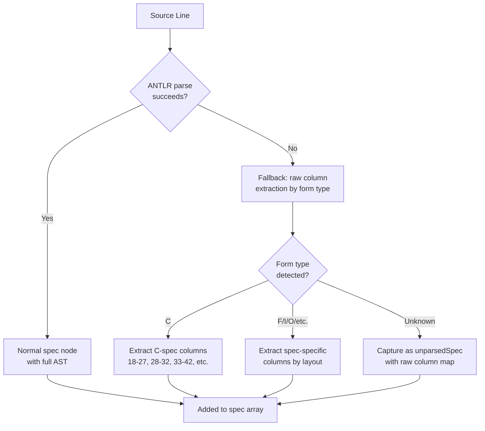

# Implementation Guide — RPG3 Parser

## Development Setup

**Prerequisites:**

- Java 17+ JDK
- Gradle 8+
- ANTLR4 4.13+ (managed via Gradle plugin)
- Python 3.10+ (for CLI wrapper)
- Existing RPGLE grammar files in `grammar/rpgle/` (source for fork)

**Initial setup:**

```bash
# 1. Ensure Java 17+ is available
java --version

# 2. Create the Gradle project structure
mkdir -p parser-core/src/main/java/com/as400parser/{common/{normalizer,model,parser,serializer},rpg3/model}
mkdir -p parser-core/src/test/java/com/as400parser/{common/normalizer,rpg3}
mkdir -p grammar/rpg3
mkdir -p cli

# 3. Initialize Gradle
cd parser-core
gradle init --type java-library
```

---

## Code Structure

**Document references:**

| Document | Path |
|---|---|
| Requirements | [feature-rpg3-parser.md](file:///d:/Code/AS400_Parser/docs/ai/requirements/feature-rpg3-parser.md) |
| Design | [feature-rpg3-parser.md](file:///d:/Code/AS400_Parser/docs/ai/design/feature-rpg3-parser.md) |
| IR JSON Template | [feature-ir-json-template.md](file:///d:/Code/AS400_Parser/docs/ai/design/feature-ir-json-template.md) |
| Sample IR Output | [rpg3.json](file:///d:/Code/AS400_Parser/example/ir/rpg3.json) |
| Implementation | `docs/ai/implementation/feature-rpg3-parser.md` ← this file |

**Source layout:**

```
parser-core/
├── build.gradle                    # ANTLR plugin + dependencies
├── src/main/java/com/as400parser/
│   ├── common/                     # Shared framework
│   │   ├── normalizer/             # Phase 1
│   │   ├── model/                  # Phase 2
│   │   │   ├── IrDocument.java
│   │   │   ├── Metadata.java
│   │   │   ├── Location.java
│   │   │   ├── SourceLine.java
│   │   │   ├── ParseError.java
│   │   │   └── ResolvedCopy.java   # Copy resolution result
│   │   ├── parser/                 # Phase 2
│   │   │   └── As400Parser.java    # Base parser interface
│   │   └── serializer/             # Phase 5
│   └── rpg3/                       # RPG3-specific
│       ├── model/                  # Phase 2
│       ├── Rpg3ParserFacade.java   # Phase 6 (implements As400Parser)
│       ├── Rpg3IrBuilder.java      # Phase 3
│       ├── Rpg3SymbolTableBuilder.java # Phase 4
│       ├── Rpg3CopyResolver.java   # Phase 4
│       └── Rpg3ErrorListener.java  # Phase 6 (ANTLR error collection)
└── src/test/java/...               # Tests per phase
```

---

## Implementation Phases

### Overview

```mermaid
gantt
    title RPG3 Parser Implementation Phases
    dateFormat X
    axisFormat %s
    section Foundation
        Phase 1 - Gradle + Normalizer    :p1, 0, 3
        Phase 2 - Grammar Fork           :p2, 3, 4
    section Core Parser
        Phase 3 - IR Builder Visitor      :p3, 4, 7
        Phase 4 - Symbol Table + Copy     :p4, 7, 5
    section Output
        Phase 5 - JSON Serializer         :p5, 5, 3
        Phase 6 - Facade + CLI            :p6, 8, 4
    section Validation
        Phase 7 - Integration Testing     :p7, 12, 3
```



---

### Phase 1: Gradle Project + Source Normalizer

**Goal:** Set up the Gradle project and implement the language-agnostic normalizer.

#### Task 1.1: Gradle Build Configuration

Create `parser-core/build.gradle`:

```groovy
plugins {
    id 'java-library'
    id 'antlr'
    id 'com.github.johnrengelman.shadow' version '8.+'  // fat JAR
}

java {
    sourceCompatibility = JavaVersion.VERSION_17
    targetCompatibility = JavaVersion.VERSION_17
}

dependencies {
    antlr "org.antlr:antlr4:4.13.2"
    implementation "org.antlr:antlr4-runtime:4.13.2"
    implementation "com.google.code.gson:gson:2.11.0"

    testImplementation "org.junit.jupiter:junit-jupiter:5.11.0"
    testImplementation "org.assertj:assertj-core:3.26.0"
}

generateGrammarSource {
    arguments += ["-visitor", "-no-listener", "-package", "com.as400parser.rpg3.generated"]
    outputDirectory = file("${project.buildDir}/generated-src/antlr/main/com/as400parser/rpg3/generated")
}

shadowJar {
    archiveBaseName.set("as400-parser-core")
    manifest {
        attributes 'Main-Class': 'com.as400parser.rpg3.Rpg3ParserFacade'
    }
}
```

#### Task 1.2: `SourceNormalizer.java`

Implement in `common/normalizer/`. Processing steps in exact order:

1. **Split lines** — handle `\r\n`, `\r`, `\n`
2. **Expand tabs** — default: standard 8-column tab stops. Configurable via `ParseOptions.tabStops` for SEU-style stops (6, 7, 17, 27, 32, 42, 48, 51, 53, 59, 74)
3. **Strip control chars** — remove 0x00–0x1F **except** SO (0x0E) and SI (0x0F) for DBCS
4. **Trim + pad** — strip trailing whitespace, right-pad to 80 chars
   - DBCS-aware: each char between SO/SI occupies 2 column positions
5. **Extract sequence numbers** — cols 1–5 → `sequenceNumbers[]`, replace with spaces
6. **Track line mapping** — `originalLineNumbers[]` (1-based)

> [!IMPORTANT]
> The normalizer must support multiple encodings via `Charset` parameter:
> - UTF-8 (default)
> - EBCDIC CCSID 930/5035 (Japanese)
> - Shift-JIS, EUC-JP

**Key classes:**

| Class | Description |
|---|---|
| `SourceNormalizer` | Main entry point with 3 `normalize()` overloads |
| `NormalizedSource` | Output: `String[] lines`, `int[] originalLineNumbers`, `String[] sequenceNumbers`, `List<NormalizationWarning> warnings` |
| `NormalizationWarning` | Warning with `line`, `column`, `message`, `type` |

#### Task 1.3: Normalizer Tests

`SourceNormalizerTest.java` — test cases:
- Basic trim + pad to 80 chars
- Tab expansion at correct column stops
- Control character stripping (preserve SO/SI)
- CRLF/CR/LF normalization
- Sequence number extraction (cols 1–5)
- Original line number tracking
- Lines > 80 chars → truncation warning
- DBCS padding (if applicable)
- Multi-encoding input (UTF-8, Shift-JIS)

---

### Phase 2: ANTLR Grammar Fork + Common Model

**Goal:** Fork the RPGLE grammar into RPG3 and create shared IR model classes.

#### Task 2.1: Fork RPGLE Grammar → RPG3

1. Copy `grammar/rpgle/RpgLexer.g4` → `grammar/rpg3/Rpg3Lexer.g4`
2. Copy `grammar/rpgle/RpgParser.g4` → `grammar/rpg3/Rpg3Parser.g4`
3. Rename all grammar-internal references

**Remove (RPG IV / ILE only):**
- Free-format modes: `FREE_Start`, `FREE`, `FreeOpExtender`
- D-spec / P-spec declarations
- CTL-OPT (free-format H-spec)
- Built-in functions (`%TRIM`, `%SUBST`, etc.)
- SQL embedding (`EXEC SQL`)
- RPG IV-only opcodes: `EVAL`, `EVALR`, `FOR`, `MONITOR`, `ON-ERROR`, `SELECT/WHEN/OTHER`, `CALLP`

**Add (RPG3-specific):**
- `FIXED_ExtensionSpec` lexer mode — E-spec arrays/tables (cols 7–74)
- `FIXED_LineCounterSpec` lexer mode — L-spec line counter (cols 7–74)
- `compileTimeData` parser rule — for `**` separator + raw data blocks
- Data Structure definitions on I-specs (RPG3 style)

**Reuse directly:**
- `FIXED_CalcSpec`, `FIXED_InputSpec`, `FIXED_FileSpec`, `FIXED_OutputSpec`, `HeaderSpecMode`
- All fixed-format opcodes and indicator handling
- `FIXED_CommentMode`, directive handling, `EndOfSourceMode`

**Top-level parser rule:**
```antlr
rpg3Program
    : (headerSpec | fileSpec | extensionSpec | lineCounterSpec
       | inputSpec | calculationSpec | outputSpec
       | commentLine | directive | blankLine)*
      compileTimeData?
      EOF
    ;
```

#### Task 2.2: Common Model Classes (`common/model/`)

| Class | Key Fields |
|---|---|
| `IrDocument` | `Metadata metadata`, `Content content`, `Dependencies dependencies` |
| `Metadata` | `irVersion`, `sourceType`, `sourceMember`, `sourceFile`, `sourceLibrary`, `parseInfo` |
| `Location` | `startLine`, `endLine`, `startColumn`, `endColumn` |
| `SourceLine` | `lineNumber`, `rawText`, `specType`, `sequenceNumber`, `isComment`, `isBlank` |
| `ParseError` | `line`, `column`, `message`, `severity` |
| `ResolvedCopy` | `found`, `resolvedPath`, `content`, `memberName`, `fileName`, `libraryName`, `qualifiedPath`, `warning` |

#### Task 2.2.1: `As400Parser` Base Interface (`common/parser/`)

Defines the contract that all source-type parsers implement. This is the extensibility foundation for future DDS, CL, RPG4 parsers.

```java
public interface As400Parser {
    /**
     * Parse a source file and produce an IR document.
     */
    IrDocument parse(Path sourceFile, ParseOptions options);

    /**
     * Parse raw source text and produce an IR document.
     */
    IrDocument parse(String sourceText, ParseOptions options);

    /**
     * Returns the source type this parser handles (e.g., "rpg3", "dds", "cl").
     */
    String getSourceType();

    /**
     * Returns the file extensions this parser can process.
     */
    List<String> getSupportedExtensions();
}
```

`Rpg3ParserFacade` implements `As400Parser` with `getSourceType() → "rpg3"` and `getSupportedExtensions() → ["rpg", "rpg3", "rpg38", "sqlrpg"]`.

#### Task 2.3: RPG3 Model Classes (`rpg3/model/`)

One Java class per spec type, each mapping 1:1 to the IR JSON template:

| Class | Corresponds To |
|---|---|
| `HeaderSpec` | `content.headerSpecs[]` entries |
| `FileSpec` | `content.fileSpecs[]` entries |
| `ExtensionSpec` | `content.extensionSpecs[]` entries |
| `LineCounterSpec` | `content.lineCounterSpecs[]` entries |
| `InputSpec` | `content.inputSpecs[]` entries |
| `CalcSpec` | `content.calculationSpecs[]` entries (polymorphic via `nodeType`) |
| `OutputSpec` | `content.outputSpecs[]` entries |
| `DataStructure` | `content.dataStructures[]` entries |
| `SymbolEntry` | `content.symbolTable[]` entries |
| `Subroutine` | `content.subroutines[]` entries (includes `calledFrom`) |
| `CompileTimeData` | `content.compileTimeData` |
| `ExpressionNode` | Expression AST hierarchy (8 subtypes) |
| `Dependency` | `dependencies` section entries |

**Expression AST hierarchy (8 node types):**

```java
public abstract class ExpressionNode {
    String nodeType;
    String rawText;
    Location location;
}

public class IdentifierNode extends ExpressionNode {
    String name;
    boolean isArray;
    String dataType;      // AS400 code: A/S/P/B/D/T/Z/G/O
    Integer length;
    Integer decimalPositions;
}

public class LiteralNode extends ExpressionNode {
    Object value;
    String dataType;
}

public class ArrayElementNode extends ExpressionNode {
    String arrayName;
    ExpressionNode index;
}

public class BinaryOpNode extends ExpressionNode {
    String operator;
    ExpressionNode left;
    ExpressionNode right;
}

public class UnaryOpNode extends ExpressionNode {
    String operator;
    ExpressionNode operand;
}

public class IndicatorNode extends ExpressionNode {
    String indicator;
    String category;      // "numeric", "control", "overflow", etc.
}

public class FigurativeConstantNode extends ExpressionNode {
    String constant;      // *BLANKS, *ZEROS, *HIVAL, *LOVAL, *ALL, *ON, *OFF
}

public class SpecialValueNode extends ExpressionNode {
    String value;         // *IN, *INxx, UDATE, UMONTH, UDAY, UYEAR, PAGE
}
```

#### Task 2.4: Grammar Compilation Test

Run `gradle generateGrammarSource` and verify:
- No ANTLR compilation errors
- Generated visitor base class matches expected visit methods
- Parse a simple RPG3 source (H-spec only) to validate lexer/parser wiring

---

### Phase 3: IR Builder Visitor

**Goal:** Implement the ANTLR visitor that walks the parse tree and builds the IR model.

#### Task 3.1: `Rpg3IrBuilder.java` — Spec Visitors

Extends `Rpg3ParserBaseVisitor<Void>`. Each visit method extracts column-positional data from the parse tree context.

**Implementation order** (simplest → most complex):

1. `visitHeaderSpec` → `headerSpecs[]` — straightforward single-line extraction
2. `visitFileSpec` → `fileSpecs[]` + `dependencies.referencedFiles[]` — includes continuation lines
3. `visitExtensionSpec` → `extensionSpecs[]` — column extraction for array/table defs
4. `visitLineCounterSpec` → `lineCounterSpecs[]` — simple 3-field extraction
5. `visitOutputSpec` → `outputSpecs[]` — record-level + field-level lines
6. `visitInputSpec` → `inputSpecs[]` + `dataStructures[]` — dual-purpose (records + DS detection)
7. `visitCalcSpec` / `visitBlock` → `calculationSpecs[]` — most complex (expression AST + control flow nesting)
8. `visitDirective` → `copyMembers[]` + `dependencies.copyMembers[]`
9. `visitCompileTimeData` → `compileTimeData` — raw text blocks

> [!IMPORTANT]
> **Column extraction pattern:** Every spec visitor must:
> 1. Get the raw source text from the parse tree token
> 2. Extract each column range according to the RPG3 spec layout (see column tables below)
> 3. Set `location` using original line numbers from `NormalizedSource`
> 4. Preserve `rawSourceLine` and `inlineComment`

##### C-Spec Column Layout Reference

| Columns | Width | Field | IR Field |
|---|---|---|---|
| 6 | 1 | Form Type | `formType` |
| 7–8 | 2 | Control Level | `controlLevel` |
| 9–11 | 3 | Conditioning Indicator 1 (N + 2-digit) | `conditioningIndicators[0]` |
| 12–14 | 3 | Conditioning Indicator 2 | `conditioningIndicators[1]` |
| 15–17 | 3 | Conditioning Indicator 3 | `conditioningIndicators[2]` |
| 18–27 | 10 | Factor 1 | `factor1` |
| 28–32 | 5 | Operation Code | `opcode` |
| 33–42 | 10 | Factor 2 | `factor2` |
| 43–48 | 6 | Result Field | `resultField` |
| 49–51 | 3 | Field Length | `fieldLength` |
| 52 | 1 | Decimal Positions | `decimalPositions` |
| 53 | 1 | Half Adjust / Op Extender | `extendedOpcode` (`H`=half-adjust, `N`=no-lock, `P`=pad) |
| 54–55 | 2 | Resulting Indicator High/Plus | `resultingIndicators.high` |
| 56–57 | 2 | Resulting Indicator Low/Minus | `resultingIndicators.low` |
| 58–59 | 2 | Resulting Indicator Equal/Zero | `resultingIndicators.equal` |
| 60–74 | 15 | Comments | `inlineComment` |

##### E-Spec Column Layout Reference

| Columns | Width | Field | IR Field |
|---|---|---|---|
| 6 | 1 | Form Type | `formType` |
| 11–18 | 8 | From File Name | `fromFileName` |
| 19–26 | 8 | To File Name | `toFileName` |
| 27–32 | 6 | Table/Array Name | `tableName` |
| 33–35 | 3 | Entries Per Record | `entriesPerRecord` |
| 36–39 | 4 | Number of Entries | `numberOfEntries` |
| 40–42 | 3 | Entry Length | `entryLength` |
| 43 | 1 | Data Format (P/B/L/R) | `dataFormat` |
| 44 | 1 | Decimal Positions | `decimalPositions` |
| 45 | 1 | Sequence (A/D) | `sequence` |
| 46–51 | 6 | Alternating Table/Array | `alternatingName` |
| 52–54 | 3 | Alternating Entry Length | `alternatingLength` |
| 55 | 1 | Alternating Data Format | `alternatingDataFormat` |
| 56 | 1 | Alternating Decimal Positions | `alternatingDecimalPositions` |
| 57 | 1 | Alternating Sequence | `alternatingSequence` |
| 58–74 | 17 | Comments | `inlineComment` |

##### L-Spec Column Layout Reference

| Columns | Width | Field | IR Field |
|---|---|---|---|
| 6 | 1 | Form Type | `formType` |
| 7–14 | 8 | File Name | `fileName` |
| 15–17 | 3 | Lines Per Page (FL) | `linesPerPage` |
| 18–20 | 3 | Overflow Line (OL) | `overflowLine` |

##### Conditioning Indicator Extraction (C-Spec cols 9–17)

Each C-spec line can have up to 3 conditioning indicators in positions `first` (cols 9–11), `second` (cols 12–14), `third` (cols 15–17):

```java
// For each 3-char conditioning position:
String pos = rawLine.substring(startCol - 1, startCol + 2); // 3 chars
if (!pos.isBlank()) {
    boolean negated = (pos.charAt(0) == 'N');
    String indicator = negated ? pos.substring(1).trim() : pos.trim();
    indicators.add(new ConditioningIndicator(negated, indicator, positionName));
}
```

##### Resulting Indicators Extraction (C-Spec cols 54–59)

Always present on every `operation` node (as `""` if not set):

```java
String high  = rawLine.substring(53, 55).trim();  // cols 54-55
String low   = rawLine.substring(55, 57).trim();  // cols 56-57
String equal = rawLine.substring(57, 59).trim();  // cols 58-59
resultingIndicators = new ResultingIndicators(high, low, equal);
```

##### Extended Opcode Extraction (C-Spec col 53)

```java
String extendedOpcode = rawLine.substring(52, 53).trim(); // col 53
// Values: "H" (half-adjust), "N" (no lock), "P" (pad), or "" (blank)
```

#### Task 3.2: Expression AST Builder

Build expression AST nodes for C-spec factors. Key logic:

> [!CAUTION]
> **Detection order matters.** Figurative constants must be checked first (finite reserved word set), then `*INxx` indicators (pattern), then `*IN` special value (exact). This avoids `*IN` (array) being misclassified as an indicator.

```
factor text → determine type → create node
  1. is blank/empty → null (no expression in this factor)
  2. is *BLANKS/*ZEROS/*HIVAL/*LOVAL/*ALL/*ON/*OFF → FigurativeConstantNode
  3. is *INxx (length ≥ 4, e.g. *IN01, *INLR, *INH1) → IndicatorNode
  4. is *IN (exactly "*IN") → SpecialValueNode (the indicator array)
  5. is UDATE/UMONTH/UDAY/UYEAR/PAGE/PAGE1-PAGE7 → SpecialValueNode
  6. starts with "'" or is quoted → LiteralNode (string)
  7. is numeric (digits, optional decimal point) → LiteralNode (numeric)
  8. contains "," (like ARR,X) → ArrayElementNode
  9. otherwise → IdentifierNode
```

> [!NOTE]
> For `IdentifierNode`, the `dataType`, `length`, and `decimalPositions` fields may be partially resolved during pass 1. Full resolution happens when the symbol table is built in Phase 4. The builder should populate what it can from C-spec column positions (fieldLength/decimalPositions in result field) and leave the rest for the symbol table pass.

#### Task 3.3: Control Flow Block Builder

Detect and nest control flow structures:

| Detection | Action |
|---|---|
| `IFxx` opcode | Create `conditionalBlock`, collect operations until matching `ELSE`/`END` |
| `ELSE` | Switch to populating `elseOps` on current `conditionalBlock` |
| `ANDxx` opcode | Extend condition of parent `IFxx`/`DOWxx`/`DOUxx` (see compound conditions below) |
| `ORxx` opcode | Extend condition of parent `IFxx`/`DOWxx`/`DOUxx` (see compound conditions below) |
| `DOWxx` opcode | Create `doWhileBlock`, collect into `bodyOps` until `END` |
| `DOUxx` opcode | Create `doUntilBlock`, collect into `bodyOps` until `END` |
| `DO` opcode | Create `doBlock`, collect into `bodyOps` until `END` |
| `CASxx` opcode | Create `caseBlock`, collect case entries until `END` |
| `BEGSR` | Create `subroutineBlock`, collect into `operations` until `ENDSR` |
| `TAG` | Create `labelNode` |
| `GOTO` | Create `gotoNode` |
| `EXSR` | Create `callSubroutine` |
| `END` / `ENDSR` | Close current block, return to parent scope |

**Implementation approach:** Use a **stack-based** block tracker. When a block-opening opcode is encountered, push a new block context onto the stack. Operations are added to the current top-of-stack block. When `END`/`ENDSR` is encountered, pop the block and add it to the parent.

> [!WARNING]
> `conditionalBlock`, `doWhileBlock`, `doUntilBlock`, and `caseBlock` must populate **both** `condition` (factor1 expression) **and** `comparisonValue` (factor2 expression), plus `comparisonType` from the opcode suffix (e.g., `IFGT` → `comparisonType: "GT"`).

##### `ANDxx` / `ORxx` Compound Condition Handling

In RPG3, `ANDxx`/`ORxx` extend the condition of a preceding `IFxx`/`DOWxx`/`DOUxx`:

```rpg3
     C           FLDA      IFGT FLDB                         IF FLDA > FLDB
     C           FLDC      ANDLTFLDD                           AND FLDC < FLDD
     C           FLDE      OREQ FLDF                           OR  FLDE = FLDF
```

**IR representation:** Build a nested `BinaryOpNode` tree combining the conditions:

```json
{
  "nodeType": "conditionalBlock",
  "condition": {
    "nodeType": "binaryOp",
    "operator": "OR",
    "left": {
      "nodeType": "binaryOp",
      "operator": "AND",
      "left": {
        "nodeType": "binaryOp", "operator": "GT",
        "left": { "nodeType": "identifier", "name": "FLDA" },
        "right": { "nodeType": "identifier", "name": "FLDB" }
      },
      "right": {
        "nodeType": "binaryOp", "operator": "LT",
        "left": { "nodeType": "identifier", "name": "FLDC" },
        "right": { "nodeType": "identifier", "name": "FLDD" }
      }
    },
    "right": {
      "nodeType": "binaryOp", "operator": "EQ",
      "left": { "nodeType": "identifier", "name": "FLDE" },
      "right": { "nodeType": "identifier", "name": "FLDF" }
    }
  },
  "comparisonType": null,
  "comparisonValue": null
}
```

**Algorithm:**
1. When `IFxx`/`DOWxx`/`DOUxx` is encountered, create the initial condition as a `BinaryOpNode(operator=xx, left=factor1, right=factor2)`
2. When `ANDxx` follows, wrap: `new BinaryOpNode("AND", previousCondition, new BinaryOpNode(xx, factor1, factor2))`
3. When `ORxx` follows, wrap: `new BinaryOpNode("OR", previousCondition, new BinaryOpNode(xx, factor1, factor2))`
4. When a non-`ANDxx`/`ORxx` line follows, the condition is finalized

> [!NOTE]
> When compound conditions are used, the block's `comparisonType` and `comparisonValue` fields should be set to `null`, since the full condition is represented in the `condition` expression tree.

#### Task 3.4: Comments + SourceLines

- Build `comments[]` — standalone comment lines (col 7 = `*`), with `specContext` tracking which spec section they appear in
- Build `sourceLines[]` — ordered array of every line with `lineNumber`, `rawText`, `specType`, `sequenceNumber`, `isComment`, `isBlank`

#### Task 3.5: IR Builder Tests

For each spec type, test with:
- The sample CUSTINQ source
- Edge cases: blank lines, comments interspersed, continuation lines (F-spec, O-spec)
- Control flow nesting (IF inside DOW inside BEGSR)
- Expression AST node type detection

---

### Phase 4: Symbol Table Builder + Copy Resolver

**Goal:** Second-pass processing — build symbol table and resolve copy members.

#### Task 4.1: `Rpg3SymbolTableBuilder.java`

**Second pass** after IR Builder. Scans 4 sources, in priority order:

| Source | Priority | Fields Available |
|---|---|---|
| `inputSpecs[].fields[]` | **Highest** — has explicit type info | `fieldName`, `dataType`, `fromPosition`, `toPosition`, `decimalPositions` |
| `dataStructures[].subfields[]` | High | `name`, `dataType`, `fromPosition`, `toPosition`, `decimalPositions` |
| `extensionSpecs[]` | Medium | `tableName`, `length`, `decimalPositions`, `dataFormat` |
| `calculationSpecs` result fields | **Lowest** — only if not already defined | `resultField.name`, `fieldLength`, `decimalPositions` |

**Conflict resolution:** I-spec definitions win over C-spec result fields. If a field appears in both, use the I-spec definition (it has explicit type information).

**Data type inference for C-spec result fields:**
- If `decimalPositions` is specified → `S` (Zoned decimal)
- If `decimalPositions` is null → `A` (Character)

**After building the symbol table:** Back-propagate resolved types onto `IdentifierNode` expression nodes in `calculationSpecs` that were left unresolved during pass 1.

#### Task 4.2: Subroutine `calledFrom` Cross-References

During or after the symbol table pass:
1. Scan all `calculationSpecs` for `EXSR` operations (or `callSubroutine` nodes)
2. For each EXSR, record its `location`
3. Match EXSR targets (by name) to `subroutines[]` entries
4. Populate `calledFrom: [location, ...]` on each matched subroutine

#### Task 4.3: `Rpg3CopyResolver.java`

```java
public class Rpg3CopyResolver {
    public Rpg3CopyResolver(List<Path> copyPaths, Path sourceRoot);
    public ResolvedCopy resolve(String directive);
}
```

**Search algorithm:**
1. Parse directive: `/COPY FILE,MEMBER` or `/COPY LIB/FILE,MEMBER`
2. For each path in `copyPaths` (left-to-right):
   - Try `path/MEMBER.rpg`
   - Try `path/MEMBER.rpg3`
   - Try `path/MEMBER.mbr`
   - Try `path/MEMBER` (no extension)
3. First match wins → read content, return `ResolvedCopy(found=true, ...)`
4. No match → return `ResolvedCopy(found=false, warning=...)`

For `LIB/FILE,MEMBER` form: resolve as `sourceRoot/LIB/FILE/MEMBER` directly.

#### Task 4.4: Tests

- Symbol table builds correct entries from each source type
- Conflict resolution (I-spec wins over C-spec)
- Data type inference from decimal positions
- Copy resolver search order
- Copy resolver with missing member → warning

---

### Phase 5: JSON Serializer

**Goal:** Serialize the `IrDocument` to JSON matching the IR template exactly.

#### Task 5.1: `IrJsonSerializer.java`

```java
public class IrJsonSerializer {
    public String serialize(IrDocument document);
    public void serialize(IrDocument document, Path outputFile);
}
```

**Gson configuration:**

```java
Gson gson = new GsonBuilder()
    .setPrettyPrinting()
    .serializeNulls()                    // null fields included (null = N/A)
    .disableHtmlEscaping()               // preserve raw source characters
    .registerTypeHierarchyAdapter(       // expression node polymorphism
        ExpressionNode.class,
        new ExpressionNodeSerializer()
    )
    .create();
```

> [!IMPORTANT]
> **Null conventions must be exact:**
> - `null` = field not applicable / not present in source
> - `""` (empty string) = field exists but is blank
> - `0` = numeric zero (meaningful value)
> - Arrays are never null — use `[]` for empty

#### Task 5.2: Validation Against Sample

Compare serializer output against [rpg3.json](file:///d:/Code/AS400_Parser/example/ir/rpg3.json):
- Field names must match exactly (camelCase)
- Nesting structure must match
- Null/empty conventions must match
- JSON must be valid and parseable

---

### Phase 6: Parser Facade + CLI

**Goal:** Wire everything together and create the user-facing interface.

#### Task 6.1: `Rpg3ParserFacade.java`

Implements the `As400Parser` interface. Orchestrates the 7-step pipeline:

```
1. SourceNormalizer.normalize(sourceFile, charset)
2. Rpg3Lexer(normalizedSource) → token stream
3. Rpg3Parser(tokenStream) → parse tree
   - Configure SLL prediction mode first, fall back to LL
   - Attach Rpg3ErrorListener → collect errors
4. Rpg3IrBuilder.visit(parseTree) → IrDocument (partial)
5. Rpg3CopyResolver.resolve() → populate copyMembers (if resolveCopies=true)
6. Rpg3SymbolTableBuilder.build(irDocument) → populate symbolTable
7. Populate metadata fields
8. IrJsonSerializer.serialize(irDocument) → JSON string
```

**Metadata population (step 7):**

| Field | Value | Source |
|---|---|---|
| `irVersion` | `"1.0.0"` | Hardcoded constant |
| `sourceType` | `"rpg3"` | From `getSourceType()` |
| `sourceMember` | e.g., `"CUSTINQ"` | Filename without extension (uppercase) |
| `sourceFile` | e.g., `"QRPGSRC"` | Parent directory name, or from `ParseOptions` |
| `sourceLibrary` | e.g., `"MYLIB"` | Grandparent directory name, or from `ParseOptions` |
| `parseInfo.parseDate` | ISO-8601 timestamp | `Instant.now()` |
| `parseInfo.parseStatus` | `"complete"` / `"partial"` / `"failed"` | Based on error count |
| `parseInfo.totalLines` | Line count | From `NormalizedSource` |
| `parseInfo.errors[]` | Parse errors | From `Rpg3ErrorListener` |
| `parseInfo.warnings[]` | Normalizer warnings | From `NormalizedSource.warnings` |

**ANTLR error listener (`Rpg3ErrorListener.java`):**

```java
public class Rpg3ErrorListener extends BaseErrorListener {
    private final List<ParseError> errors = new ArrayList<>();
    private final int[] originalLineNumbers;  // from NormalizedSource

    @Override
    public void syntaxError(Recognizer<?,?> recognizer, Object offendingSymbol,
                            int line, int charPositionInLine,
                            String msg, RecognitionException e) {
        errors.add(new ParseError(
            originalLineNumbers[line - 1],  // map back to original line
            charPositionInLine + 1,          // 1-based column
            msg,
            "ERROR"
        ));
    }

    public List<ParseError> getErrors() { return errors; }
}
```

**Error handling:** If ANTLR parsing fails partially, still produce a partial IR with:
- `metadata.parseInfo.parseStatus = "partial"`
- `metadata.parseInfo.errors[]` populated from `Rpg3ErrorListener`
- Whatever spec data was successfully extracted

#### Task 6.2: `ParseOptions.java`

```java
public class ParseOptions {
    private List<Path> copyPaths = List.of();
    private Path sourceRoot = null;
    private boolean resolveCopies = false;
    private Charset charset = StandardCharsets.UTF_8;
}
```

#### Task 6.3: Python CLI Wrapper (`cli/rpg3_parser_cli.py`)

Three subcommands:

```python
# argparse structure
parser = argparse.ArgumentParser(prog='rpg3-parser')
subparsers = parser.add_subparsers()

# parse — single file
parse_cmd = subparsers.add_parser('parse')
parse_cmd.add_argument('source', type=Path)
parse_cmd.add_argument('-o', '--output', type=Path)
parse_cmd.add_argument('--copy-path', type=str)  # colon-separated paths
parse_cmd.add_argument('--charset', default='utf-8')

# batch — directory
batch_cmd = subparsers.add_parser('batch')
batch_cmd.add_argument('source_dir', type=Path)
batch_cmd.add_argument('-o', '--output-dir', type=Path)
batch_cmd.add_argument('--copy-path', type=str)
batch_cmd.add_argument('--parallel', type=int, default=4)

# validate — check IR JSON
validate_cmd = subparsers.add_parser('validate')
validate_cmd.add_argument('json_file', type=Path)
```

**Invocation:** CLI calls Java via subprocess:
```python
result = subprocess.run(
    ['java', '-jar', 'parser-core/build/libs/as400-parser-core-all.jar',
     '--source', str(source_path),
     '--charset', charset,
     '--copy-path', copy_path],
    capture_output=True, text=True
)
```

---

### Phase 7: Integration Testing

**Goal:** End-to-end validation with real RPG3 source.

#### Task 7.1: CUSTINQ Sample Test

Parse the sample `CUSTINQ.rpg` → compare output against `example/ir/rpg3.json`:
- Exact field-by-field comparison
- All 7 spec types parsed correctly
- Expression AST nodes have correct types
- Symbol table has all entries with correct types/lengths
- Subroutines have `calledFrom` populated
- Comments are in correct `specContext`

#### Task 7.2: Edge Case Tests

| Test Case | What It Validates |
|---|---|
| F-spec continuation lines | Multi-line file declarations |
| O-spec record + field lines | Dual-purpose O-spec parsing |
| Nested IF inside DOW inside BEGSR | 3-level control flow nesting |
| Mixed-case source | Case-insensitive opcode matching |
| 5000+ line source | Performance (<1s) and memory |
| Source with compile-time data (`**`) | CTDATA blocks associated with E-spec arrays |
| Blank lines and comment interspersed | Non-spec lines handled correctly |
| Missing /COPY member | Warning in errors, parsing continues |
| Partial parse failure | Status = "partial", partial IR produced |

#### Task 7.3: CLI Integration Test

Test the Python CLI end-to-end:
- `rpg3-parser parse source/CUSTINQ.rpg -o output.json` → valid JSON
- `rpg3-parser batch source/ -o output/` → one JSON per source file
- `rpg3-parser validate output.json` → validation passes

---

## Implementation Notes

### Key Technical Details

1. **Column extraction is critical** — RPG3 is entirely column-positional. Off-by-one errors in column extraction will produce incorrect IR. Use constants for all column ranges.
2. **Two-pass architecture** — Pass 1 (visitor) builds spec data; pass 2 (symbol table builder) cross-references and resolves types. Don't try to do both in one pass.
3. **SLL → LL fallback** — Configure ANTLR to try SLL prediction mode first (fast), then fall back to LL (correct but slower) on ambiguity. This is important for performance.
4. **Null vs empty string** — Be extremely careful with IR conventions. Use `null` for N/A, `""` for blank, `0` for zero. Test serialized output against the sample JSON.
5. **Expression type resolution** — Some `IdentifierNode` fields won't have type info during pass 1. The symbol table builder must back-propagate resolved types.

### Common Pitfalls

| Pitfall | Mitigation |
|---|---|
| DBCS characters miscount columns | Test padding with SO/SI delimited content |
| E-spec ↔ CTDATA association order | Associate by E-spec source order, not alphabetical |
| Control flow END matching wrong block | Use stack-based tracking, validate block types |
| Inline comments vs. trailing source | C-spec: cols 60–74. Other specs have different comment ranges |
| Tab expansion at wrong positions | Default: standard 8-column stops. Configurable for SEU-style |
| `*IN` vs `*INxx` misclassification | Check figurative constants first, then `*INxx` (≥4 chars), then `*IN` (exact) |
| `ANDxx`/`ORxx` not recognized | Absorb into parent IFxx/DOWxx/DOUxx condition as `BinaryOpNode` tree |
| Missing `extendedOpcode` (col 53) | Always extract col 53 — `H`=half-adjust, `N`=no-lock, `P`=pad |
| Missing `resultingIndicators` | Always extract cols 54-59 as high/low/equal (empty string if blank) |

---

## Integration Points

- **IR JSON Template** — Output must strictly conform to [feature-ir-json-template.md](file:///d:/Code/AS400_Parser/docs/ai/design/feature-ir-json-template.md)
- **Sample JSON** — [rpg3.json](file:///d:/Code/AS400_Parser/example/ir/rpg3.json) is the golden reference for serializer validation
- **RPGLE Grammar** — [RpgLexer.g4](file:///d:/Code/AS400_Parser/grammar/rpgle/RpgLexer.g4) and [RpgParser.g4](file:///d:/Code/AS400_Parser/grammar/rpgle/RpgParser.g4) are the fork source
- **Downstream tools** — Dependency analyzer, code generator, and visualization tools will consume the IR JSON

---

## Error Handling

| Error Type | Handling |
|---|---|
| ANTLR parse errors | Collect in `metadata.parseInfo.errors[]`, continue parsing |
| Normalizer warnings | Collect in normalizer output, propagate to `parseInfo.warnings[]` |
| Unresolved /COPY | `copyMembers[].resolved = false`, warning in errors |
| Encoding failures | Fall back to UTF-8, emit warning |
| File I/O errors | Propagate as parse failure with `parseStatus = "failed"` |

### Unparseable Line Strategy — Zero Data Loss

> [!CAUTION]
> **Every column in every source line MUST be captured in the IR.** A silently skipped line means missing business logic, which causes bugs when the IR is used for migration. There is NO acceptable data loss.

When a line cannot be parsed via the normal ANTLR grammar path, a **fallback raw column extraction** ensures it still appears in the spec arrays:



**Three-tier fallback:**

| Tier | When | Result | `parseQuality` |
|---|---|---|---|
| **Tier 1: Full parse** | ANTLR grammar matches | Normal spec node with expression AST | `"full"` |
| **Tier 2: Column extraction** | ANTLR fails, but form type (col 6) is recognized | Spec node with raw column values (strings, not AST) — expressions are `rawText` only | `"columnOnly"` |
| **Tier 3: Raw capture** | Form type unrecognized or column extraction fails | `unparsedSpec` node with full raw text + column map | `"raw"` |

**Tier 2 implementation (column extraction fallback):**

```java
// When ANTLR parse fails but we can read col 6 (form type):
private CalcSpec fallbackCalcSpec(String rawLine, int lineNumber) {
    CalcSpec spec = new CalcSpec();
    spec.setParseQuality("columnOnly");
    spec.setRawSourceLine(rawLine);
    spec.setFormType("C");
    spec.setControlLevel(extract(rawLine, 7, 8));
    // Extract conditioning indicators (cols 9-17)
    spec.setConditioningIndicators(extractConditioningIndicators(rawLine));
    // Factor1/opcode/factor2/result as raw strings (no AST)
    spec.setFactor1(rawIdentifier(extract(rawLine, 18, 27)));
    spec.setOpcode(extract(rawLine, 28, 32));
    spec.setFactor2(rawIdentifier(extract(rawLine, 33, 42)));
    spec.setResultField(rawIdentifier(extract(rawLine, 43, 48)));
    spec.setFieldLength(parseIntOrNull(extract(rawLine, 49, 51)));
    spec.setDecimalPositions(parseIntOrNull(extract(rawLine, 52, 52)));
    spec.setExtendedOpcode(extract(rawLine, 53, 53));
    spec.setResultingIndicators(extractResultingIndicators(rawLine));
    spec.setInlineComment(extract(rawLine, 60, 74));
    return spec;
}

// rawIdentifier: wraps raw text in a minimal IdentifierNode with rawText only
private ExpressionNode rawIdentifier(String text) {
    if (text.isBlank()) return null;
    IdentifierNode node = new IdentifierNode();
    node.setNodeType("identifier");
    node.setRawText(text.trim());
    node.setName(text.trim());
    return node;
}
```

**Tier 3 implementation (last resort):**

```java
// When even column extraction fails:
public class UnparsedSpec {
    String parseQuality = "raw";
    String rawSourceLine;           // full 80-char line
    int lineNumber;
    String formType;                // col 6, or null if unrecognized
    Map<String, String> columns;    // raw column map: {"7-8": "  ", "18-27": "CUSTNO    ", ...}
    String parseError;              // why it failed
}
```

**`parseQuality` field on every spec node:**

Every spec node (in all spec arrays) carries a `parseQuality` field:

| Value | Meaning |
|---|---|
| `"full"` | Normal parse — full AST with resolved expressions |
| `"columnOnly"` | Fallback — raw column values preserved, expressions are `rawText` only |
| `"raw"` | Last resort — raw text and column map only |

> [!IMPORTANT]
> **Migration safety rule:** Downstream migration tools MUST check `parseQuality` before processing a node. A `"columnOnly"` or `"raw"` node means the expression AST may be incomplete — the tool should flag it for human review rather than silently generating incorrect code.

**Where each tier appears in the IR:**

| Tier | In spec arrays? | In `sourceLines[]`? | In `errors[]`? |
|---|---|---|---|
| Full | ✅ Yes (normal) | ✅ Yes | ❌ No |
| Column-only | ✅ Yes (with `parseQuality: "columnOnly"`) | ✅ Yes | ✅ Yes (warning) |
| Raw | ✅ Yes (as `unparsedSpec` in relevant spec array) | ✅ Yes | ✅ Yes (error) |

**`parseStatus` determination:**

| Condition | Status |
|---|---|
| All lines Tier 1 | `"complete"` |
| Any lines Tier 2 (column-only) | `"partial"` |
| Any lines Tier 3 (raw) | `"partial"` |
| File I/O or total failure | `"failed"` |

---

## Performance Considerations

- **Target:** < 1 second for 1000-line source
- **SLL mode:** ANTLR SLL prediction mode handles most inputs faster
- **Batch amortization:** JVM warm-up cost is amortized across batch runs
- **Memory:** IR model holds ~2x source size in memory — acceptable for 5000+ lines
- **Parallelism:** Python CLI batch mode can invoke multiple Java processes in parallel
