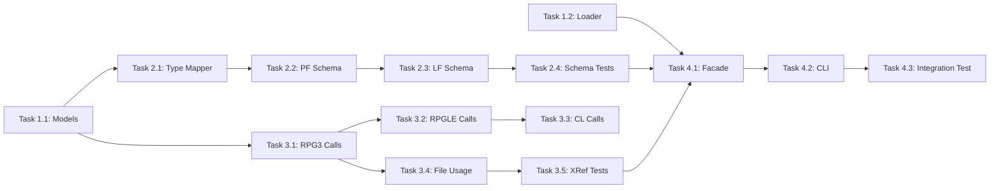

# Project Planning: Analyzer

## Milestones

- [ ] Milestone 1: Database Schema Extraction (DDS PF/LF → relational model)
- [ ] Milestone 2: Cross-Reference Analyzer (call graph + file usage map)
- [ ] Milestone 3: Integration & CLI support
- [ ] Milestone 4: Full test coverage + verification with student-mgmt app

## Task Breakdown

### Phase 1: Foundation — Models & Loader

- [ ] Task 1.1: Create analyzer model classes in `com.as400parser.common.analyzer.model`
  - `DatabaseSchema`, `TableDefinition`, `ColumnDefinition`
  - `IndexDefinition`, `KeyFieldDef`, `SelectOmitRule`
  - `CrossReference`, `CallTarget`, `FileUsage`, `IOOperation` enum
  - `AnalysisResult` (root container)
  - **Effort**: 1-2 hours

- [ ] Task 1.2: Create `IrDocumentLoader` — batch-load IR JSON from directory
  - Use existing `Gson` + `IrDocument` model
  - Group documents by sourceType
  - **Effort**: 30 min

### Phase 2: Schema Extraction (DDS → DB)

- [ ] Task 2.1: Implement `DdsToSqlTypeMapper`
  - Static mapping: A→VARCHAR, P→NUMERIC, S→NUMERIC, B→INTEGER, L→DATE, etc.
  - Handle edge cases: null decimal positions, zero-length fields
  - **Effort**: 30 min

- [ ] Task 2.2: Implement `SchemaAnalyzer` — PF processing
  - Extract table name from metadata.sourceMember
  - Extract columns from recordFormats[0].fields
  - Extract primary key from recordFormats[0].keys or key definitions
  - Extract UNIQUE from fileKeywords
  - Extract TEXT, COLHDG, DFT, VALUES keywords for column metadata
  - **Effort**: 1-2 hours

- [ ] Task 2.3: Implement `SchemaAnalyzer` — LF processing
  - Detect LF type: simple / select-omit / join
  - Extract PFILE reference → parent table name
  - Extract key fields with sort order
  - Extract select/omit conditions
  - **Effort**: 1 hour

- [ ] Task 2.4: Write tests for SchemaAnalyzer
  - Test with STUDNTPF (14 fields, composite key, UNIQUE)
  - Test with STUCLSPF (4 fields, composite key)
  - Test with STUDNTL1 (simple LF, 2 key fields)
  - Test with STUDNTL2 (LF with select/omit)
  - Test DdsToSqlTypeMapper for all DDS types
  - **Effort**: 1-2 hours

### Phase 3: Cross-Reference Analysis

- [ ] Task 3.1: Implement `CrossReferenceAnalyzer` — RPG3 call extraction
  - Scan C-spec operations for CALL, EXSR, CALLP, CALLB opcodes
  - Extract factor2 as target program/subroutine name
  - **Effort**: 1 hour

- [ ] Task 3.2: Implement `CrossReferenceAnalyzer` — RPGLE call extraction
  - Handle both fixed-format (C-spec) and free-format calls
  - Extract CALLP targets, procedure calls
  - **Effort**: 1 hour

- [ ] Task 3.3: Implement `CrossReferenceAnalyzer` — CL call extraction
  - Scan CL commands for CALL, SBMJOB
  - Extract PGM parameter value as target
  - **Effort**: 30 min

- [ ] Task 3.4: Implement `FileUsageAnalyzer`
  - Extract file definitions (F-spec / DCL-F) → access mode
  - Scan C-spec operations for file I/O opcodes (READ, CHAIN, WRITE, etc.)
  - Map opcode factor2 to file name
  - **Effort**: 1-2 hours

- [ ] Task 3.5: Write tests for Cross-Reference
  - Test with STUPRG.rpg (calls EXSR, uses STUDNTPF)
  - Test with MNUCL.clle (CALL PGM→ multiple programs)
  - Test with sample_order.rpgle (procedure calls)
  - **Effort**: 1-2 hours

### Phase 4: Integration

- [ ] Task 4.1: Create `AnalyzerFacade` — orchestrate all analyzers
  - Load all IR files → run SchemaAnalyzer + CrossReferenceAnalyzer → AnalysisResult
  - JSON serialization of AnalysisResult
  - **Effort**: 30 min

- [ ] Task 4.2: Add `--analyze` mode to CLI
  - `java -jar ... --source-dir DIR --analyze` → outputs analysis JSON
  - **Effort**: 30 min

- [ ] Task 4.3: Integration test with student-mgmt app
  - Parse all 20+ files → analyze → verify complete cross-reference
  - **Effort**: 1 hour

## Dependencies

## Timeline & Estimates

| Phase | Tasks | Estimated Effort |
|-------|-------|------------------|
| Foundation | 1.1, 1.2 | 2 hours |
| Schema Extraction | 2.1-2.4 | 4-5 hours |
| Cross-Reference | 3.1-3.5 | 5-6 hours |
| Integration | 4.1-4.3 | 2 hours |
| **Total** | | **~13-15 hours** |

## Risks & Mitigation

| Risk | Impact | Mitigation |
|------|--------|------------|
| IR JSON format inconsistency between source types | Medium | Use common IrDocument model; adapter per sourceType |
| DDS REF/REFFLD not fully resolved | Low | Already handled by DdsRefResolver in batch parse |
| RPG3 vs RPGLE C-spec model differences | Medium | Abstract opcode extraction behind interface |
| JOIN logical file complexity | Low | Start with basic support; flag complex cases |

## Resources Needed

- Existing IR JSON output from student-mgmt app (already in `output/` directory)
- Understanding of DDS data types (documented in design doc)
- Understanding of RPG3/RPGLE C-spec opcode mapping (existing parser code)
