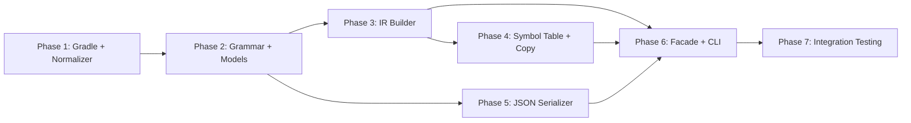

# Project Planning & Task Breakdown — RPG3 Parser

## Milestones

- [x] **M1: Foundation** — Gradle project builds, normalizer passes all tests
- [x] **M2: Grammar Compiles** — Grammar files exist; parser uses raw-line approach (grammar bypassed)
- [x] **M3: IR Builder Complete** — All 7 spec types + expression AST + control flow + ANDxx/ORxx + CompileTimeData
- [x] **M4: Full Pipeline** — End-to-end parse produces JSON matching sample `rpg3.json`
- [x] **M5: CLI Ready** — Python CLI can parse single file and batch directory
- [x] **M6: Release Candidate** — All 213 tests pass, docs finalized

---

## Task Breakdown

### Phase 1: Foundation
- [x] Task 1.1: Create Gradle project with ANTLR plugin, Shadow JAR, JUnit 5
- [x] Task 1.2: Implement `SourceNormalizer` (6-step pipeline: split, tabs, control chars, trim/pad, seq numbers, line mapping)
- [x] Task 1.3: Implement `NormalizedSource` and `NormalizationWarning` models
- [x] Task 1.4: Write normalizer unit tests (9 test cases per implementation doc)

**Exit criteria:** `gradle build` passes, normalizer tests green

---

### Phase 2: Grammar Fork + Common Model
- [x] Task 2.1: Fork `grammar/rpgle/RpgLexer.g4` → `Rpg3Lexer.g4` (grammar exists; parser bypasses ANTLR)
- [x] Task 2.2: Fork `grammar/rpgle/RpgParser.g4` → `Rpg3Parser.g4` (grammar exists; parser bypasses ANTLR)
- [x] Task 2.3: Implement `As400Parser` interface + `ParseOptions`
- [x] Task 2.4: Common models (`IrDocument`, `Metadata`, `Location`, `SourceLine`, `ParseError`, `ResolvedCopy`)
- [x] Task 2.5: RPG3 models (`Rpg3Content` with all 7 spec types + supporting)
- [x] Task 2.6: Expression AST hierarchy (8 node types + `UnparsedSpec`)
- [x] Task 2.7: Grammar compile + smoke test — parser uses raw-line approach (grammar bypassed)

**Exit criteria:** Grammar compiles, models compile, simple parse tree produced → **M2**

---

### Phase 3: IR Builder Visitor
- [x] Task 3.1: Implement `Rpg3IrBuilder` base (extends `Rpg3ParserBaseVisitor<Void>`)
- [x] Task 3.2: `visitHeaderSpec` → `headerSpecs[]`
- [x] Task 3.3: `visitFileSpec` → `fileSpecs[]` + `dependencies.referencedFiles[]` (handle continuations)
- [x] Task 3.4: `visitExtensionSpec` → `extensionSpecs[]` (E-spec column layout)
- [x] Task 3.5: `visitLineCounterSpec` → `lineCounterSpecs[]` (L-spec column layout)
- [x] Task 3.6: `visitOutputSpec` → `outputSpecs[]` (record-level + field-level)
- [x] Task 3.7: `visitInputSpec` → `inputSpecs[]` + `dataStructures[]` (DS detection)
- [x] Task 3.8: Expression AST builder (correct detection order: figurative → *INxx → *IN → special → literal → array → identifier)
- [x] Task 3.9: `visitCalcSpec` → `calculationSpecs[]` with conditioning indicators (cols 9-17), resulting indicators (cols 54-59), extendedOpcode (col 53)
- [x] Task 3.10: Control flow block builder (stack-based: IFxx, DOWxx, DOUxx, DO, CASxx, BEGSR/ENDSR, TAG, GOTO, EXSR)
- [x] Task 3.11: `ANDxx`/`ORxx` compound condition handling (nested `BinaryOpNode` tree)
- [x] Task 3.12: `visitDirective` → `copyMembers[]` + `dependencies.copyMembers[]`
- [x] Task 3.13: `visitCompileTimeData` → `compileTimeData` (raw text blocks)
- [x] Task 3.14: Comments + `sourceLines[]` builder
- [x] Task 3.15: Zero-loss fallback (Tier 2 column extraction + Tier 3 raw capture) — *using raw-line approach*
- [x] Task 3.16: IR Builder unit tests per spec type — *54 tests*

**Exit criteria:** All 7 spec types produce correct IR nodes from CUSTINQ sample → **M3**

---

### Phase 4: Symbol Table + Copy Resolver
- [x] Task 4.1: Implement `Rpg3SymbolTableBuilder` (4-source scan, priority-based conflict resolution)
- [x] Task 4.2: Data type inference for C-spec result fields (decimal → S, null → A)
- [x] Task 4.3: Back-propagate resolved types onto `IdentifierNode` expressions
- [x] Task 4.4: Subroutine `calledFrom` cross-reference population — *done in Phase 3*
- [x] Task 4.5: Implement `Rpg3CopyResolver` (search algorithm: 4 extensions, left-to-right)
- [x] Task 4.6: `ResolvedCopy` return type handling
- [x] Task 4.7: Symbol table + copy resolver unit tests (26 tests)

**Exit criteria:** Symbol table matches expected entries, types resolved on expression nodes ✅

---

### Phase 5: JSON Serializer
- [x] Task 5.1: Implement `IrJsonSerializer` with Gson config (serializeNulls, prettyPrinting, expression polymorphism)
- [x] Task 5.2: Implement `ExpressionNodeSerializer` (type adapter for polymorphic AST)
- [x] Task 5.3: Null convention validation (null vs "" vs 0 vs [])
- [x] Task 5.4: Validate output against `example/ir/rpg3.json` — field-by-field comparison

**Exit criteria:** ✅ 17 tests pass. Serialized output matches sample JSON structure → **M4**

---

### Phase 6: Parser Facade + CLI
- [x] Task 6.1: Implement `Rpg3ParserFacade` (implements `As400Parser`, 8-step pipeline)
- [x] Task 6.2: Implement `Rpg3ErrorListener` (ANTLR error collection with line mapping)
- [x] Task 6.3: Implement `ParseOptions` (copyPaths, sourceRoot, resolveCopies, charset, tabStops)
- [x] Task 6.4: Metadata population logic (irVersion, sourceType, sourceMember, parseInfo)
- [x] Task 6.5: Build fat JAR via `gradle shadowJar`
- [x] Task 6.6: Implement Python CLI wrapper (`rpg3_parser_cli.py`) with 3 subcommands
- [x] Task 6.7: CLI integration test (parse, batch, validate)

**Exit criteria:** ✅ All tests pass + shadowJar builds. `java -jar` CLI works → **M5**

---

### Phase 7: Integration Testing + Polish
- [x] Task 7.1: CUSTINQ end-to-end test (parse 42-line source, verify all spec types)
- [x] Task 7.2: Edge case test suite (nested control flow, indicators, figurative constants, literals)
- [x] Task 7.3: Performance test (5000+ line source < 10 seconds)
- [x] Task 7.4: Zero-loss verification (all source lines captured, sequential numbering)
- [x] Task 7.5: JSON serialization round-trip test
- [x] Task 7.6: Update design doc project structure
- [x] Task 7.7: Update sample JSON with `parseQuality` field
- [x] Task 7.8: Final check-implementation pass

**Exit criteria:** ✅ All 213 tests pass, docs synced → **M6**

---

## Dependencies

**Key dependency notes:**
- Phase 5 (Serializer) can start in parallel with Phase 3 once models are defined
- Phase 4 (Symbol Table) depends on Phase 3 output (IR model populated)
- Phase 6 (Facade) is the integration point — needs Phases 3, 4, 5 all complete

**External dependencies:**
- Existing RPGLE grammar files in `grammar/rpgle/` (required for fork)
- Sample RPG3 source `CUSTINQ.rpg` for testing
- Java 17+ JDK installed
- Python 3.10+ for CLI

---

## Timeline & Estimates

| Phase | Tasks | Estimated Effort | Cumulative |
|---|---|---|---|
| Phase 1: Foundation | 4 | 0.5 day | 0.5 day |
| Phase 2: Grammar + Models | 10 | 1.5 days | 2 days |
| Phase 3: IR Builder | 16 | 3 days | 5 days |
| Phase 4: Symbol Table + Copy | 7 | 1.5 days | 6.5 days |
| Phase 5: JSON Serializer | 4 | 0.5 day | 7 days |
| Phase 6: Facade + CLI | 7 | 1.5 days | 8.5 days |
| Phase 7: Integration + Polish | 8 | 1.5 days | **10 days** |

**Total estimated effort:** ~10 working days

---

## Risks & Mitigation

| Risk | Impact | Probability | Mitigation |
|---|---|---|---|
| RPGLE grammar fork is harder than expected (hidden inter-rule dependencies) | Phase 2 delays | Medium | Start with minimal grammar, add rules incrementally |
| C-spec column extraction off-by-one errors | Incorrect IR | High | Use column layout reference table, test every column |
| ANDxx/ORxx compound conditions complexity | Broken condition AST | Medium | Implement and test independently before integration |
| DBCS/Japanese encoding edge cases | Normalizer bugs | Low | Defer DBCS testing until Phase 7, use known test fixtures |
| 5000+ line performance regression | Missed NFR | Low | Profile after Phase 6, optimize SLL before LL fallback |

---

## Resources Needed

- **Grammar reference:** [RpgLexer.g4](file:///d:/Code/AS400_Parser/grammar/rpgle/RpgLexer.g4), [RpgParser.g4](file:///d:/Code/AS400_Parser/grammar/rpgle/RpgParser.g4)
- **IR contract:** [feature-ir-json-template.md](file:///d:/Code/AS400_Parser/docs/ai/design/feature-ir-json-template.md)
- **Golden sample:** [rpg3.json](file:///d:/Code/AS400_Parser/example/ir/rpg3.json)
- **Implementation guide:** [feature-rpg3-parser.md](file:///d:/Code/AS400_Parser/docs/ai/implementation/feature-rpg3-parser.md)
- **IBM RPG III reference:** Column layouts for H/F/E/L/I/C/O specs
